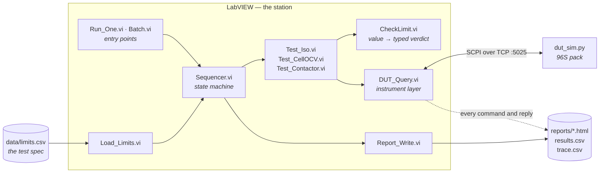

<div align="center">

# eol-station

**An end-of-line test station for a 96S battery pack, built in NI LabVIEW against a simulated DUT.**

[](https://www.ni.com/labview)
[](https://www.python.org)
[](docs/03-dut-simulator.md)
[](#running-it)
[](docs/README.md)
[](LICENSE)

**[📖 Read the documentation →](docs/README.md)**

</div>

An EOL station is the machine at the end of a production line: it connects to a finished unit,
runs a fixed sequence of measurements against limits it did not invent, stamps the unit PASS or
FAIL, and produces the record that says why.

This one tests battery packs. The pack is simulated in software — no hardware, no high voltage
— so the **station** is the deliverable: the instrument layer, the sequencer, the limits, the
verdict model, and the evidence it leaves behind.

<!-- FIGURE 1 — uncomment once docs/img/01-sequencer-panel.png exists

-->

| | |
|---|---|
| **Application layer** | NI LabVIEW 2026 Q3 |
| **Instrument protocol** | SCPI over TCP, port 5025 |
| **DUT** | Python simulator — 96 cells, ~355 V nominal, deterministic seeded faults |
| **Outputs** | per-unit HTML report · `results.csv` · `trace.csv` command log |
| **Metrics** | first pass yield · first-failure Pareto · tester availability · cycle time |

---

## The four questions

Every structural decision in this repository answers one of these. They are also the questions
a test-engineering interview opens with.

| Question | The answer built here |
|---|---|
| **Where do the limits come from?** | [`data/limits.csv`](data/limits.csv), under version control, with a `source` column naming each limit's provenance. Read at run time. No number is typed onto a block diagram. → [Test specification](docs/04-test-specification.md) |
| **Was that a bad unit, or a bad tester?** | Three verdicts, not two. A reply beginning `ERR,` is the DUT answering with a refusal — that is data. A LabVIEW error means no answer arrived — that is a station fault, and it leaves the yield denominator. → [The verdict model](docs/08-verdict-model.md) |
| **What did the station send and receive?** | Every command goes through one VI, and that VI appends a timestamped row to `data/trace.csv`. No code path can bypass it. → [The instrument layer](docs/05-instrument-layer.md) |
| **How do you know the tester is right?** | A golden unit with known-exact values is tested before every batch. If it does not pass, the batch does not run. → [Batch metrics](docs/10-batch-metrics.md) |

## Architecture



**One instrument VI.** Every command in the station goes through `DUT_Query.vi` — the only
place that knows about terminators, timeouts and framing, and the reason the trace log cannot
be bypassed.

**One connector pane across all test steps.** Each takes `(connection, limits, error)` and
returns an array of typed results. The sequencer does not know which step it is calling, so
adding a fourth test is a new VI and one case rather than a redesign.

**Limits are data.** They enter once, from a file, and travel down the call chain as a typed
cluster.

→ [Architecture in full](docs/02-architecture.md)

## Documentation

Fifteen chapters in [`docs/`](docs/README.md). The build guide shows *how to wire it*; these
pages describe **what it does and why**, for someone evaluating the design.

| | | |
|---|---|---|
| [Overview](docs/01-overview.md) | [Architecture](docs/02-architecture.md) | [The DUT simulator](docs/03-dut-simulator.md) |
| [Test specification](docs/04-test-specification.md) | [The instrument layer](docs/05-instrument-layer.md) | [The test steps](docs/06-test-steps.md) |
| [The sequencer](docs/07-sequencer.md) | [The verdict model](docs/08-verdict-model.md) | [Reporting and evidence](docs/09-reporting.md) |
| [Batch metrics](docs/10-batch-metrics.md) | [Cycle time and frames](docs/11-cycle-time.md) | [Failure injection](docs/12-failure-injection.md) |
| [LabVIEW design notes](docs/13-labview-design-notes.md) | [Mapping to NI TestStand](docs/14-teststand-mapping.md) | [Glossary](docs/glossary.md) |

**In fifteen minutes:** [Overview](docs/01-overview.md), then
[the verdict model](docs/08-verdict-model.md). Those two contain the reasoning everything else
implements.

## Reference units

Five deterministic fixtures. Every value produced by running the simulator, not estimated:

| Seed | Insulation | Σ cells | Spread ΔV | Injected fault | Expected first failure |
|---|---|---|---|---|---|
| **123** | 11.06 MΩ | 360.3158 V | 0.0396 V | — | *none — passes* |
| **120** | 5.22 MΩ | 356.7013 V | 0.4298 V | `BADCELL` cell 42 → 3.31 V | Cell OCV |
| **125** | **0.40 MΩ** | 362.9687 V | 0.0392 V | `ISO` | Insulation → **abort** |
| **130** | 6.02 MΩ | 344.2818 V | 0.0383 V | `CONT` | Contactor |
| *golden* | 10.00 MΩ | 355.2000 V | 0.0000 V | — | *gates the batch* |

Seed 125 is the one worth understanding: insulation fails, the sequence aborts, and the
remaining steps are recorded `Skipped` — never `Pass`, never `Fail`. That distinction is what
keeps the yield number and the Pareto honest.

## Running it

**Requirements:** NI LabVIEW 2026 Q3 (Community edition is sufficient) and Python 3.8+. No
hardware, no toolkits, no NI drivers.

```bash
# terminal 1 — the DUT
python simulator/dut_sim.py
# listening on 127.0.0.1:5025
```

Then in LabVIEW:

1. Open `eol-station.lvproj`.
2. Run `station/Run_One.vi` for a single unit — set `seed`, press run.
3. Run `station/Batch.vi` for the golden gate, thirty units and the metrics.

Reports land in `reports/`. The command log appends to `data/trace.csv`.

> **Do not stop a running VI with the abort button.** Aborting does not close the TCP
> connection; the refnum stays open, the simulator stays blocked on a dead socket, and every
> subsequent run times out with error 56. Stop through the loop's stop control. If it has
> already happened: restart the simulator *and* reopen the VI.

## Repository layout

<details>
<summary><b>Full tree</b></summary>

<br>

```
eol-station/
├── data/limits.csv               test limits — the spec, under version control
├── docs/                         15 documentation chapters + 54 diagrams
│   ├── README.md                 documentation index
│   ├── TEST_SPEC.md              the formal test specification
│   └── img/                      figures
├── lib/                          reusable VIs and type definitions
│   ├── DUT_Query.vi              the instrument layer — one command, one reply, traced
│   ├── Tick.vi                   ordered timing via an error-wire pass-through
│   ├── Load_Limits.vi            limits.csv → typed Limits cluster
│   ├── Limit_Lookup.vi           one step name → low, high, found?
│   ├── CheckLimit.vi             value + limits → typed Result with signed margin
│   ├── Test_Iso.vi               insulation resistance
│   ├── Test_CellOCV.vi           per-cell OCV and spread
│   ├── Test_Contactor.vi         close, cross-check against Σ cells, always re-open
│   └── *.ctl                     Limits · Result · StepStatus · TestState · TestData · Verdict
├── reports/sample/               committed example reports — evidence, not output
├── simulator/dut_sim.py          the DUT
├── station/
│   ├── Bench.vi                  send one command by hand
│   ├── Bench_Tests.vi            exercise any single test VI
│   ├── Sequencer.vi              the state machine
│   ├── Run_One.vi                one unit, end to end
│   └── Batch.vi                  golden gate + 30 units + metrics
└── eol-station.lvproj
```

`*.vi` and `*.ctl` are marked **binary** in [`.gitattributes`](.gitattributes) — git must never
attempt to merge them, and there is no meaningful diff in a pull request. Everything that can
be text is text. See [reviewing a LabVIEW repository](docs/13-labview-design-notes.md#reviewing-a-labview-repository).

Runtime output (`trace.csv`, `results.csv`, `reports/*.html`) is ignored; the committed samples
under `reports/sample/` are the deliberate exception, kept as evidence.

</details>

## Status

| Session | Delivers | State |
|---|---|---|
| 1–2 | Repository skeleton, DUT simulator | ✅ built |
| 3 | Instrument layer — `DUT_Query.vi`, `Tick.vi`, trace log | ✅ built |
| 4 | `limits.csv` + `Load_Limits.vi`, `CheckLimit.vi`, three test steps | ✅ built |
| 5 | Type definitions, aligned test VIs, `Sequencer.vi`, `Run_One.vi` | 🔨 in progress |
| 6 | `Stamp.vi`, `Report_Write.vi` — HTML report and CSV row | ⬜ specified |
| 7 | `Batch.vi` — golden gate, 30 units, FPY, Pareto | ⬜ specified |
| 8 | Frame decoder and the measured cycle-time improvement | ⬜ specified |
| 9 | Fault injection, root-cause walkthrough, sample evidence | ⬜ specified |

The architecture and the test specification are complete and are not expected to change.
Chapters describing sessions 5–9 document intended behaviour; every table marked *pending* is
filled with measured values as that session lands. **Nothing in this repository claims a
result the code cannot produce.**

### Scope and honesty

This is a personal project. The DUT is **simulated** — there is no hardware and no high voltage
anywhere in it. The limits are **representative of published practice, not calibrated**, and
one of them was fitted to the simulator's population rather than to a datasheet
([documented here](docs/04-test-specification.md#the-350-v-decision)). **No measurement system
analysis** has been performed. Timing figures come from one developer machine over TCP
loopback: they demonstrate a method for measuring cycle time, not a throughput claim.

What this demonstrates is the **structure** of an EOL station and the reasoning behind each
piece of it. That is the part that transfers to real hardware; the numbers would not.

## License

MIT — see [LICENSE](LICENSE).
