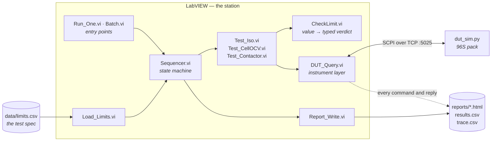
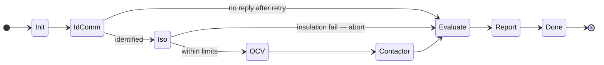

<div align="center">

# eol-station

**An end-of-line test station for a 96S battery pack, built in NI LabVIEW against a simulated DUT.**

[](https://www.ni.com/labview)
[](https://www.python.org)
[](#the-device-under-test)
[](#running-it)
[](LICENSE)

</div>

An EOL station is the machine at the end of a production line: it connects to a finished
unit, runs a fixed sequence of measurements, stamps it PASS or FAIL, and produces the
record that says why. This one tests battery packs.

The pack is simulated in software — no hardware, no high voltage — so the **station** is
the deliverable: the instrument layer, the sequencer, the limits, the verdict model, and
the evidence it leaves behind.

<!-- FIGURE 1 — uncomment once docs/img/01-sequencer-panel.png exists

-->

| | |
|---|---|
| **Application layer** | NI LabVIEW 2026 Q3 |
| **Instrument protocol** | SCPI over TCP, port 5025 |
| **DUT** | Python simulator — 96 cells, ~355 V nominal, deterministic seeded faults |
| **Outputs** | per-unit HTML report · `results.csv` · `trace.csv` command log |
| **Metrics** | first pass yield · first-failure Pareto · tester availability · cycle time |

---

## Contents

| | | |
|---|---|---|
| [Why this exists](#why-this-exists) | [Architecture](#architecture) | [The device under test](#the-device-under-test) |
| [Test specification](#test-specification) | [The sequencer](#the-sequencer) | [The verdict model](#the-verdict-model) |
| [Evidence](#evidence-the-station-leaves-behind) | [Batch metrics](#batch-metrics) | [Cycle time & frames](#cycle-time-and-frame-decoding) |
| [Repository layout](#repository-layout) | [Running it](#running-it) | [Design decisions](#design-decisions-worth-defending) |
| [Reproducible reference units](#reproducible-reference-units) | [Status](#status) | [License](#license) |

---

## Why this exists

I spent 18 months in production automotive firmware validation — CAN/LIN gateway logic on
a Body Control unit, diagnosed from bus traces. This project is a deliberate move from
*validating a product* to *building the machine that tests the product*, which is a
different discipline with different failure modes.

The interesting problems in EOL test are not the measurements. They are:

> **Where do the limits come from?** If they live on a block diagram, nobody can audit
> them, and changing one means editing every test that uses it.
>
> **Was that a bad unit, or a bad tester?** A yield number that mixes the two is worse
> than no yield number, because it sends engineers to fix the wrong thing.
>
> **What did the station actually send and receive?** Without that log, every failure
> investigation is a re-enactment.
>
> **How do you know the tester is right before you trust it?** You test a unit whose
> answers you already know.

Every design decision below is an answer to one of those four.

---

## Architecture



Three properties fall out of this shape:

**1 · The instrument layer is one VI.** Every command in the whole station goes through
`DUT_Query.vi`. It is the only place that knows about terminators, timeouts and framing —
and the only place that changes when the transport does.

**2 · Test steps share one connector pane.** All three take `(connection, limits, error)`
and return an array of typed results. The sequencer does not know which test it is
calling. Adding a fourth test is a new VI and one case, not a redesign.

**3 · Limits are data, not code.** They enter the station once, from a file under version
control, and travel down the call chain as a typed cluster.

<!-- FIGURE 2 — uncomment once docs/img/02-sequencer-diagram.png exists

-->

---

## The device under test

`simulator/dut_sim.py` is a single-file TCP server that behaves like a pack tester
interface. It is **deterministic**: the same seed always produces the same pack, so every
number in this README is reproducible from a clean checkout.

<details>
<summary><b>Command set</b> — SCPI-style, CRLF-terminated</summary>

<br>

| Command | Reply | Notes |
|---|---|---|
| `*IDN?` | `SIMU,BP96,SN-000123,FW1.0` | identification |
| `MEAS:ISO?` | `11.06` | insulation resistance, MΩ |
| `MEAS:VOLT:CELL? n` | `3.7757` | one cell, `0 ≤ n < 96` |
| `MEAS:CELL:BURST?` | `320:0EB2…;321:…` | all 96 cells as 24 packed frames |
| `MEAS:VOLT:PACK?` | `360.32` | pack terminal voltage — `ERR,CONT_OPEN` while open |
| `SYS:CONT CLOSE` | `OK` | close contactors — `ERR,CONT_FAULT` on a faulty unit |
| `SYS:CONT OPEN` | `OK` | open contactors — the safe state |
| `SYS:GOLDEN` | `OK,SN-GOLDEN` | load the known-good reference pack |
| `SYS:NEWUUT <seed>` | `OK,SN-000124` | load the next unit under test |

An out-of-range cell index returns `ERR,RANGE`; an unrecognised command returns
`ERR,SYNTAX`.

</details>

<details>
<summary><b>Injected faults</b> — deterministic, seed-driven</summary>

<br>

Every fifth seed carries a fault. The pattern cycles through four slots —
`BADCELL`, `ISO`, `CONT`, `BADCELL` — so bad cells appear twice as often as the other
two, which is roughly how a real line behaves.

| Fault | What the pack does | Which step catches it |
|---|---|---|
| `BADCELL` | cell 42 collapses to 3.31 V | **Cell OCV** — and ΔV as a consequence |
| `ISO` | insulation drops to 0.40 MΩ | **Insulation** — aborts the sequence |
| `CONT` | `SYS:CONT CLOSE` returns `ERR,CONT_FAULT` | **Contactor** |

Seeds not divisible by five are healthy. The golden unit is fault-free by construction:
all 96 cells at exactly 3.7000 V, insulation 10.00 MΩ.

</details>

<!-- FIGURE 3 — uncomment once docs/img/03-simulator-console.png exists

-->

---

## Reproducible reference units

Four seeds are used as fixtures throughout the build. Every value below was produced by
running `simulator/dut_sim.py`, not estimated:

| Seed | Serial | Insulation | Σ cells | ΔV | Injected fault | Expected first failure |
|---|---|---|---|---|---|---|
| **123** | `SN-000123` | 11.06 MΩ | 360.3158 V | 0.0396 V | — | *none — passes* |
| **120** | `SN-000120` | 5.22 MΩ | 356.7013 V | 0.4298 V | `BADCELL` cell 42 → 3.31 V | **CellOCV** |
| **125** | `SN-000125` | **0.40 MΩ** | 362.9687 V | 0.0392 V | `ISO` | **Insulation** → abort |
| **130** | `SN-000130` | 6.02 MΩ | 344.2818 V | 0.0383 V | `CONT` | **Contactor** |
| *golden* | `SN-GOLDEN` | 10.00 MΩ | 355.2000 V | 0.0000 V | — | *none — gates the batch* |

Seed 125 is the interesting one: insulation fails, the sequence aborts, and Cell OCV and
Contactor are written into the results as `Skipped` — never as `Pass`.

---

## Test specification

The full spec, including the rationale for the order of operations, is in
[`docs/TEST_SPEC.md`](docs/TEST_SPEC.md). Limits live in
[`data/limits.csv`](data/limits.csv) and are read at run time:

```csv
step,low,high,unit,source
Insulation,2.0,1000,MOhm,representative of published Li-ion EOL practice
CellOCV,3.50,3.85,V,cell operating window
DeltaV,0,0.05,V,cell-to-cell spread limit
PackVolt,-1.0,1.0,V,deviation from sum of cells
```

The `source` column is not decoration. On a real line every limit traces to a document
somebody signed. **A limit with no provenance is a guess with a decimal point.**

**The order of operations is not arbitrary:**

1. **ID & comms** — nothing downstream means anything if the unit cannot be identified.
2. **Insulation** — measured *before* any step that closes contactors. A pack with
   degraded isolation must never be energised.
3. **Cell OCV** — per-cell window, plus cell-to-cell spread as a derived check.
4. **Contactor** — only reached if insulation passed. Re-opened on **every** exit path,
   including the error path.

---

## The sequencer

`station/Sequencer.vi` is a state machine: a While loop, a Case Structure, and three shift
registers carrying the next state, the accumulating test data, and the error cluster.



Every case does the same four things: unbundle what it needs, call its test VI, append the
returned results, write the next state. That regularity is the point — it is the
step/sequence model **NI TestStand** implements, built by hand so its trade-offs are
understood rather than assumed.

An error on the error wire overrides the state selector at the top of the loop, so a
tester fault jumps straight to `Evaluate` rather than continuing to interrogate a DUT that
is not answering.

---

## The verdict model

Three outcomes, never two.

| Verdict | Meaning | Counts toward |
|---|---|---|
| 🟢 **PASS** | every executed step within limits | FPY numerator |
| 🔴 **DUT FAIL** | at least one limit violated | FPY denominator only |
| 🟡 **TESTER ERROR** | timeout, refused connection, protocol error after retry | availability — **excluded from FPY** |

The distinction is enforced at the source, inside `DUT_Query.vi`:

- a reply beginning `ERR,` is **data** — the DUT answered, and its answer was a refusal;
- an error on the LabVIEW error wire (56 timeout, 63 refused, 66 peer closed) is a
  **tester fault** — no answer was received at all.

Book them the wrong way round and the Pareto blames the product for the station's own
bugs, or scraps good packs because a cable fell out.

<details>
<summary><b>Why each step returns a typed result rather than a boolean</b></summary>

<br>

| Field | Purpose |
|---|---|
| `step name` | which step produced this row |
| `value` · `low` · `high` | what was measured, against what |
| `margin` | **signed** distance to the *nearest* limit |
| `duration ms` | per-step cycle time |
| `note` | worst cell index, raw DUT reply, or the reason for a skip |
| `status` | `NotRun` · `Pass` · `Fail` · `Skipped` |

`margin` is the field that earns its place. A line that says FAIL sends a technician
looking. A line that says

```
CellOCV   3.3100 V   limit 3.500–3.850   margin −0.1900   note "worst cell 42"
```

sends them to the right cell with the right expectation.

Positive margins matter too: a batch whose insulation margins drift from 9 MΩ toward
1 MΩ is telling you something months before anything fails.

</details>

---

## Evidence the station leaves behind

### Per unit — an HTML report

Pass/fail banner, serial, and the step table with measured values, limits, margins and
durations.

<!-- FIGURE 4 — uncomment once docs/img/04-report-pass.png exists

-->

<!-- FIGURE 5 — uncomment once docs/img/05-report-fail.png exists

-->

### Per batch — `results.csv`

One row per unit: serial, verdict, first failed step, per-step values, duration. This is
the file that becomes the yield analysis.

### Always — `trace.csv`

Every command sent and every reply received, timestamped, with elapsed time per
transaction. Written inside `DUT_Query.vi`, so no code path can bypass it.

```csv
timestamp,command,reply,elapsed_ms
2026-08-08T22:14:07.412,*IDN?,"SIMU,BP96,SN-000123,FW1.0",0.79
2026-08-08T22:14:07.418,MEAS:ISO?,11.06,0.62
2026-08-08T22:14:07.425,SYS:CONT CLOSE,OK,0.55
```

Timestamps are written `%Y-%m-%dT%H:%M:%S%3u` — ISO 8601, so the file sorts correctly and
does not depend on the machine's regional settings. Replies are quoted, because a reply
containing commas would otherwise become four columns.

> **A known limitation, documented rather than hidden.** LabVIEW's File I/O nodes pass an
> incoming error straight through without acting, so a command that fails at the TCP layer
> produces no trace row — the one exchange you most want to see is the one that is missing.
> The DUT faults this project exists to catch all come back as valid replies, so the log
> covers them; the transport-failure path is instrumented separately in session 9.

---

## Batch metrics

`station/Batch.vi` runs 30 units and produces the numbers a line actually reports.

**The golden gate runs first.** Before any real unit, the station tests `SYS:GOLDEN` — a
pack whose values are known exactly. If the golden unit does not pass, **the station is
wrong and the batch does not proceed.** Testing 30 units with a broken tester produces 30
wrong answers and a confident report.

| Metric | Definition |
|---|---|
| **First pass yield** | units passing on first attempt ÷ units started |
| **First-failure Pareto** | count of units grouped by the *first* step that failed |
| **Tester availability** | 1 − (tester errors ÷ units started) |
| **Cycle time** | total sequence duration per unit, and per step |

The Pareto attributes each reject to its **first** failing step, not every failing step.
A collapsed cell is the physical cause; the wide ΔV that follows is its consequence.
Counting both double-counts one defect and points the improvement effort at a symptom.

<!-- FIGURE 6 — uncomment once docs/img/06-batch-metrics.png exists

-->

| Batch result | Value |
|---|---|
| Units started | *pending — session 7* |
| First pass yield | *pending* |
| Tester availability | *pending* |
| First-failure Pareto | *pending* |

---

## Cycle time and frame decoding

The first working OCV test sends 96 separate `MEAS:VOLT:CELL?` queries. It is correct and
it is slow, and on a real line slow means fewer units per hour.

`MEAS:CELL:BURST?` returns the whole pack as 24 CAN-style frames in one transaction:

```
32A:0EB30EB20EB30EBC
│   │   │   │   └── cell 43 = 0x0EBC = 3772 mV = 3.772 V
│   │   │   └────── cell 42 = 0x0EB3 = 3763 mV
│   │   └────────── cell 41
│   └────────────── cell 40
└────────────────── frame ID 0x32A  (0x320 + frame index 10)
```

Four cells per frame, each a 16-bit unsigned integer in millivolts, big-endian,
hex-encoded. 96 cells ÷ 4 = **24 frames**, IDs `0x320`–`0x337`.

**The improvement is measured, not asserted.** `station/Compare_OCV.vi` runs both paths
against the same unit and reports the maximum absolute difference across all 96 cells —
the decoder must agree with the per-cell path before the fast path is trusted. Both
timings come from `lib/Stopwatch.vi`, same machine, same run.

| | Per-cell path | Burst path |
|---|---|---|
| Transactions per unit | 96 | **1** |
| OCV step duration | *pending — session 8* | *pending* |
| Max deviation vs per-cell | — | *pending* |

<!-- FIGURE 7 — uncomment once docs/img/07-compare-ocv.png exists

-->

The 96-query version is kept, not deleted. It is the reference the fast path is verified
against, and the baseline the improvement is measured from.

---

## Repository layout

<details>
<summary><b>Full tree</b></summary>

<br>

```
eol-station/
├── data/
│   └── limits.csv                 test limits — the spec, under version control
├── docs/
│   ├── TEST_SPEC.md               order of operations, verdict model, open points
│   └── img/                       figures referenced by this README
├── lib/                           reusable VIs and type definitions
│   ├── DUT_Query.vi               the instrument layer — one command, one reply, traced
│   ├── Tick.vi                    ordered timing via an error-wire pass-through
│   ├── Timestamp_ms.vi            monotonic millisecond stamp for step durations
│   ├── Stopwatch.vi               elapsed-time instrument for cycle-time work
│   ├── Load_Limits.vi             limits.csv → typed Limits cluster
│   ├── Limit_Lookup.vi            one step name → low, high, found?
│   ├── CheckLimit.vi              value + limits → typed Result with signed margin
│   ├── Test_Iso.vi                insulation resistance
│   ├── Test_CellOCV.vi            per-cell OCV and spread — 96-query reference path
│   ├── Test_CellOCV_Burst.vi      per-cell OCV via packed frames — fast path
│   ├── Test_Contactor.vi          close, cross-check against Σ cells, always re-open
│   ├── Judge_OCV.vi               one judgment shared by both OCV paths
│   ├── Stamp.vi                   serial, start time and duration onto the test record
│   ├── Report_Write.vi            per-unit HTML report and CSV row
│   └── *.ctl                      Limits · Result · StepStatus · TestState · TestData · Verdict
├── reports/
│   └── sample/                    committed example reports — evidence, not output
├── simulator/
│   └── dut_sim.py                 the DUT
├── station/
│   ├── Bench.vi                   send one command by hand
│   ├── Bench_Tests.vi             exercise any single test VI
│   ├── Sequencer.vi               the state machine
│   ├── Run_One.vi                 one unit, end to end
│   ├── Batch.vi                   golden gate + 30 units + metrics
│   └── Compare_OCV.vi             burst path vs per-cell path
└── eol-station.lvproj
```

`*.vi` and `*.ctl` are marked **binary** in `.gitattributes` — git must never attempt to
merge them. Runtime output (`trace.csv`, `results.csv`, `reports/*.html`) is ignored; the
committed samples under `reports/sample/` are the deliberate exception, kept as evidence.

</details>

<!-- FIGURE 8 — uncomment once docs/img/08-project-explorer.png exists

-->

---

## Running it

**Requirements:** NI LabVIEW 2026 Q3 (Community edition is sufficient) and Python 3.8+.
No hardware, no toolkits, no NI drivers.

```bash
# terminal 1 — the DUT
python simulator/dut_sim.py
# listening on 127.0.0.1:5025
```

Then in LabVIEW:

1. Open `eol-station.lvproj`.
2. Run `station/Run_One.vi` for a single unit — set `seed`, press run.
3. Run `station/Batch.vi` for the golden gate, 30 units and the metrics.

Reports land in `reports/`. The command log appends to `data/trace.csv`.

<details>
<summary><b>⚠ Do not stop a running VI with the abort button</b></summary>

<br>

Aborting a LabVIEW VI does not close open TCP connections. The refnum stays open until
LabVIEW is closed, and the simulator — which serves one client at a time — stays blocked
inside `recv()` on a dead socket and never returns to `accept()`. Every subsequent run
then connects but never gets an answer, and dies with **error 56**.

**Symptom:** it worked five minutes ago and now everything times out.

**Cure:** <kbd>Ctrl</kbd>+<kbd>C</kbd> in the Python terminal, restart the simulator,
*and* close and reopen the VI so the stale refnum is dropped.

**Prevention:** stop through the loop's stop control, and keep the Python terminal
visible. It prints `client connected` and `client disconnected`; two connects with no
disconnect between them means something was aborted.

</details>

---

## Design decisions worth defending

<details open>
<summary><b>Six decisions, and the reasoning behind each</b></summary>

<br>

**Limits in a file, not on a diagram.** On a real line, limits come from a specification
signed off by Quality; a test engineer does not type them into a tester. Reading them from
a version-controlled file is the difference between a demo and something that looks like
production. It paid for itself the first time a limit moved: one line in one text file,
not three edits across three block diagrams.

**One instrument VI, not scattered TCP calls.** Every command goes through
`DUT_Query.vi`. That is why the trace log cannot be bypassed, why timeouts are consistent,
and why moving from TCP to VISA later is one VI's worth of work.

**The refnum is chained, not branched.** Passing the connection through each call —
`connection ID` in, `connection ID out` — forces execution order through data dependency.
LabVIEW is a dataflow language: two nodes that share a connection but not a wire have no
defined order between them, and the resulting bug appears only under load.

**A skipped step is `Skipped`.** Not `Pass`, not `Fail`. Rolling a skip into either
corrupts both the yield number and the Pareto. A skipped test recorded as a pass is how
bad units ship.

**The golden unit gates the batch.** Testing the tester before trusting it is cheap, and
it is the difference between a station and a script.

**The slow path is kept.** The 96-query OCV test still exists after the burst decoder
works, because an optimisation you cannot verify against a reference is a guess.

</details>

---

## Status

| Session | Delivers | State |
|---|---|---|
| 1–2 | Project skeleton, DUT simulator | ✅ complete |
| 3 | Instrument layer — `DUT_Query.vi`, `Tick.vi`, trace log | ✅ complete |
| 4 | `limits.csv` + `Load_Limits.vi`, `CheckLimit.vi`, three test steps | ✅ complete |
| 5 | `Sequencer.vi` — the state machine, `Run_One.vi` | 🔨 in progress |
| 6 | `Report_Write.vi` — HTML report and CSV row | ⬜ specified |
| 7 | `Batch.vi` — golden gate, 30 units, FPY, Pareto | ⬜ specified |
| 8 | Frame decoder and the measured cycle-time improvement | ⬜ specified |
| 9 | Fault injection, root-cause walkthrough, sample evidence | ⬜ specified |

The architecture and the test specification are complete and are not expected to change.
Sections above describing sessions 5–9 document intended behaviour; every table marked
*pending* is filled with measured values as that session lands. **Nothing in this README
claims a result the repository cannot produce.**

### Scope and honesty

This is a personal project. The pack is simulated in software — there is no hardware and
no high voltage anywhere in it. The limits are representative of published practice, not
calibrated against a real cell chemistry, and no measurement system analysis has been
performed. What it demonstrates is the **structure** of an EOL station and the reasoning
behind it, not a qualified test process.

---

## License

MIT — see [LICENSE](LICENSE).
