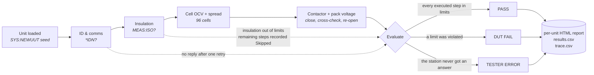

# Overview

This page says what an end-of-line test station is, what this one measures, and — just as
important — what is actually built versus what is only written down. It is the entry point
for anyone evaluating the project: a hiring manager, a test engineer, or me in six months.

## What an end-of-line station is

An EOL station is the machine at the end of a production line. A finished unit arrives, the
station connects to it, runs a fixed sequence of measurements against limits it did not
invent, stamps the unit PASS or FAIL, and produces the record that says why. It is the last
point at which a defect costs the factory instead of the customer.

The measurements are rarely the hard part. Reading an insulation resistance is one command.
The hard part is everything around the measurement: where the limit came from, whether a
failure belonged to the product or to the tester, what the station actually said to the unit,
and how anybody knows the station is telling the truth today.

This project is a station for a 96-cell-series battery pack, roughly 355 V nominal. The pack
is a Python program — [`simulator/dut_sim.py`](../simulator/dut_sim.py) — that speaks
SCPI-style commands over TCP on port 5025 and answers deterministically from a seed. There is
no hardware and no high voltage anywhere in it. The station is the deliverable.

## The four questions

Every structural decision in this repository is an answer to one of four questions. If you
read nothing else, read this table and then the chapter it points at.

| Question | The answer built here | Chapter |
|---|---|---|
| **Where do the limits come from?** | Limits live in [`data/limits.csv`](../data/limits.csv) with a `source` column naming their provenance, and are read at run time by `Load_Limits.vi`. No number is typed onto a block diagram. | [Test specification](04-test-specification.md) |
| **Was that a bad unit, or a bad tester?** | Three verdicts, not two. A reply beginning `ERR,` is the DUT answering with a refusal — that is data. A LabVIEW error on the wire means no answer arrived — that is a station fault, and it is excluded from yield. | [The verdict model](08-verdict-model.md) |
| **What did the station send and receive?** | Every command in the station goes through one VI, and that VI appends a timestamped row to `data/trace.csv`. No code path can bypass it. | [The instrument layer](05-instrument-layer.md) · [Reporting](09-reporting.md) |
| **How do you know the tester is right?** | A golden unit with known-exact values (`SYS:GOLDEN`, all 96 cells at 3.7000 V, insulation 10.00 MΩ) is tested before every batch. If it does not pass, the batch does not run. | [Batch metrics](10-batch-metrics.md) |

None of these are exotic. They are the questions a test-engineering interview opens with, and
a station that has no answer to them is a script with a front panel.

## One unit, start to finish

Four steps in a fixed order, then a single verdict, then evidence.

The order is not arbitrary. Identification comes first because nothing downstream means
anything if the unit cannot be named. Insulation is measured **before** any step that closes
contactors — a pack with degraded isolation must never be energised — and a failure there
aborts the rest of the sequence. Cell OCV checks each of the 96 cells against a window and
derives the cell-to-cell spread from the same 96 readings. The contactor step closes,
cross-checks pack terminal voltage against the sum of the cells, and re-opens on every exit
path including the error path.

Seed 125 is the unit worth understanding: insulation reads 0.40 MΩ against a 2.0 MΩ floor, the
sequence aborts, and Cell OCV and Contactor are written into the record as `Skipped` — never
as `Pass`, never as `Fail`. That single distinction is what keeps the yield number and the
Pareto honest. See [failure injection](12-failure-injection.md) for the other three fixture
seeds.

*This is the specified operator panel, drawn from the design — `Sequencer.vi` is in build now,
so it is not a screenshot of a running VI. Three LEDs rather than one, because a single
boolean has two states and this station has three outcomes.*

## What is built, and what is only specified

The repository is honest about this on every page, and so is this one.

<b>Build state by session</b>

 

| Session | Delivers | State |
|---|---|---|
| 1–2 | Repository skeleton, DUT simulator, test spec, limits file | ✅ built |
| 3 | Instrument layer — `DUT_Query.vi`, `Tick.vi`, the trace log | ✅ built |
| 4 | `Load_Limits.vi`, `Limit_Lookup.vi`, `CheckLimit.vi`, the three test steps | ✅ built |
| 5 | Type definitions, aligned test VIs, `Sequencer.vi`, `Run_One.vi` | 🔨 in progress |
| 6 | `Stamp.vi`, `Report_Write.vi` — HTML report and CSV row | ⬜ specified |
| 7 | `Batch.vi` — golden gate, 30 units, FPY, Pareto, availability | ⬜ specified |
| 8 | `Stopwatch.vi`, `Judge_OCV.vi`, burst decoder, measured cycle time | ⬜ specified |
| 9 | Fault injection, root-cause walkthrough, sample evidence | ⬜ specified |

Sessions 6 to 9 are fully specified — interfaces, invariants and failure modes are documented
in these pages — but the VIs do not exist yet. Wherever a page would otherwise quote a
measured result from unbuilt code, it says *pending* instead. A number in these pages either
came out of the simulator or out of a VI that runs.

## Scope and honesty

This is a personal project, and the following are true and stated up front rather than
discovered by a reader:

- The DUT is **simulated**. There is no hardware, no fixture, no high voltage, and no real
  cell chemistry behind any number.
- The limits are **representative of published practice, not calibrated**. `docs/TEST_SPEC.md`
  is marked draft v0.1 and lists the open points, including one limit — the 3.50 V cell floor —
  that was relaxed from 3.55 V to fit the *simulator's* OCV model rather than a datasheet. That
  is documented in [the test specification](04-test-specification.md) precisely because it is
  the kind of decision that should never be silent.
- **No measurement system analysis** has been performed. No gauge R&R, no repeatability study,
  no uncertainty budget. Nothing here is a qualified test process.
- Timing numbers, when they land, come from one developer machine over TCP loopback. They
  demonstrate a method for measuring cycle time, not a throughput claim.

What the project demonstrates is the **structure** of an EOL station and the reasoning behind
each piece of it. That is the thing that transfers to real hardware; the numbers would not.

## How to read this documentation

Fifteen chapters, and you almost certainly do not want all of them.

- **Evaluating the design** — start with [Architecture](02-architecture.md), then
  [The sequencer](07-sequencer.md), [The verdict model](08-verdict-model.md) and
  [LabVIEW design notes](13-labview-design-notes.md). Those four carry the trade-offs.
- **Interested in the measurements** — [The DUT simulator](03-dut-simulator.md),
  [Test specification](04-test-specification.md), [The test steps](06-test-steps.md) and
  [Cycle time and frame decoding](11-cycle-time.md).
- **Interested in what a line actually gets out of it** — [Reporting and evidence](09-reporting.md),
  [Batch metrics](10-batch-metrics.md) and [Failure injection and root cause](12-failure-injection.md).
- **Wondering how this maps to commercial tooling** — [Mapping to NI TestStand](14-teststand-mapping.md).
  The sequencer here is a hand-built step/sequence model; that chapter says what TestStand
  would replace and what it would cost.
- Unfamiliar terms are in the [glossary](glossary.md).

<!-- nav -->
---

| | | |
|:--|:-:|--:|
| &nbsp; | [Documentation index](README.md) | [Architecture](02-architecture.md) → |
