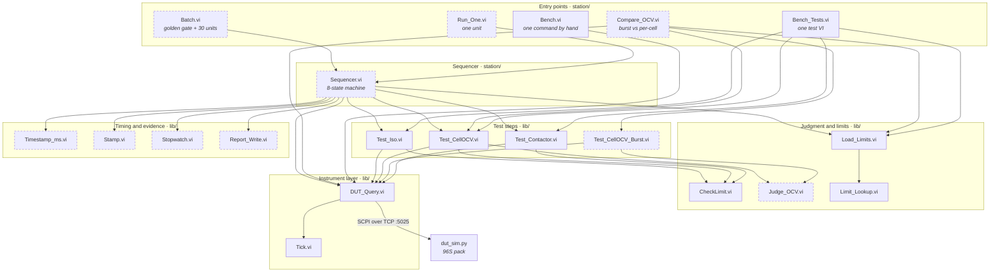
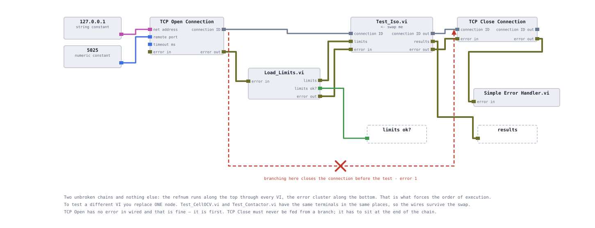
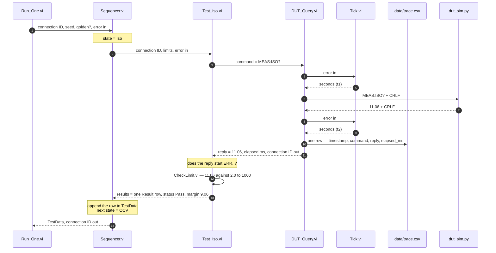
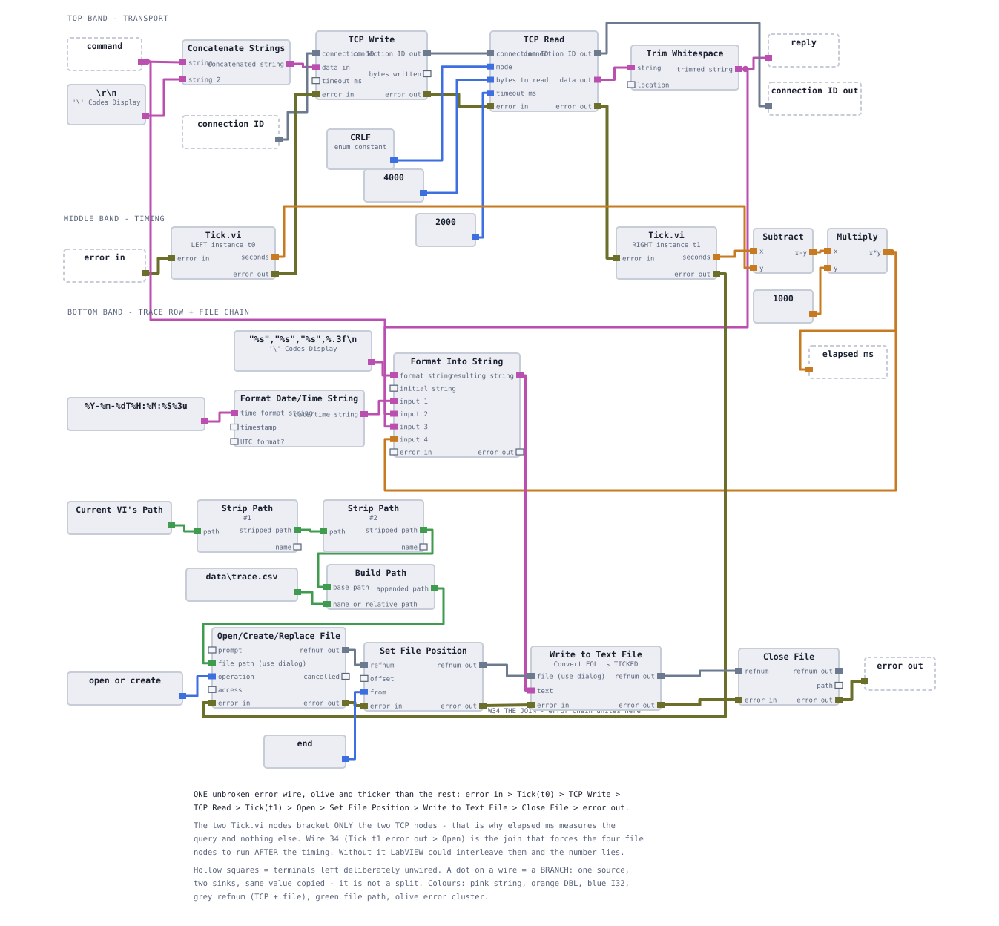
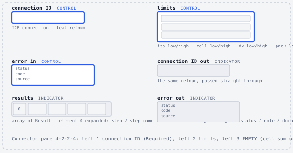
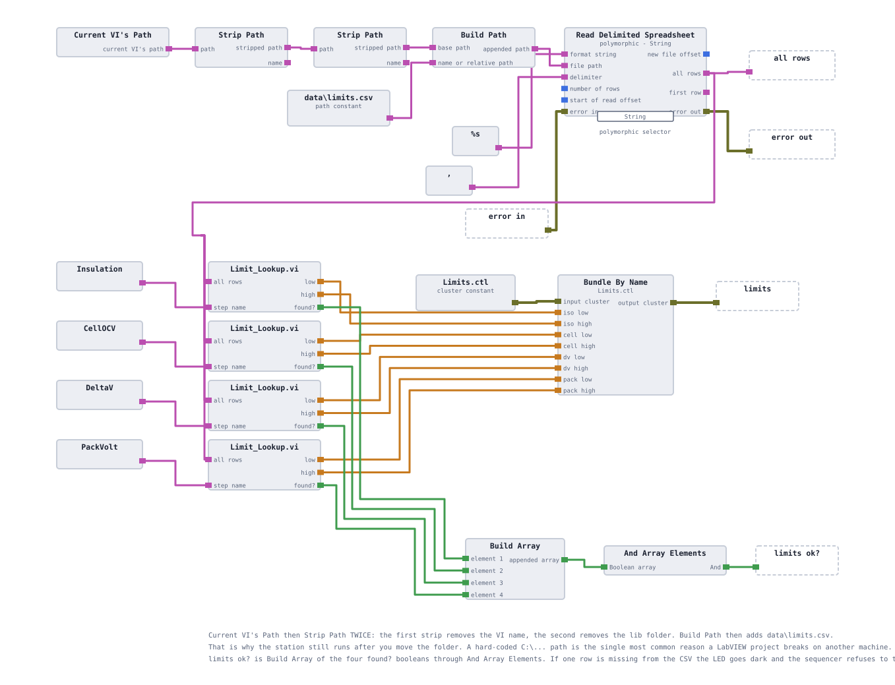

# Architecture

This page describes the shape of the station: which layers exist, what each one is allowed to
do, how a single measurement travels from an entry-point VI down to a TCP socket and back, and
what every VI in the repository is for. It is written for someone deciding whether the design
would survive contact with real hardware and a second engineer.

**On this page**

- [The layers](#the-layers)
- [The call graph](#the-call-graph)
- [One measurement, end to end](#one-measurement-end-to-end)
- [Property 1 — the instrument layer is one VI](#property-1--the-instrument-layer-is-one-vi)
- [Property 2 — every test step has the same connector pane](#property-2--every-test-step-has-the-same-connector-pane)
- [Property 3 — limits are data](#property-3--limits-are-data)
- [VI inventory](#vi-inventory)

## The layers

Six layers, each with one job and an explicit list of things it does not do. The "does not"
column is the load-bearing one: it is what stops the station turning into a single VI with a
thousand nodes in it.

| Layer | Lives in | Responsibility | Deliberately does not |
|---|---|---|---|
| **Entry points** | `station/` | Own the TCP socket — open it, run something through it, close it. Decide how many units to test. | Judge anything, or know what a step measures |
| **Sequencer** | `station/` | Order the steps, apply the abort policy, produce one verdict and one record per unit | Open or close the connection — the caller owns it |
| **Test steps** | `lib/` | Acquire one physical quantity and return typed result rows | Decide the unit's verdict, or manage the connection lifetime |
| **Judgment and limits** | `lib/` | Turn a number and a window into a typed `Result` with a signed margin; get the window out of a file | Touch the network |
| **Instrument layer** | `lib/` | One command out, one trimmed reply back, one timestamped trace row, one round-trip time | Interpret the reply or know what a measurement means |
| **DUT** | `simulator/` | Answer deterministically from a seed | — |

Two consequences worth stating explicitly, because they are the ones that get violated first
in real projects.

**The sequencer does not own the socket.** `Sequencer.vi` takes `connection ID` in and hands
`connection ID out` back, exactly like every other VI in the chain. That is what lets
`Batch.vi` open one connection and push thirty units through it, and it is what lets
`Run_One.vi` open, run and close in three nodes.

**The sequencer talks to the DUT in exactly two places.** Everything else is delegated to a
test step. The two exceptions are the identification query in the `IdComm` state, and the
unconditional `SYS:CONT OPEN` after the While loop ends — a safe-state command that must run
on every exit path, including the path where everything else has already failed. See
[the sequencer](07-sequencer.md) for why that one sits outside the loop with a Clear Errors in
front of it.

## The call graph

Who calls whom. Dashed outlines are specified but not yet built — see
[the overview](01-overview.md#what-is-built-and-what-is-only-specified) for the build state.



Everything above the instrument layer is a tree, and everything funnels into one node at the
bottom. That is the whole architectural claim, and the next three sections are what it buys.

`Bench.vi` and `Bench_Tests.vi` are not part of the production path. `Bench.vi` sends one
typed command and shows the reply — a multimeter for the protocol. `Bench_Tests.vi` runs a
single test VI against the simulator with a real limits cluster, so a step can be verified in
isolation before the sequencer exists. Both stay in the repository permanently; a station you
cannot poke by hand is a station you debug by guessing.



## One measurement, end to end

One unit, one step: the insulation measurement, from the entry point down to the socket and
back. Read it as the pattern — the other steps differ only in how many round trips they make
and what arithmetic they do on the way back.



Four things in that trace are design decisions rather than plumbing.

**The two `Tick.vi` calls bracket the write/read pair and nothing else.** `Tick.vi` wraps a
single clock-read node whose only purpose is to acquire an `error in` terminal. A LabVIEW node
with no inputs has no data dependency, so the language is free to run it whenever it likes;
diagram position constrains nothing. Wrapping the read in a SubVI with error terminals is the
only mechanism in the language — short of a sequence structure — that pins it to a point in a
chain. Get this wrong and `elapsed ms` is a plausible-looking number that measures nothing.

**The trace row is written inside `DUT_Query.vi`, downstream of the second tick.** No caller
can bypass the log, and the cost of logging is not inside the interval being timed. The known
limitation — a command that fails at the TCP layer produces no trace row, because LabVIEW File
I/O nodes pass an incoming error straight through — is documented in
[the instrument layer](05-instrument-layer.md) rather than hidden.

**The `ERR,` guard sits above the number conversion.** `Fract/Exp String To Number` does not
fail on a non-numeric string; it quietly returns `0`. Without the guard, an `ERR,CONT_OPEN`
reply becomes a measurement of 0.00 MΩ — a catastrophic failure that never happened, and a
DUT fault booked as a station fault. Every test VI checks the first four characters of the
reply before converting it.

**The refnum is chained, never branched.** `connection ID` in, `connection ID out` out, at
every level. Two nodes that share a connection but not a wire have no defined order between
them in a dataflow language, and the resulting bug shows up under load rather than on the
bench. More on that in [LabVIEW design notes](13-labview-design-notes.md).

## Property 1 — the instrument layer is one VI

Every command the station sends — from `*IDN?` to the final `SYS:CONT OPEN` — goes through
`DUT_Query.vi`. It is the only VI in the repository that knows about terminators, timeouts,
byte counts and framing.



Its interface is deliberately small: `command` and `connection ID` in, `reply`, `elapsed ms`
and `connection ID out` out, error cluster through. The caller passes a bare command string —
`DUT_Query.vi` appends the terminator itself, which is why no test VI contains a `\r\n`
anywhere. Sessions 8 and 9 add two optional inputs, `trace?` and `timeout ms`, without changing
the pattern, so no caller is relinked.

Four things follow from having exactly one of these:

- The trace log **cannot** be bypassed, because there is nowhere else to send a command from.
- Timeouts are consistent across the whole station, and changing one changes all of them.
- Moving from TCP to VISA, or to a real instrument driver, is one VI's worth of work.
- Per-command timing exists everywhere for free, which is what
  [cycle time](11-cycle-time.md) is built on.

The single point of change is also a single point of failure, and that is the honest trade:
a bug in `DUT_Query.vi` is a bug in every measurement. The mitigation is that it is thirty
nodes long, it has a one-command bench harness (`Bench.vi`), and its error chain is verified by
deliberately breaking it — closing the simulator to force error 63, and corrupting the
terminator to force error 56.

## Property 2 — every test step has the same connector pane

All three test VIs use the same twelve-cell connector pane (LabVIEW lists it under Patterns as
4-2-2-4: four cells down each side, two along the top and bottom). Nine of the twelve cells
carry the same object on every VI; exactly one cell on each side differs.

<details>
<summary><b>The shared cell map</b> — what sits in each of the twelve cells</summary>

<br>

| Cell | `Test_Iso.vi` | `Test_CellOCV.vi` | `Test_Contactor.vi` |
|---|---|---|---|
| left 1 | `connection ID` — TCP connection refnum, **Required** | same | same |
| left 2 | `limits` — the `Limits` cluster from `Load_Limits.vi` | same | same |
| left 3 | *empty* | *empty* | `cell sum` (DBL) |
| left 4 | `error in` — **Recommended** | same | same |
| right 1 | `connection ID out` | same | same |
| right 2 | `results` — array of `Result` | same | same |
| right 3 | *empty* | `cell sum` (DBL) | *empty* |
| right 4 | `error out` | same | same |

The third cell on each side is the only difference. `Test_CellOCV.vi` produces the sum of the
96 cell voltages; `Test_Contactor.vi` consumes it, so that the measured pack terminal voltage
can be cross-checked against it. Two of the twelve cells carry that one dependency, and the
other ten are identical everywhere.

`Test_CellOCV_Burst.vi` reproduces this map exactly and adds `log frames?` in a spare cell,
marked **Optional** — which is what makes it a one-right-click replacement for
`Test_CellOCV.vi` inside the sequencer. Optional is right for a debug switch and would be
wrong for a refnum: an unwired Optional input silently uses the control's default.

</details>



The reason for the uniformity is that it makes the sequencer's cases identical. Every case does
the same four things — unbundle what it needs, call its test VI, append the returned rows,
write the next state — because the sequencer does not know or care which test it is calling.
It knows only that a step takes a connection and a limits cluster and hands back an array of
typed results.

Three practical consequences:

1. **Adding a fourth test is a new VI and one case**, not a redesign. "How would you add a DCIR
   test?" has a ten-minute answer, and it is only true because of this shape.
2. **Swapping one step for another keeps every wire.** `Bench_Tests.vi` swaps between all three
   test VIs with `Replace ▸ Select a VI…`; because the panes match, only the third-cell wire
   ever breaks. The same mechanism swaps `Test_CellOCV.vi` for `Test_CellOCV_Burst.vi` inside
   the sequencer when the fast path is trusted.
3. **The pattern must never change.** Changing a connector pane pattern relinks the VI and
   breaks every caller's wiring. `Sequencer.vi` therefore reserves an unused right-hand cell up
   front for the CSV row that session 6 adds — a spare cell costs nothing now and an hour later.

This is, in miniature, what NI TestStand calls a step type. Building it by hand is the point:
[the TestStand mapping](14-teststand-mapping.md) says what the commercial tool would replace
and what that would cost.

## Property 3 — limits are data

No number that decides a pass or a fail appears on a block diagram. All eight of them live in
[`data/limits.csv`](../data/limits.csv), under version control, with a `source` column naming
where each one came from:

```csv
step,low,high,unit,source
Insulation,2.0,1000,MOhm,representative of published Li-ion EOL practice
CellOCV,3.50,3.85,V,cell operating window
DeltaV,0,0.05,V,cell-to-cell spread limit
PackVolt,-1.0,1.0,V,deviation from sum of cells
```

`Load_Limits.vi` reads the file once per run, calls `Limit_Lookup.vi` four times — one per step
name — and bundles the eight numbers into a `Limits` cluster that travels down the call chain
by wire. It also returns `limits ok?`, the AND of the four lookups' `found?` outputs, so a
misspelled or missing row is loud rather than silently zero. Its path is derived from the VI's
own location rather than hard-coded, so a clone runs from any folder.



The `source` column is the part that matters and the part that is easiest to skip. On a real
line every limit traces to a document somebody signed. A limit with no provenance is a guess
with a decimal point — and in this project one of the four is openly a fitted value, not a
datasheet value: the 3.50 V cell floor was relaxed from 3.55 V because the simulator's own OCV
model can produce healthy cells as low as 3.5200 V. That reasoning is written down in
[the test specification](04-test-specification.md) instead of living in someone's memory.

The payoff is measurable in edits. Changing that one limit was one line in one text file. With
the number typed onto diagrams it would have been three edits across three block diagrams, and
the fourth place that also had it would have been found six weeks later.

## VI inventory

Everything in the repository, what it does, and whether it exists. **Built** means it is in the
commit and runs against the simulator. **In build** means session 5 is creating it now.
**Specified** means its interface, invariants and failure modes are documented — in these pages
and in the build guide — but the file does not exist yet.

| VI or type | Layer | What it does | State |
|---|---|---|---|
| `simulator/dut_sim.py` | DUT | 96-cell pack over TCP :5025, deterministic from a seed, four injected fault types | ✅ built |
| `lib/DUT_Query.vi` | Instrument | One command → trimmed reply, round-trip time, one trace row | ✅ built |
| `lib/Tick.vi` | Instrument | A clock read with error terminals, so it can be ordered | ✅ built |
| `lib/Load_Limits.vi` | Limits | `limits.csv` → `Limits` cluster + `limits ok?` | ✅ built |
| `lib/Limit_Lookup.vi` | Limits | 2-D CSV rows + a step name → `low`, `high`, `found?` | ✅ built |
| `lib/CheckLimit.vi` | Judgment | value + window + step name + note → one `Result` with a **signed** margin | ✅ built |
| `lib/Test_Iso.vi` | Test step | `MEAS:ISO?`, guarded and judged → one `Result` row | ✅ built |
| `lib/Test_CellOCV.vi` | Test step | 96 × `MEAS:VOLT:CELL?` → worst-cell row + spread row + cell sum | ✅ built |
| `lib/Test_Contactor.vi` | Test step | Close, cross-check pack V against Σ cells, re-open on every path → two rows | ✅ built |
| `lib/Limits.ctl` | Type | The eight limit numbers as one cluster | ✅ built |
| `lib/Result.ctl` | Type | One report row: name, value, low, high, margin, duration, note, status | ✅ built |
| `lib/StepStatus.ctl` | Type | `NotRun` · `Pass` · `Fail` · `Skipped` — `NotRun` is item 0 on purpose | ✅ built |
| `lib/TestState.ctl` | Type | The eight sequencer states; also the `step` field on every `Result` | 🔨 in build |
| `lib/Verdict.ctl` | Type | `Pass` · `DutFail` · `TesterError` | 🔨 in build |
| `lib/TestData.ctl` | Type | Everything known about one unit — serial, results, verdict, first failed step, timing, note | 🔨 in build |
| `station/Sequencer.vi` | Sequencer | While loop, eight-case state machine, three shift registers, abort policy, verdict | 🔨 in build |
| `lib/Timestamp_ms.vi` | Timing | Millisecond clock read pinned to a point in the error chain | ⬜ specified |
| `lib/Stamp.vi` | Timing | Millisecond count and a timestamp, for the per-unit record | ⬜ specified |
| `lib/Stopwatch.vi` | Timing | Elapsed-seconds instrument used to bracket one step for cycle-time work | ⬜ specified |
| `lib/Judge_OCV.vi` | Judgment | The OCV judgment extracted once, so both acquisition paths judge identically | ⬜ specified |
| `lib/Test_CellOCV_Burst.vi` | Test step | Same pack, one `MEAS:CELL:BURST?` round trip, 24 frames decoded | ⬜ specified |
| `lib/Report_Write.vi` | Evidence | One `TestData` → an HTML file, one CSV row, and the first failing step name | ⬜ specified |
| `station/Run_One.vi` | Entry point | Open, run one unit through the sequencer, close | ⬜ specified |
| `station/Batch.vi` | Entry point | Golden gate, then 30 units, then FPY, Pareto and availability | ⬜ specified |
| `station/Compare_OCV.vi` | Entry point | Runs both OCV paths against the same unit and reports the maximum deviation | ⬜ specified |
| `station/Bench.vi` | Entry point | Send one command by hand, see the reply and the round-trip time | ✅ built |
| `station/Bench_Tests.vi` | Entry point | Run any single test VI against the simulator with real limits | ✅ built |

`station/Scratch.vi` is also in the repository. It is an early practice VI from session 1,
nothing calls it, and it is not part of the station.

Notice what is absent from this list: there is no configuration VI, no global variable, no
functional global, and no VI that both talks to the DUT and decides something. Each of those
would be a shortcut worth taking on a one-evening demo and worth refusing here — see
[LabVIEW design notes](13-labview-design-notes.md) for the ones that were tempting.

<!-- nav -->
---

| | | |
|:--|:-:|--:|
| ← [Overview](01-overview.md) | [Documentation index](README.md) | [The DUT simulator](03-dut-simulator.md) → |
