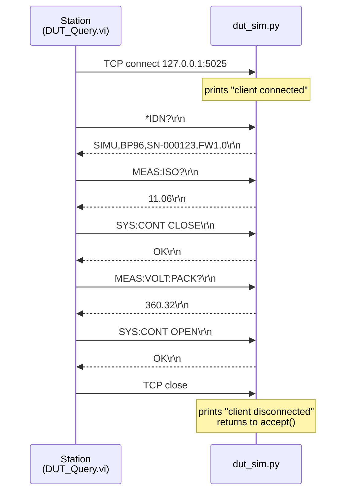
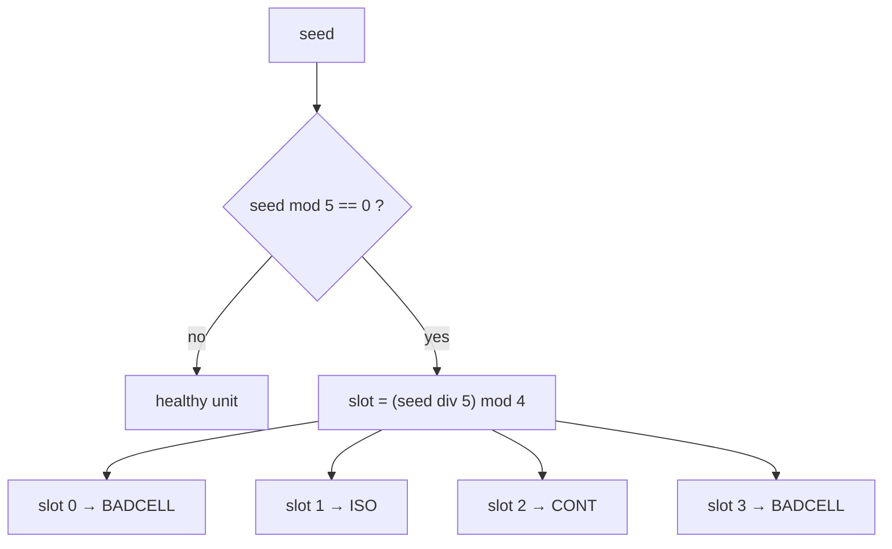

# The DUT simulator

The device under test is a Python program. This page documents what it models, the protocol
it speaks, how its faults are injected, and the fixture units every number in this
documentation is measured against. If you want to know whether a result quoted elsewhere is
real, this is the page that tells you how to reproduce it.

**On this page:** [What it models](#what-it-models) · [Protocol](#protocol) ·
[Command set](#command-set) · [The fault model](#the-fault-model) ·
[Reference units](#reference-units) · [Statefulness](#statefulness-and-why-it-matters) ·
[Limits of the model](#what-the-model-does-not-do)

## What it models

[`simulator/dut_sim.py`](../simulator/dut_sim.py) is a single file, standard library only, no
dependencies. It presents one battery pack over a TCP socket:

| Property | Value |
|---|---|
| Cells in series | 96 |
| Nominal pack voltage | ~355 V (sum of 96 cells at ~3.7 V) |
| Listen address | `127.0.0.1:5025` |
| Concurrency | one client at a time (`listen(1)`, sequential `accept`) |
| Determinism | full — a seed fixes every cell voltage and every fault |

A pack is generated from its seed, not stored:

```python
self.soc   = 0.45 + (seed % 21) / 100.0        # 0.45 … 0.65
base       = 3.0 + 1.2 * self.soc              # 3.54 … 3.78 V
self.cells = [round(base + r.uniform(-0.02, 0.02), 4) for _ in range(96)]
self.iso   = round(5.0 + r.uniform(0, 15), 2)  # 5 … 20 MΩ
```

Two properties of that model matter downstream and are worth stating plainly:

**Cells sit in a ±0.02 V band around a per-unit base.** Across 96 draws the sample nearly
fills the band, so a healthy pack's cell-to-cell spread lands close to 0.040 V against a
0.05 V limit. Healthy units therefore pass the spread check with a deliberately thin margin
— roughly 0.010 V — which is realistic and which makes the check meaningful rather than
decorative.

**The base voltage moves with the seed.** `seed % 21` gives 21 distinct state-of-charge
levels between 0.45 and 0.65, so different units genuinely sit at different points in the
cell window. Seed 130 averages 3.588 V; seed 125 averages 3.780 V. Both pass. That variation
is why the 3.50 V floor was chosen the way it was — see
[the test specification](04-test-specification.md#the-350-v-decision).

## Protocol

SCPI-flavoured text over a raw TCP stream. There is no VISA layer and no instrument driver;
the station opens a socket and writes bytes.



**Framing.** The server splits its input buffer on `\n` and answers each line. Replies are
terminated `\r\n`, which is why the station reads in CRLF mode. Sending a terminator twice
produces `ERR,SYNTAX`, because the trailing `\r` becomes part of the command token — a real
mistake made during the build and the reason `DUT_Query.vi` owns terminator handling
exclusively. See [the instrument layer](05-instrument-layer.md).

**Errors are replies, not transport failures.** Every error the DUT can express comes back as
a normal, well-formed line beginning `ERR,`. The socket stays open. This distinction is the
spine of [the verdict model](08-verdict-model.md): an `ERR,` string is a measurement result
that says "no", while a socket timeout is the station failing to measure at all.

## Command set

<details>
<summary><b>Every command the DUT understands</b></summary>

<br>

| Command | Reply on success | Error replies | Notes |
|---|---|---|---|
| `*IDN?` | `SIMU,BP96,SN-000123,FW1.0` | — | Vendor, model, serial, firmware. Serial is `SN-` plus the seed zero-padded to six digits, or `SN-GOLDEN`. |
| `MEAS:ISO?` | `11.06` | — | Insulation resistance in MΩ, two decimals. |
| `MEAS:VOLT:CELL? n` | `3.7757` | `ERR,SYNTAX` if `n` is not an integer<br/>`ERR,RANGE` if `n` outside 0–95 | One cell, four decimals, volts. |
| `MEAS:CELL:BURST?` | `320:0EB2…;321:…` | — | All 96 cells as 24 semicolon-separated frames. See [cycle time](11-cycle-time.md). |
| `MEAS:VOLT:PACK?` | `360.32` | `ERR,CONT_OPEN` while contactors are open | Pack terminal voltage, two decimals. Physically meaningless with the contactors open, and the DUT says so rather than returning a number. |
| `SYS:CONT CLOSE` | `OK` | `ERR,CONT_FAULT` on a `CONT`-fault unit | On the fault path the contactors stay **open** — the DUT refuses, it does not half-close. |
| `SYS:CONT OPEN` | `OK` | — | Any argument other than `CLOSE` opens. The safe state is the default branch, deliberately. |
| `SYS:GOLDEN` | `OK,SN-GOLDEN` | — | Replaces the resident pack with the reference unit. |
| `SYS:NEWUUT <seed>` | `OK,SN-000124` | `ERR,SYNTAX` if the seed is not an integer | Replaces the resident pack with a freshly generated one. |
| *anything else* | — | `ERR,SYNTAX` | Unknown verbs are refused, not ignored. |

Commands are matched on the first whitespace-delimited token, upper-cased. Arguments are
whatever follows, trimmed.

</details>

**`ERR,CONT_OPEN` is not a fault.** It is the DUT correctly refusing a question that has no
answer yet. The station reaches it only if it asks for pack voltage before closing the
contactors — a station bug, not a product defect — and the guard in `Test_Contactor.vi`
exists so that mistake surfaces as a `TESTER ERROR` rather than as a pack measuring 0.00 V.

## The fault model

Faults are a function of the seed alone, so a batch is reproducible:



One in five units carries a fault, and the four-slot cycle contains `BADCELL` twice — so
collapsed cells occur at twice the rate of the other two failure modes. That is intentional
and roughly matches how a real cell line behaves: individual cell defects dominate the Pareto.

| Fault | Physical effect on the pack | Detected by | Aborts the sequence? |
|---|---|---|---|
| `BADCELL` | cell 42 forced to **3.31 V** | Cell OCV window, and the spread check as a consequence | no — later steps still run |
| `ISO` | insulation forced to **0.40 MΩ** | Insulation, against a 2.0 MΩ floor | **yes** — nothing may be energised |
| `CONT` | `SYS:CONT CLOSE` returns `ERR,CONT_FAULT` | Contactor step | pack-voltage row recorded `Skipped` |

`BADCELL` failing two checks at once is exactly the case the first-failure attribution rule
exists for. Cell OCV is element 0 in the results array and the spread is element 1, so the
Pareto blames the collapsed cell — the physical cause — and not the wide spread, which is its
consequence. See [the verdict model](08-verdict-model.md#first-failure-attribution).

## Reference units

Five units are used as fixtures throughout the build and this documentation. Every value below
came from running the simulator, not from an estimate:

| Seed | Serial | Insulation | Σ cells | Spread ΔV | Fault | Expected first failure |
|---|---|---|---|---|---|---|
| **123** | `SN-000123` | 11.06 MΩ | 360.3158 V | 0.0396 V | — | *none — passes* |
| **120** | `SN-000120` | 5.22 MΩ | 356.7013 V | 0.4298 V | `BADCELL` | **Cell OCV** |
| **125** | `SN-000125` | **0.40 MΩ** | 362.9687 V | 0.0392 V | `ISO` | **Insulation** → abort |
| **130** | `SN-000130` | 6.02 MΩ | 344.2818 V | 0.0383 V | `CONT` | **Contactor** |
| *golden* | `SN-GOLDEN` | 10.00 MΩ | 355.2000 V | 0.0000 V | — | *none — gates the batch* |

Derived values for seed 123, which is the unit most checkpoints use:

| Quantity | Value |
|---|---|
| Worst cell index | 70 |
| Worst cell voltage | 3.7757 V |
| Margin to nearest limit (3.85 V ceiling) | **0.0743 V** |
| Spread margin (0.05 V limit) | 0.0104 V |
| Pack voltage with contactors closed | 360.32 V |
| Pack-vs-sum deviation | 0.0042 V, margin 0.9958 V |

<details>
<summary><b>Reproducing any of these yourself</b></summary>

<br>

```bash
python3 - <<'PY'
import sys; sys.path.insert(0, 'simulator')
from dut_sim import Pack, handle
p = Pack(123)
print(p.serial, p.iso, round(sum(p.cells), 4),
      round(max(p.cells) - min(p.cells), 4), p.fault)
print(handle('MEAS:CELL:BURST?', p).split(';')[10])
PY
```

The golden unit is `Pack(0, golden=True)`. Note that the worst cell on a healthy pack is the
**highest** one: margin is distance to the nearest limit in either direction, and seed 123's
cells sit near the top of the 3.50–3.85 V window, so cell 70 at 3.7757 V has the least
headroom. That is not a bug — it is what "the pack's margin" means.

</details>

## Statefulness, and why it matters

The server holds **one pack in memory**, created at startup as `Pack(123)`. `SYS:NEWUUT` and
`SYS:GOLDEN` replace it in place; nothing else does.

Two consequences that have cost real debugging time:

**A leftover command changes your results.** If the last thing sent from `Bench.vi` was
`SYS:GOLDEN`, the resident pack is the golden unit until something says otherwise, and a
checkpoint expecting seed 123 will not match. Restart the simulator, or send
`SYS:NEWUUT 123` — both call the same constructor and both reset the contactors to open.

**One client at a time.** The accept loop is sequential. If a LabVIEW VI is aborted with the
red stop button, its socket is never closed: the refnum stays open until LabVIEW itself
closes, the server sits inside `recv()` on a dead connection and never returns to `accept()`,
and every subsequent run connects into the listen backlog and then times out with **error
56**. The symptom is "it worked five minutes ago". The cure is restarting the simulator *and*
reopening the VI. The prevention is stopping loops through their stop control.

The server prints `client connected` and `client disconnected` for exactly this reason. Two
connects with no disconnect between them means something was aborted.

## What the model does not do

Stated so nobody has to infer it:

- **No electrical model.** Cells do not sag under load, temperature does not exist, and there
  is no impedance, DCIR or capacity behaviour. Voltages are drawn from a distribution.
- **No measurement noise.** Reading the same cell twice returns identical values. There is
  therefore nothing here that could support a repeatability study — see the scope note in
  [the overview](01-overview.md#scope-and-honesty).
- **No timing realism.** Replies come back in well under a millisecond over loopback. The
  cycle-time work in [chapter 11](11-cycle-time.md) measures the *station's* per-transaction
  overhead and the effect of reducing transaction count; it says nothing about what real
  instrument hardware would take.
- **No partial or corrupt frames.** The burst reply is always well-formed. Decoder robustness
  against truncation is not exercised.

The simulator exists to make the station's structure testable and its failure handling
demonstrable. It is a fixture, not a model of a battery.

<!-- nav -->
---

| | | |
|:--|:-:|--:|
| ← [Architecture](02-architecture.md) | [Documentation index](README.md) | [Test specification](04-test-specification.md) → |
