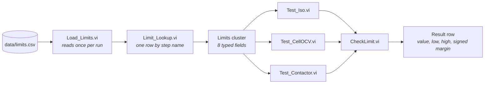
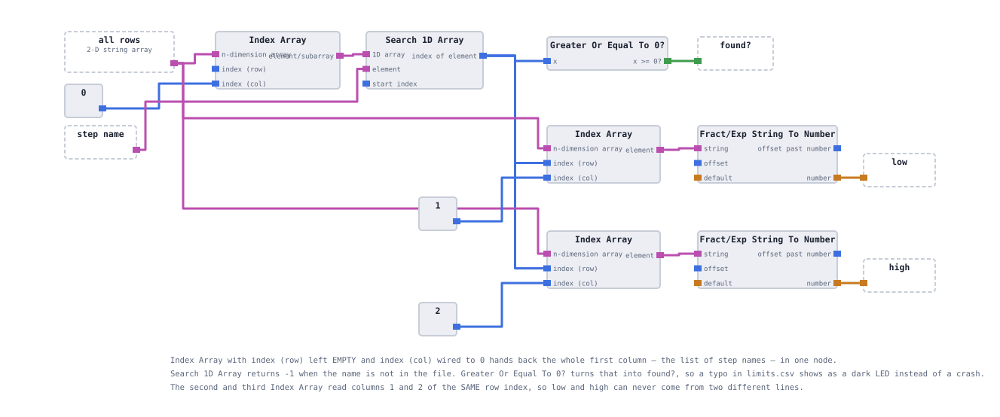
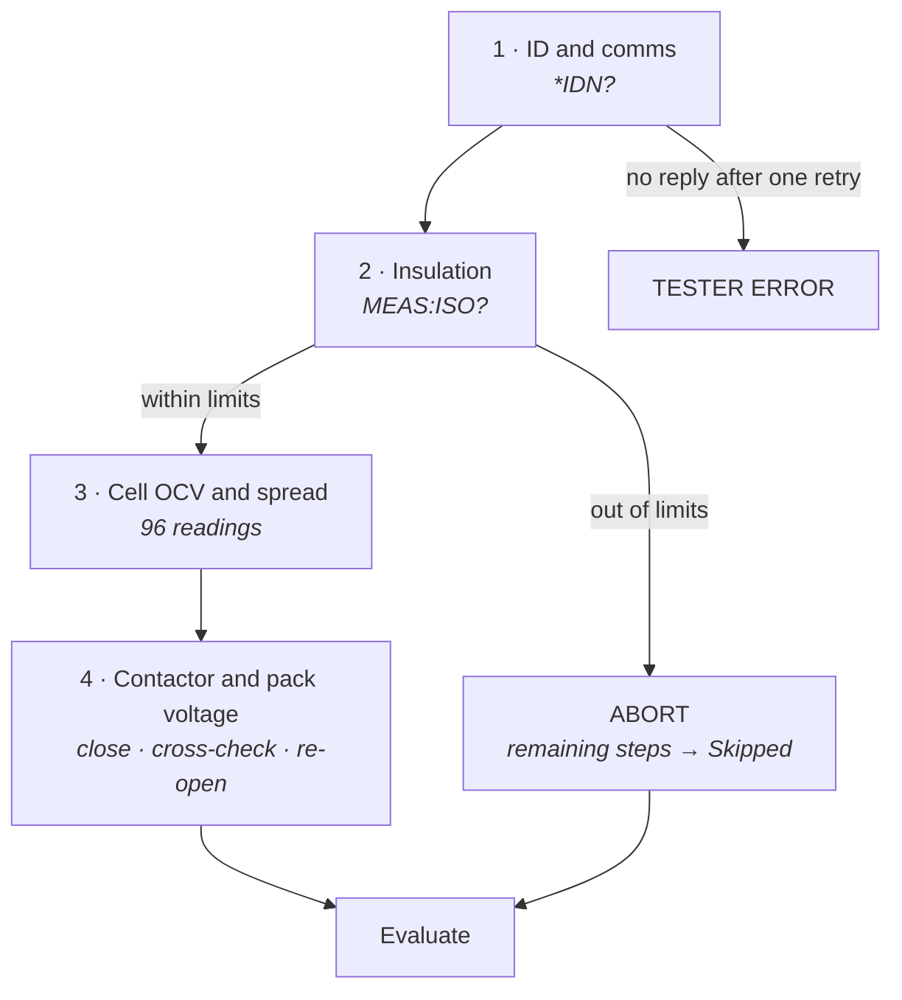

# Test specification

Where the limits come from, what each step is allowed to conclude, and why the steps run in
the order they do. The formal specification lives in
[`docs/TEST_SPEC.md`](TEST_SPEC.md); this page explains the reasoning behind it and the two
naming systems that trip people up.

**On this page:** [Limits as data](#limits-as-data) · [The file](#the-file) ·
[Order of operations](#order-of-operations) · [The 3.50 V decision](#the-350-v-decision) ·
[Two naming systems](#two-naming-systems) · [Changing a limit](#changing-a-limit) ·
[Open points](#open-points)

## Limits as data

On a production line, limits come from a specification signed off by Quality. A test engineer
does not type them into a tester, and nobody can audit a number that exists only inside a
compiled program.

So no limit in this station is written on a block diagram. They live in
[`data/limits.csv`](../data/limits.csv), under version control, and are read at run time by
`Load_Limits.vi` into a typed cluster that is passed down the call chain.



The file is read **once** per run, not once per step. A batch of thirty units is tested
against one snapshot of the specification, which is the only way a yield number means
anything: limits that could change mid-batch would make the denominator meaningless.


<details>
<summary><b>Why the lookup is a separate VI</b></summary>

<br>

`Limit_Lookup.vi` takes the parsed rows and one step name and returns `low`, `high` and a
`found?` boolean. Splitting it out buys two things:

- **A missing row is loud.** The four `found?` outputs are combined with And Array Elements
  into a single `limits ok?` indicator. If a step name in the file does not match a step name
  in the code, the flag drops. Without it, a missing row yields `low = 0, high = 0` and every
  measurement silently passes — the worst possible failure mode for a test limit.
- **Adding a fifth step is a data change.** A new row in the CSV plus one more lookup call,
  rather than new parsing logic.



</details>

## The file

```csv
step,low,high,unit,source
Insulation,2.0,1000,MOhm,representative of published Li-ion EOL practice
CellOCV,3.50,3.85,V,cell operating window
DeltaV,0,0.05,V,cell-to-cell spread limit
PackVolt,-1.0,1.0,V,deviation from sum of cells
```

| Column | Purpose |
|---|---|
| `step` | Lookup key. Must match the constant in `Load_Limits.vi` character for character. |
| `low`, `high` | Inclusive bounds. A value exactly on a bound passes. |
| `unit` | Documentation for the human reading the file, and a check against unit-confusion bugs. |
| `source` | **Provenance.** Where this number came from and who is accountable for it. |

The `source` column is not decoration. It is the difference between a limit and a guess with a
decimal point. On a real programme it would name a document and a revision; here it names the
reasoning, honestly, including where that reasoning is thin.

**What each limit means:**

| Step | Bounds | What is being asked |
|---|---|---|
| `Insulation` | 2.0 – 1000 MΩ | Is the high-voltage system isolated from the chassis? The upper bound catches an open measurement circuit reporting infinity. |
| `CellOCV` | 3.50 – 3.85 V | Is every cell inside its operating window? Evaluated against the **worst** cell — if the worst is inside, all 96 are. |
| `DeltaV` | 0 – 0.05 V | Is the pack balanced? Derived from the same 96 readings, no extra transactions. |
| `PackVolt` | −1.0 – +1.0 V | Does the measured pack terminal voltage agree with the sum of the cells? A cross-check of the measurement path itself, not of the pack. |

`PackVolt` deserves a note. It is the only limit here that tests the **station** rather than
the product: if the pack terminals read 360.32 V and the cells sum to 360.3158 V, both
measurement paths agree and both are probably trustworthy. A deviation of several volts means
one of them is lying, and you do not yet know which.

## Order of operations



Each position is a decision, not a habit:

**1 · Identification first.** No downstream measurement can be attributed to a unit that has
not been named. A pack tested and recorded against the wrong serial is worse than one not
tested at all, because the record is now actively wrong.

**2 · Insulation before anything energises.** This is the safety-shaped decision in the
sequence and the one that would matter most on real hardware. A pack whose isolation has
degraded must never have its contactors closed. The step therefore runs before the contactor
step and a failure **aborts** — the sequence does not "continue to gather more data".

**3 · Cell OCV before the contactor step.** Open-circuit voltage means open circuit. Measuring
cells with the contactors closed measures something else.

**4 · Contactor last, and re-opened on every path.** The safe state is restored whether the
step passed, failed, or the sequence died with an error. In `Test_Contactor.vi` the
`SYS:CONT OPEN` call sits **outside** the Case Structure precisely so that no branch can skip
it. See [the test steps](06-test-steps.md#test_contactorvi).

**An abort is not a failure of the remaining steps.** Cell OCV and Contactor are written into
the results array with status `Skipped` and a note saying why. They are never `Pass` and never
`Fail`. A skipped test recorded as a pass is how bad units ship; recorded as a fail, it
double-counts one defect and corrupts the Pareto.

## The 3.50 V decision

This is documented at length because it is exactly the kind of change that should never be
silent.

The cell window was originally specified **3.55 – 3.85 V**. Running the simulator's healthy
population against it showed the floor cutting into good units: the seed model puts a pack's
base voltage anywhere from 3.54 V upward, and individual cells sit up to 0.02 V below that, so
healthy cells can legitimately read as low as **3.5200 V**. Five of thirty fixture seeds
failed `CellOCV` with no injected fault at all, and first pass yield came out at 63.3% instead
of the 80% the fault model implies.

The floor was moved to **3.50 V**.

<details>
<summary><b>Why that is a defensible change and what it costs</b></summary>

<br>

**The honest framing:** the limit was adjusted to fit the *simulator's* population, not a cell
datasheet. On a real programme that is the wrong direction of travel — you do not move a limit
because units are failing it. Here the "population" is a random number generator whose range
was chosen arbitrarily, so the limit and the model were simply inconsistent with each other,
and one of them had to move.

**Why the limit and not the model:** the model is referenced by roughly forty checkpoint
values across the build. Changing it would have invalidated every one of them. Changing one
number in one CSV file invalidated nothing — which is itself the argument for keeping limits
in a file.

**What it cost:** `docs/TEST_SPEC.md` carries the change and the reason. Anyone reading the
specification sees that this limit is fitted, not derived. That is the minimum acceptable
treatment, and it is why the `source` column exists.

**What would happen on real hardware:** the limit would come from the cell supplier's
datasheet and the process window agreed with Quality, and a unit failing it would be a unit
failing it.

</details>

## Two naming systems

Two different strings identify the same test step, and confusing them breaks things in
different ways.

| | The CSV key | The report label | The machine label |
|---|---|---|---|
| Example | `CellOCV` | `Cell OCV` | `OCV` |
| Type | string | string | `TestState` enum |
| Where it lives | `data/limits.csv`, and constants inside `Load_Limits.vi` | `step name` field on every Result row | `step` field on every Result row |
| Read by | `Limit_Lookup.vi` | a human, on the report | `Batch.vi`, for the Pareto |
| If you change it | limits stop resolving, `limits ok?` drops, every limit becomes 0.00 | the report reads differently; nothing breaks | the Pareto bins move |

| Step | CSV key | `step name` | `step` |
|---|---|---|---|
| Insulation | `Insulation` | `Insulation` | `Iso` |
| Cell window | `CellOCV` | `Cell OCV` | `OCV` |
| Cell spread | `DeltaV` | `Cell spread` | `OCV` |
| Contactor close | — | `Contactor close` | `Contactor` |
| Pack voltage | `PackVolt` | `Pack voltage` | `Contactor` |

Two things worth noticing. Both OCV rows carry `step = OCV`, because a collapsed cell fails
the window and the spread for one physical reason — and element 0 comes first in the array, so
first-failure attribution lands on the window check, which is the honest answer. And
`Contactor close` has no CSV row: its bounds are the constants 1 and 1, because "did the
contactors close" is a boolean dressed as a measurement so that it can be judged by the same
`CheckLimit.vi` as everything else.

**The enum is what the Pareto uses.** Binning on `step name` would mean string comparison at
run time, where a single typo silently creates a phantom category that nobody notices until
the numbers are already in a report. Binning on an enum is an array index.

## Changing a limit

One line, one file, one commit:

```diff
- CellOCV,3.55,3.85,V,cell operating window
+ CellOCV,3.50,3.85,V,cell operating window
```

No VI is edited, no diagram is opened, nothing is recompiled. The change is visible in
`git log`, attributable to a commit message, and applies to every step that reads that row.

The alternative — limits typed onto three block diagrams — would have meant three edits, three
saves, three chances to fumble one of them, and no record of what any unit was actually tested
against. That is the whole argument for this design, and it paid for itself the first time the
floor moved.

## Open points

Carried from [`TEST_SPEC.md`](TEST_SPEC.md) and repeated here because they qualify everything
above:

- Limits are **representative, not signed off**. The specification is marked draft v0.1.
  Nothing here has been reviewed by anyone.
- **DCIR and capacity** tests belong in a real pack EOL specification and are not implemented.
  Neither is temperature, insulation at working voltage, or any dielectric withstand test.
- **No measurement system analysis.** No gauge R&R, no uncertainty budget. The simulator
  returns identical values for repeated reads, so repeatability cannot even be assessed here.
- The `Insulation` upper bound of 1000 MΩ is a plausibility ceiling, not a specification —
  it exists to catch an open measurement circuit reporting an implausibly large number.

<!-- nav -->
---

| | | |
|:--|:-:|--:|
| ← [The DUT simulator](03-dut-simulator.md) | [Documentation index](README.md) | [The instrument layer](05-instrument-layer.md) → |
