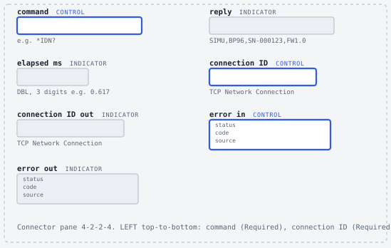
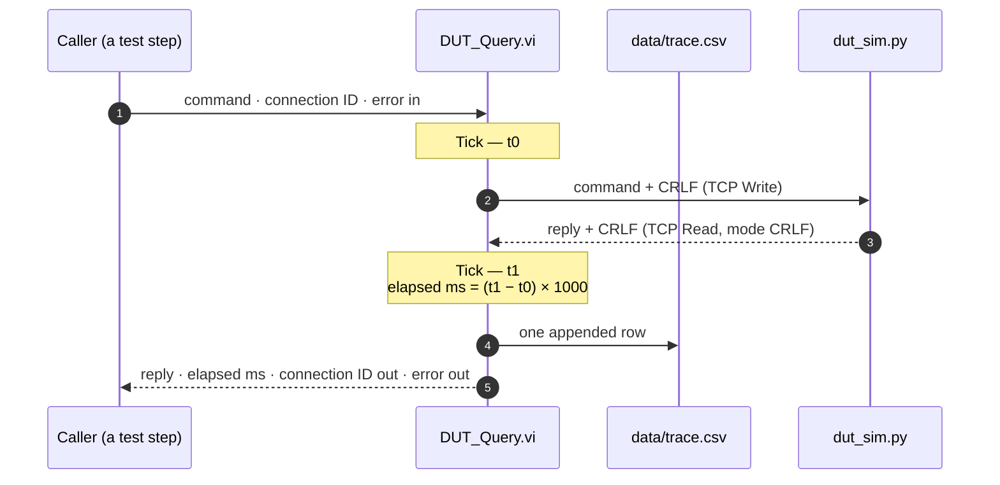
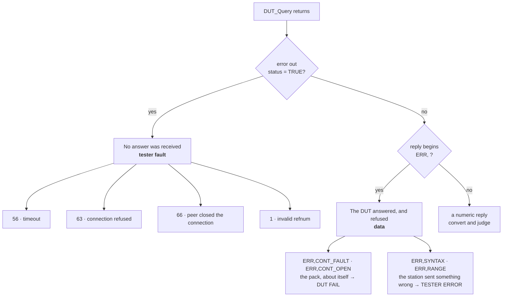

# The instrument layer

Every command the station sends passes through one VI, `lib/DUT_Query.vi`. This page describes the interface it presents, the invariants it maintains, how execution order and timing are enforced in a dataflow language, what the trace log records — and, precisely, what it fails to record. It is written for someone deciding whether the transport layer under this station can be trusted.

**On this page**

- [The interface](#the-interface)
- [What one call guarantees](#what-one-call-guarantees)
- [The terminator lives in exactly one place](#the-terminator-lives-in-exactly-one-place)
- [Ordering is a wire, not a layout](#ordering-is-a-wire-not-a-layout)
- [Elapsed time, and what it excludes](#elapsed-time-and-what-it-excludes)
- [The trace log](#the-trace-log)
- [The limitation: a failed exchange leaves no row](#the-limitation-a-failed-exchange-leaves-no-row)
- [Error taxonomy](#error-taxonomy)
- [Two switches added later](#two-switches-added-later)
- [Status](#status)

## The interface

`DUT_Query.vi` is a driver VI in the ordinary sense: it takes a socket it did not open, uses it once, and hands it back.

| Terminal | Direction | Pane setting | Carries |
|---|---|---|---|
| `command` | in | **Required** | one SCPI-style command, **without** a terminator |
| `connection ID` | in | **Required** | an open TCP connection owned by the caller |
| `error in` | in | Recommended | the incoming error chain |
| `reply` | out | — | the reply with `\r\n` stripped |
| `connection ID out` | out | — | the same connection, handed back |
| `elapsed ms` | out | — | round-trip time of this command, write to read |
| `error out` | out | — | the outgoing error chain |

The connector pane is the 4-2-2-4 pattern used by every VI in the project, with the error pair in the bottom corners. `connection ID` is marked **Required** on purpose: an unwired SubVI input is not an error in LabVIEW, it silently uses the control's default, and the default of a refnum is *no connection*. That produces error 1 at run time instead of a broken run arrow at edit time. Marking it Required converts a confusing runtime failure into an obvious editing one.



`DUT_Query.vi` never opens or closes anything. `station/Bench.vi` opens the socket, chains it through the query, and closes it; from session 5 onward [the sequencer](07-sequencer.md) opens one socket per unit and chains a few dozen commands through it. That split is what lets a whole test sequence run over one connection with the order guaranteed by the wire rather than by hope.

## What one call guarantees



Six invariants, and each of them is the reason something downstream is allowed to be simple:

1. **One command in, one whole reply out.** TCP Read runs in CRLF mode, so a read returns exactly one line, not a slice of the byte stream. No caller ever has to reassemble a partial reply.
2. **The caller owns the socket.** In, then out. Nothing in this VI can leave a connection open or closed at a moment the caller did not choose.
3. **The reply is trimmed.** `\r\n` is stripped before the value leaves the VI, so no downstream string comparison has to know about line endings.
4. **A reply beginning `ERR,` is returned as a value, not an error.** The DUT answered; what it said was a refusal. Turning that into a LabVIEW error would erase the difference between a bad pack and a bad tester. See [the verdict model](08-verdict-model.md).
5. **Every call is timed**, and the timing is ordered rather than incidental.
6. **Every call is logged** — with one documented exception, [below](#the-limitation-a-failed-exchange-leaves-no-row).

Because there is only one transport VI, the trace log cannot be bypassed by any code path, timeouts are consistent everywhere, and moving from TCP to VISA later is one VI's worth of work rather than a search-and-replace across the project.

## The terminator lives in exactly one place

The DUT's protocol is line-oriented: commands are CRLF-terminated, replies come back CRLF-terminated. `DUT_Query.vi` appends the terminator itself, from a string constant in `'\' Codes Display` mode concatenated onto `command`.

That single decision propagates:

- Callers pass `MEAS:ISO?`, never `MEAS:ISO?\r\n`. A caller that appends its own terminator sends two, and [the simulator](03-dut-simulator.md) answers `ERR,SYNTAX` — a station bug that looks exactly like a DUT refusal until you read the trace.
- TCP Read is capped at 4000 bytes. That is a maximum, not an expectation: the largest reply in the protocol is `MEAS:CELL:BURST?` at exactly 503 characters, so the cap has headroom and costs nothing.
- The read timeout is 2000 ms. If the DUT has not answered a loopback query in two seconds, something is wrong and the station should say so rather than wait.
- The write timeout is left at its default of 25000 ms. Writing to a socket that is accepting bytes is not the failure mode worth guarding.

There is a failure mode worth naming here because it is the single most common way this VI breaks: if the terminator constant is not in escape-code display mode, it holds the four literal characters `\`, `r`, `\`, `n` instead of a carriage return and a line feed. The simulator is alive, is listening, and will never see a line ending — so the read times out with **error 56** rather than failing fast. [Failure injection](12-failure-injection.md) reproduces exactly this on purpose.

## Ordering is a wire, not a layout

LabVIEW is a dataflow language. A node runs when its inputs arrive; a node with no inputs has nothing to wait for and may run at any moment between the start and the end of the VI. Position on the diagram constrains nothing at all. Two consequences shape this VI.

**The refnum is chained, never branched.** `TCP Write ▸ connection ID out` feeds `TCP Read ▸ connection ID`, and `TCP Read ▸ connection ID out` leaves the VI. Every node that takes a connection, a file or a task hands the same handle back out precisely so it can be chained. Branch it instead and you get two independent users of one socket with no order between them — which is how a caller ends up closing the connection before the write happens and reporting error 1 from an operation that looks correct on screen.

**The error cluster is one unbroken chain.** Nine nodes, one wire between each:

```
error in ▸ Tick ▸ TCP Write ▸ TCP Read ▸ Tick ▸ Open/Create/Replace ▸ Set File Position ▸ Write to Text File ▸ Close File ▸ error out
```

Any node whose `error in` is empty is a node that is not ordered and whose failures are invisible. This chain is also what lets a caller write `DUT_Query ▸ error out → TCP Close ▸ error in` and be certain the connection closes *after* the query rather than alongside it.


### Tick.vi: four objects and two wires

`lib/Tick.vi` contains one node — High Resolution Relative Seconds — a `seconds` indicator, and an error pair wired straight across with nothing in between. The timer node has no inputs, so on its own it is unordered. Wrapping it in a SubVI with `error in` and `error out` gives it inputs: a SubVI cannot start until its `error in` arrives, and nothing downstream can start until it has finished.


On `Tick.vi`, `error in` is marked **Required** rather than Recommended. On any other VI that would be unusual. Here the error terminal *is* the ordering mechanism, so an unwired one is not a stylistic lapse — it silently produces a meaningless number. Required means LabVIEW breaks the run arrow at edit time instead.

This is the reason the project contains no sequence structures anywhere. The alternative to an error chain is drawing a box around the code you want ordered, and a box has to be resized every time a node moves. The same trick — a timing node wrapped in an error-terminal SubVI — reappears as `Stopwatch.vi` when [cycle time](11-cycle-time.md) needs to bracket a whole test step. More of this reasoning is collected in [the LabVIEW design notes](13-labview-design-notes.md).

## Elapsed time, and what it excludes

Two `Tick.vi` calls sit on the error chain, one immediately before TCP Write and one immediately after TCP Read. They bracket the write/read pair and nothing else. `elapsed ms` is `(t1 − t0) × 1000`, displayed to three decimals.

What it deliberately does **not** include is the trace write. The file chain hangs off the *second* tick's `error out`, which places the whole open/append/close cycle after the second reading rather than racing alongside it. That matters more than it sounds: an open/append/close on Windows costs on the order of 0.5–2 ms, while a loopback round trip is a fraction of a millisecond. Log the timing inside the timed region and `elapsed ms` becomes mostly a measurement of the logger.

That distinction is load-bearing later. When [cycle time](11-cycle-time.md) compares 96 single-cell queries against one burst query, the per-command file write is the confounder, which is why a `trace?` switch exists to measure the protocol change separately from the logging cost. No per-command timing figures are quoted on this page: the measured table belongs to session 8 and is *pending* until that session lands.

## The trace log

Every command and every reply is appended to `data/trace.csv` from inside `DUT_Query.vi`, so no code path in the station can bypass it. The file is generated at run time and is gitignored — it is evidence that the station ran, not source.

```csv
timestamp,command,reply,elapsed_ms
2026-08-08T22:14:07.412,*IDN?,"SIMU,BP96,SN-000123,FW1.0",0.79
2026-08-08T22:14:07.418,MEAS:ISO?,11.06,0.62
2026-08-08T22:14:07.425,SYS:CONT CLOSE,OK,0.55
```

<details>
<summary><b>Schema, format strings, and the reason for each choice</b></summary>

<br>

| Column | Source | Written as |
|---|---|---|
| `timestamp` | Format Date/Time String, timestamp input left unwired (= now) | `%Y-%m-%dT%H:%M:%S%3u` |
| `command` | the `command` control, branched | quoted `%s` |
| `reply` | the **trimmed** reply, branched | quoted `%s` |
| `elapsed_ms` | the Multiply output | `%.3f` |

The row is built by one Format Into String with the format string `"%s","%s","%s",%.3f\n`.

**Why ISO 8601 and not the OS format.** `Get Date/Time String` formats according to the machine's regional settings, so `06.08.2026` on one machine and `08/06/2026` on another. Neither sorts. `Format Date/Time String` with an explicit format produces a timestamp that sorts lexicographically and does not change when the station moves to a different desk.

**Why the replies are quoted.** `*IDN?` alone answers `SIMU,BP96,SN-000123,FW1.0` — three commas inside one field. Unquoted, that one row becomes seven columns and every downstream reader is wrong. The quotes are the difference between four named columns in Excel and a file that opens fine and means nothing.

**Why `\n` and not `\r\n`.** Write to Text File converts a bare `\n` to the platform line ending itself (its `Convert EOL` option, left on). Typing `\r\n` as well risks writing it twice and leaving a blank line between every row.

**Why the decimal point is a period.** LabVIEW's *Use localized decimal point* option, left on, writes `3,7012` in a locale that uses a decimal comma. The DUT writes `3.7012`. One comma in one number turns a four-column row into a five-column row and misaligns everything after it. The option is turned off before the first row is ever written.

**How the append works.** `Open/Create/Replace File` with operation `open or create`, then `Set File Position` with `from` = `end` and `offset` unwired — 0 counted from the end *is* the end. That pair is the whole definition of "append". `Write to Text File` is deliberately fed a **refnum**, not a path: given a path it opens, writes and closes by itself, which is the right tool for a report that is replaced each run and the wrong tool for a log that grows.

**How the path is built.** `Current VI's Path` → two `Strip Path` nodes (removing `DUT_Query.vi`, then `lib`) → `Build Path` with the relative constant `data\trace.csv`. Three nodes and one constant, and the project runs from any folder on any machine — which is what makes `git clone` a demo rather than an apology.

</details>

The honest cost of writing a row per command: the 96-query OCV path appends **96 rows per unit**. That is one of the two reasons [the burst decoder](11-cycle-time.md) exists, and it is why the trace can be switched off for a measurement without being switched off for a production run.

## The limitation: a failed exchange leaves no row

Every File I/O node in LabVIEW passes an incoming error straight through without acting. The file chain sits downstream of TCP Read on the error wire. So when TCP Read returns error 56 or 66, all four file nodes no-op and the exchange that failed is the one exchange the log does not contain.

> This is stated plainly rather than papered over, because a log that stops writing at the moment things go wrong is worse than no log — you will trust it.

The trade was accepted for sessions 3 to 7 on a specific argument: the DUT faults this project exists to catch — `BADCELL`, `ISO`, `CONT` — all come back as perfectly valid replies and are traced in full. Only genuine transport failures go untraced, and those announce themselves loudly as an error code on `error out` and a dialog from Simple Error Handler. It is demonstrated rather than asserted: breaking the terminator constant produces error 56, and `trace.csv` gains no new row.

The fix is **specified, not yet built**. It is three changes inside `DUT_Query.vi`:

- a `Clear Errors` node between TCP Read and the file chain, so the file nodes see a clean error wire and always write;
- the VI's `error out` taken as a second branch **directly** from `TCP Read ▸ error out`, so clearing the wire for the logger does not hide the failure from the caller;
- a third branch into `Unbundle By Name ▸ code`, appended to the row as a fifth column `err_code`.


Branching an error cluster is safe here in a way that branching a refnum never is: the branches only *read* the value, and a SubVI cannot return until every node on its diagram has finished, so the row is still written before the caller sees anything. With the column in place, the elapsed time on a failing row becomes diagnostic in its own right — near zero for a peer that vanished, near the full timeout for a peer that is merely slow. [Failure injection](12-failure-injection.md) walks both cases.

## Error taxonomy

The most important line in the station is the one between *the DUT answered badly* and *the DUT did not answer*.



Book these the wrong way round and the Pareto blames the product for the station's own bugs, or scraps good packs because a cable fell out. `DUT_Query.vi` does not classify — it preserves the distinction and hands both the reply and the error cluster to the caller, so [the test steps](06-test-steps.md) can put the raw reply in a result's `note` field and [the sequencer](07-sequencer.md) can apply the policy in exactly one place.

<details>
<summary><b>Field guide to the four codes you will actually meet</b></summary>

<br>

| Code | What it means | Where it comes from | Corrective action |
|---|---|---|---|
| **56** | Timeout — something *is* listening and did not answer in time | TCP Read | Raise the timeout for that step only, or fix the slow operation. On this station it usually means a malformed terminator constant, so the DUT is waiting for a line ending it will never get |
| **63** | Connection refused — nothing is listening on that port | TCP Open | Start the simulator; retry the connection on the next unit |
| **66** | The peer closed an established connection | TCP Read, sometimes TCP Write | Book a tester error, close the stale refnum, re-open, continue |
| **1** | Invalid refnum — the connection was never opened, or was already closed | TCP Write | Check the refnum chain; something closed it before you used it, or a Required input was left unwired |

56 and 63 have opposite causes and are the two you meet a hundred times: **63 means nobody is home; 56 means somebody is home and is not answering.** 66 and 56 are the pair that look alike in a batch and are told apart by elapsed time — a process that exits sends FIN, so the read returns *immediately* with 66, while a slow peer burns the full timeout and returns 56.

**One operational trap that produces error 56 out of nowhere.** Aborting a running VI with the red abort button does not close open TCP refnums; LabVIEW holds them until it is closed. The simulator serves one client at a time, so it stays blocked inside `recv()` on the dead socket and never returns to `accept()`. The next run connects — the listen backlog takes it — and then times out. Symptom: *it worked five minutes ago and now everything times out.* Cure: `Ctrl+C` the simulator, restart it, **and** close and reopen the VI so the stale refnum is dropped. Prevention: keep the simulator's console visible; it prints `client connected` and `client disconnected`, and two connects with no disconnect between them means something was aborted.

</details>

## Two switches added later

Both are **specified, not yet built**, and both are designed so that adding them changes no existing caller.

| Control | Default | Pane setting | Why it exists |
|---|---|---|---|
| `trace?` | TRUE | Optional | Puts the whole trace group inside a Case Structure so the per-command file write can be excluded from a cycle-time measurement. Default TRUE means every call that exists today keeps logging exactly as it does now |
| `timeout ms` | 2000 | Optional | Promotes the hardcoded TCP Read timeout to a control, so one slow step can be given more room without loosening the timeout for the whole station |

An Optional input that is left unwired uses the control's default value, which is why *Make Current Value Default* on both controls is the step that keeps the project from breaking. The connector pane **pattern** does not change — changing a pattern relinks the VI and breaks every caller's wiring — only unused white cells are assigned.

## Status

| Piece | State |
|---|---|
| `lib/DUT_Query.vi` — command, reply, refnum pass-through, elapsed ms, trace row | ✅ built and pushed |
| `lib/Tick.vi` — ordered timing | ✅ built and pushed |
| `station/Bench.vi` — send one command by hand | ✅ built and pushed |
| `data/trace.csv` four-column schema | ✅ produced at run time |
| `trace?` gate, `timeout ms` control | ⬜ specified — session 8 |
| `Clear Errors` + `err_code` fifth column | ⬜ specified — session 9 |
| Measured per-command and per-step timings | ⬜ pending — session 8 |

Related reading: [the DUT simulator](03-dut-simulator.md) for what is on the other end of the socket, [the test steps](06-test-steps.md) for the VIs that call this one, [the verdict model](08-verdict-model.md) for what the station does with the distinction this VI preserves, and the source itself — [`DUT_Query.vi`](../lib/DUT_Query.vi), [`Tick.vi`](../lib/Tick.vi), [`Bench.vi`](../station/Bench.vi), [`dut_sim.py`](../simulator/dut_sim.py).

<!-- nav -->
---

| | | |
|:--|:-:|--:|
| ← [Test specification](04-test-specification.md) | [Documentation index](README.md) | [The test steps](06-test-steps.md) → |
