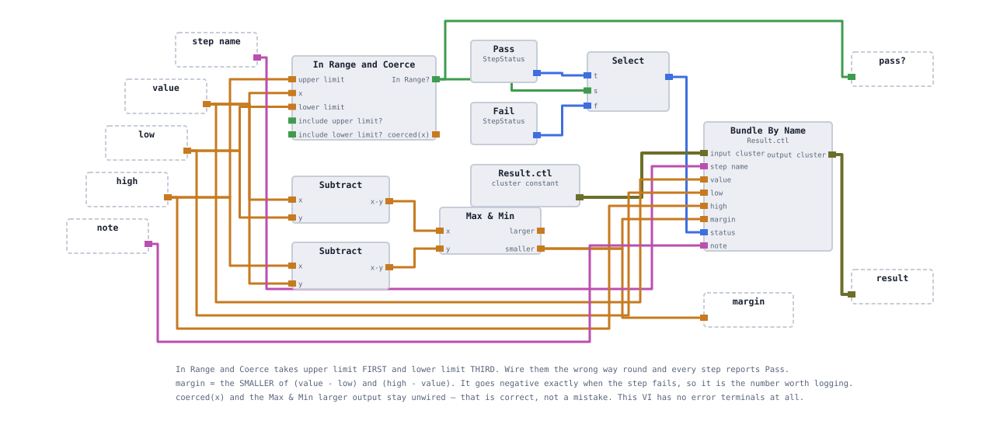
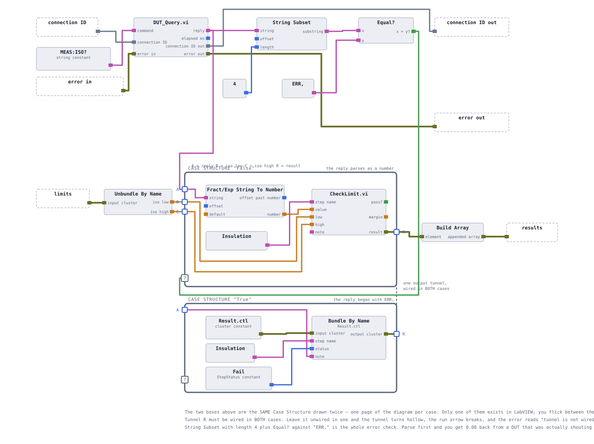
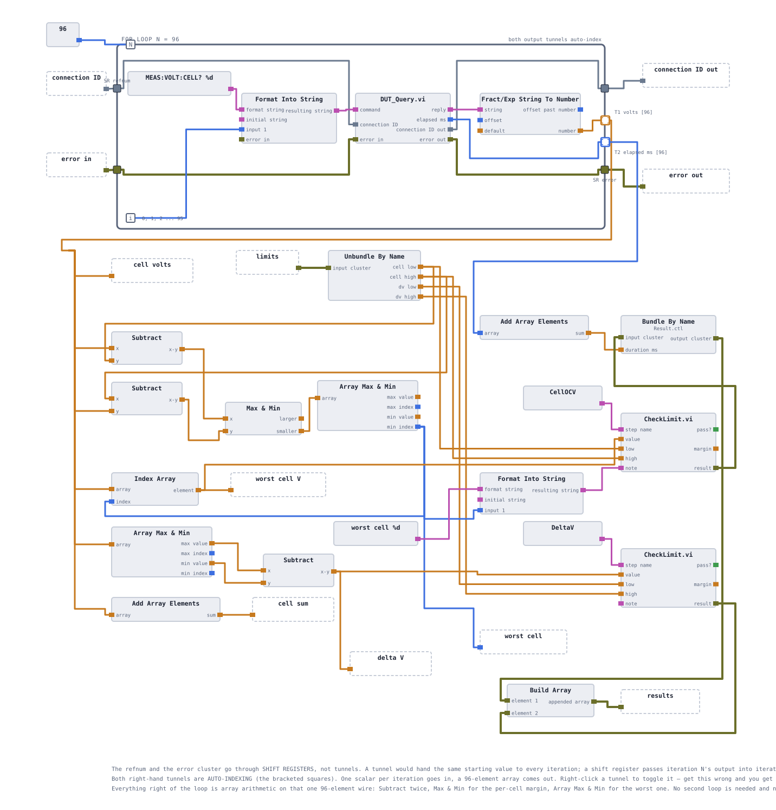
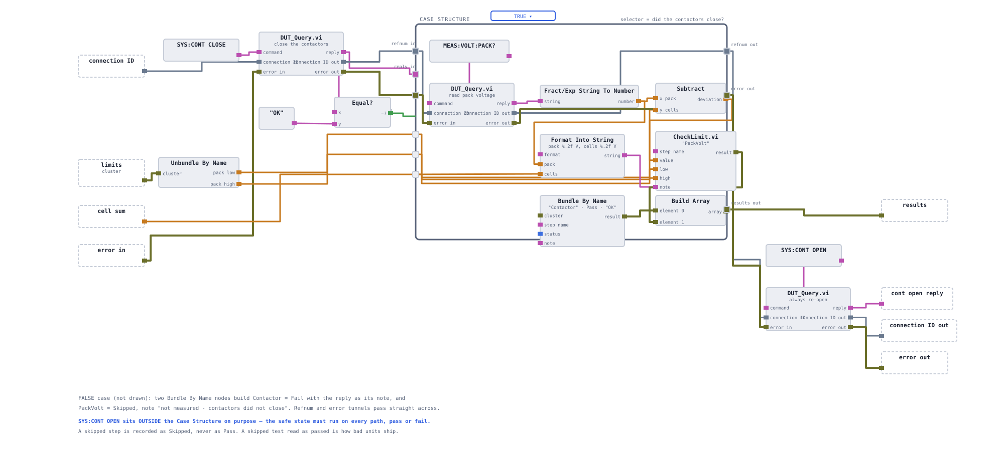

# The test steps

Three VIs, one interface. This page documents what each step measures, the command sequence
it issues, the Result rows it returns, and the specific failure it is built to survive. For
how a step's verdict is computed from a measurement, see
[the verdict model](08-verdict-model.md).

**On this page:** [One shape, three steps](#one-shape-three-steps) ·
[CheckLimit.vi](#checklimitvi) · [The ERR guard](#the-err-guard) ·
[Test_Iso.vi](#test_isovi) · [Test_CellOCV.vi](#test_cellocvvi) ·
[Test_Contactor.vi](#test_contactorvi) · [The bench harness](#the-bench-harness)

## One shape, three steps

Every test step presents the same connector pane. The sequencer does not know which step it is
calling — only that it takes a connection and a limits cluster and hands back an array of
typed results.


| Pane cell | Terminal | Direction | Notes |
|---|---|---|---|
| left 1 | `connection ID` | in | TCP refnum, **Required** |
| left 2 | `limits` | in | the whole `Limits` cluster; each step unbundles the two or four fields it needs |
| left 3 | *step-specific* | in | only `Test_Contactor` uses it (`cell sum`) |
| left 4 | `error in` | in | **Recommended** |
| right 1 | `connection ID out` | out | pass-through, forces ordering |
| right 2 | `results` | out | **array** of `Result`, even when there is one row |
| right 3 | *step-specific* | out | only `Test_CellOCV` uses it (`cell sum`) |
| right 4 | `error out` | out | |

Three consequences:

**`results` is always an array.** `Test_Iso` returns one row, the other two return two rows.
Same type, same terminal, one shape for the sequencer to consume — and a fourth step returning
five rows would need no change anywhere upstream.

**The refnum is chained, not branched.** `connection ID` in, `connection ID out` out. LabVIEW
is a dataflow language: two nodes that share a connection but not a wire have no defined order
between them. Chaining the refnum is what makes "close the contactors, *then* read the pack
voltage" mean what it says. See [LabVIEW design notes](13-labview-design-notes.md).

**Swapping one step for another is a right-click.** Because the panes match,
`Bench_Tests.vi` can Replace one test VI with another and every wire survives except the one
step-specific terminal.

## CheckLimit.vi

One VI turns a number into a verdict, so that judgment logic exists in exactly one place.



| Input | | Output |
|---|---|---|
| `step name` (string) | | `result` — a `Result` cluster |
| `value`, `low`, `high` (DBL) | | with `value`, `low`, `high` copied through, |
| `note` (string) | | a **signed** `margin`, and `status` = `Pass` or `Fail` |

`margin` is the distance to the **nearest** limit, in either direction. Positive means
headroom; negative means out of limits, and its magnitude says how far out.

That single field is why a report line is useful rather than merely correct:

```
Cell OCV   3.3100 V   limit 3.500 – 3.850   margin −0.1900   note "worst cell 42"
```

A line that says FAIL sends a technician looking. That line sends them to cell 42 with the
right expectation. Positive margins matter too — a batch whose insulation margins drift from
9 MΩ toward 1 MΩ is saying something months before anything fails.

`CheckLimit.vi` writes seven of the nine `Result` fields. The other two are stamped by the
caller: `duration ms` by `Test_CellOCV`, and `step` by every test VI, because `CheckLimit` has
no idea who called it.

## The ERR guard

Every step that converts a reply to a number guards it first, and the guard is the same three
nodes each time: take the first four characters, compare them to `ERR,`, branch on the result.

**What it prevents.** `Fract/Exp String To Number` does **not** raise an error on a
non-numeric string — it quietly returns `0`. Without the guard:

| The station does | The DUT answers | Unguarded result | Booked as |
|---|---|---|---|
| typo in a command | `ERR,SYNTAX` | 0.00 | catastrophic insulation failure |
| off-by-one cell index | `ERR,RANGE` | 0.0000 V | collapsed cell, pack scrapped |
| reads pack voltage too early | `ERR,CONT_OPEN` | 0.00 V | pack voltage wildly wrong |

Every row of that table is a **station bug presenting as a product defect**. A good pack is
scrapped and an engineer spends a week looking for a physical cause that does not exist. This
is the single most important guard in the project and it is the concrete form of the
DUT-fault-versus-tester-fault distinction that the whole station is organised around.

<details>
<summary><b>Two shapes of the same guard, and when to use each</b></summary>

<br>

**Case Structure form** — used in `Test_Iso.vi`. The conversion and the judgment sit on the
same diagram level, so the guard selects between two whole branches: measure normally, or
build a `Fail` row carrying the raw reply as its note.

**Override form** — used in `Test_CellOCV.vi` and `Test_Contactor.vi`. The conversion happens
first, then a `Select` replaces the note (and in the OCV case, flags the whole array) if any
reply was an error. This is the right shape when the detection happens inside a loop and the
judgment happens outside it: 96 booleans collapse through `Or Array Elements` into one, and
that one drives a single `Select`.

The choice is structural, not stylistic — you cannot put a Case Structure around a judgment
that lives outside the loop where the detection happened.

</details>

## Test_Iso.vi

The simplest step, and the one that aborts the sequence.



| | |
|---|---|
| **Command** | `MEAS:ISO?` — one transaction |
| **Limits consumed** | `iso low` (2.0), `iso high` (1000) MΩ |
| **Returns** | one row: `step = Iso`, `step name = Insulation` |
| **On seed 123** | value 11.06 MΩ, margin 9.06, `Pass` |
| **On seed 125** | value 0.40 MΩ, margin −1.60, `Fail` → **sequence aborts** |

The upper bound of 1000 MΩ is a plausibility ceiling. An insulation measurement circuit that
has come adrift reports something implausibly large rather than something implausibly small,
and a limit with only a floor would call that a pass.

This is the step whose failure stops everything downstream. That is a safety decision, not a
performance one: a pack with degraded isolation must never have its contactors closed. The
abort itself is implemented in the sequencer, not here — this VI reports a `Fail` and the
`Iso` case decides what that means. See [the sequencer](07-sequencer.md).

## Test_CellOCV.vi

The heaviest step: 96 transactions, and all the arithmetic outside the loop.



| | |
|---|---|
| **Commands** | `MEAS:VOLT:CELL? 0` … `MEAS:VOLT:CELL? 95` |
| **Limits consumed** | `cell low` (3.50), `cell high` (3.85), `dv low` (0), `dv high` (0.05) |
| **Returns** | two rows, both `step = OCV`: `Cell OCV` then `Cell spread` |
| **Also outputs** | `cell sum` — consumed by `Test_Contactor` |

**Ninety-six readings, one judgment.** The step does not call `CheckLimit` ninety-six times.
It computes each cell's margin to the nearest limit with two subtractions and a `Max & Min`
node operating on whole arrays, finds the smallest with `Array Max & Min`, and judges that
one cell. If the worst cell is inside the window, all 96 are — so one call gives the identical
verdict and also names the offender.

<details>
<summary><b>Why the worst cell on a healthy pack is the highest one</b></summary>

<br>

Margin is distance to the *nearest* limit in either direction. Seed 123's cells sit between
3.7361 V and 3.7757 V — near the top of a 3.50–3.85 V window — so the cell in most danger is
the **highest** one: cell 70, with 0.0743 V of headroom to the ceiling.

That is not a fudge. The pack's margin is the margin of its worst cell, on whichever side that
happens to be. A pack sitting low would report its lowest cell instead, from the same code.

</details>

**The spread comes free.** Cell-to-cell spread is `max − min` of the same 96 readings — no
extra transactions, no second loop. On seed 123 it is 0.0396 V against a 0.05 V limit, a
margin of 0.0104 V. That is thin by construction: the simulator draws cells in a ±0.02 V band,
so a 96-sample population nearly fills 0.040 V. Healthy units pass, but not comfortably, which
is what makes the check worth having.

**Order of the two rows is not cosmetic.** `Cell OCV` is element 0 and `Cell spread` is element
1, and first-failure attribution takes the first failing row. A collapsed cell fails both: the
window because the cell is out of range, the spread because one cell being 0.4 V low widens
the pack. The collapsed cell is the physical cause and the wide spread is its consequence, so
the Pareto must blame the window check. Reversing the two rows would silently point every
future improvement effort at a symptom.

**Duration is stamped here.** Each `DUT_Query` call returns its own elapsed time; the 96 values
are auto-indexed out of the loop and summed. That total is bundled into the `Cell OCV` row's
`duration ms` field and becomes the baseline the burst decoder is measured against in
[cycle time](11-cycle-time.md).

## Test_Contactor.vi

Three round trips, one Case Structure, and the only step with a safety obligation on exit.



| | |
|---|---|
| **Commands** | `SYS:CONT CLOSE` → *(if OK)* `MEAS:VOLT:PACK?` → `SYS:CONT OPEN` |
| **Limits consumed** | `pack low` (−1.0), `pack high` (+1.0) V |
| **Extra input** | `cell sum` from `Test_CellOCV` |
| **Returns** | two rows, both `step = Contactor`: `Contactor close`, then `Pack voltage` |

**`SYS:CONT OPEN` sits outside the Case Structure.** Not in the True branch, not duplicated in
both branches — outside, on the wire that leaves the structure, so it runs on every path
including the one where the close failed and the one where an error is propagating. The safe
state is not conditional.

**`Contactor close` is a boolean dressed as a measurement.** Its `value` is 1 when the DUT
answered `OK` and 0 otherwise, against `low = 1, high = 1`. That looks odd until you notice
what it buys: the row is produced by the same `CheckLimit.vi` as every other row, carries a
margin, prints in the same report table, and bins into the same Pareto. A boolean handled
specially would have needed special handling everywhere downstream.

**Pack voltage is a cross-check of the station, not of the pack.** The measured terminal
voltage is compared against the sum of the 96 cells measured moments earlier by a different
command path. On seed 123 the deviation is 0.0042 V — the two paths agree, and both are
probably telling the truth. A deviation of several volts would mean one of them is lying, and
you would not yet know which. That is the value of a redundant measurement.

**The False branch reports two rows, honestly.** When `SYS:CONT CLOSE` returns
`ERR,CONT_FAULT`, `Contactor close` is `Fail` with the raw reply as its note, and `Pack
voltage` is `Skipped` with the note *not measured — contactors did not close*. Not `Fail`: the
pack-voltage test did not run, and recording an untested step as failed would double-count one
defect.

## The bench harness

`station/Bench_Tests.vi` exists to exercise exactly one test VI against the simulator without
the sequencer in the way.


Open a socket, load the limits, call one test step, close. Swapping which step it calls is
**Replace ▸ Select a VI…** and, because the connector panes match, every wire survives except
the one step-specific terminal. That is the harness paying back the cost of the shared pane.

There is also `station/Bench.vi`, which sends a single typed command and shows the raw reply.
It is how `SYS:NEWUUT 130` gets sent before testing the contactor-fault unit, and it is the
first thing to reach for when a reply does not look like what the documentation claims.

**Checkpoints** for each step on seed 123 are listed in
[the DUT simulator](03-dut-simulator.md#reference-units). If a step's `value` is right but its
verdict is wrong, the limits did not arrive. If `low` and `high` read 0.00, the `limits`
cluster never reached the VI. If the value is 0.00, the reply was not a number — check the
trace log for what actually came back.

<!-- nav -->
---

| | | |
|:--|:-:|--:|
| ← [The instrument layer](05-instrument-layer.md) | [Documentation index](README.md) | [The sequencer](07-sequencer.md) → |
