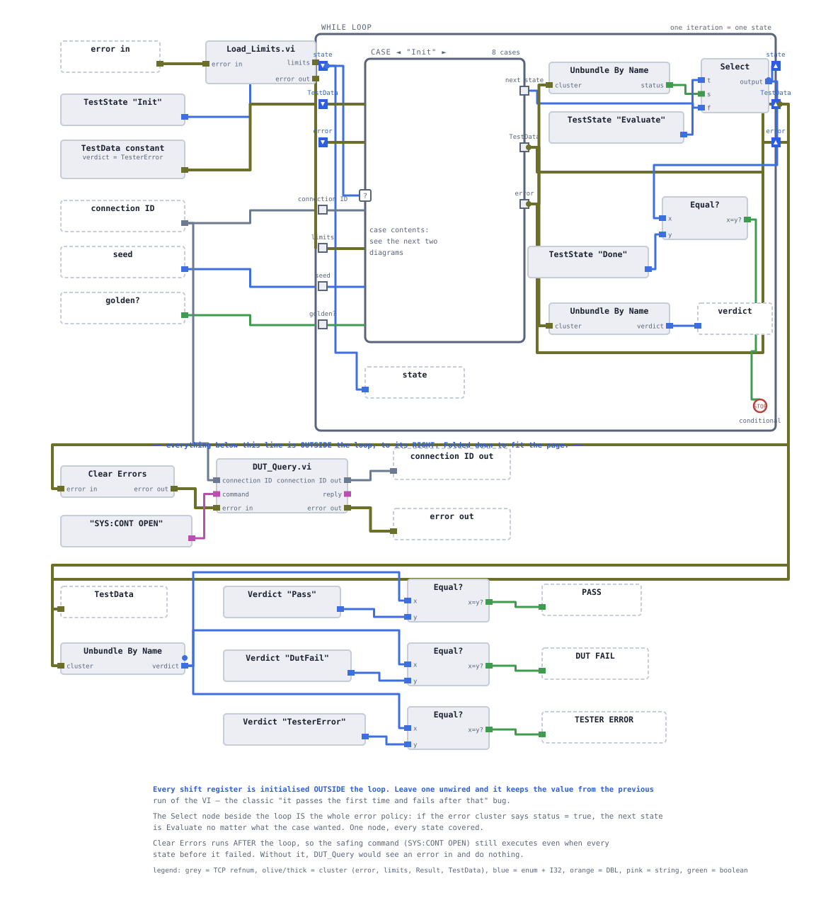
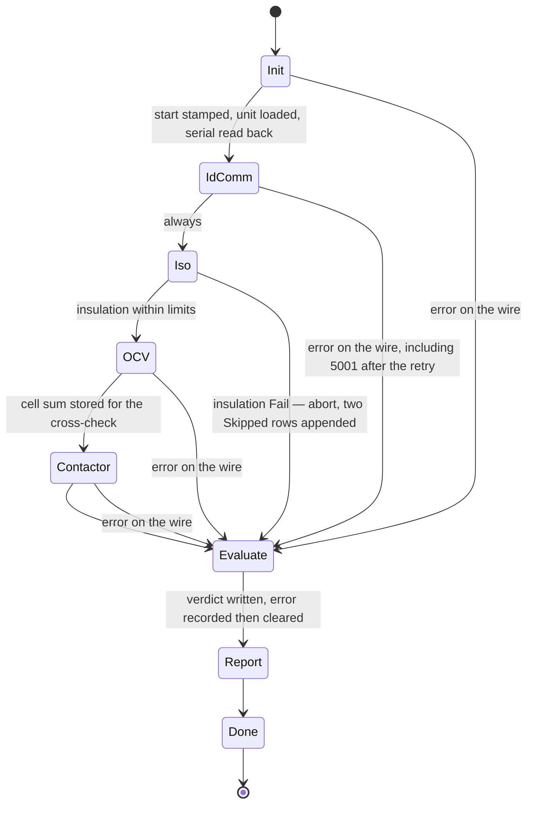
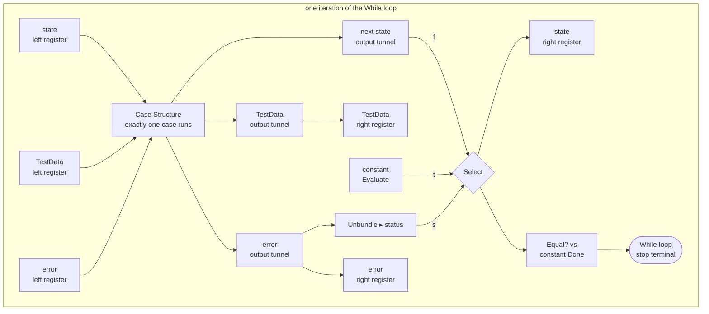
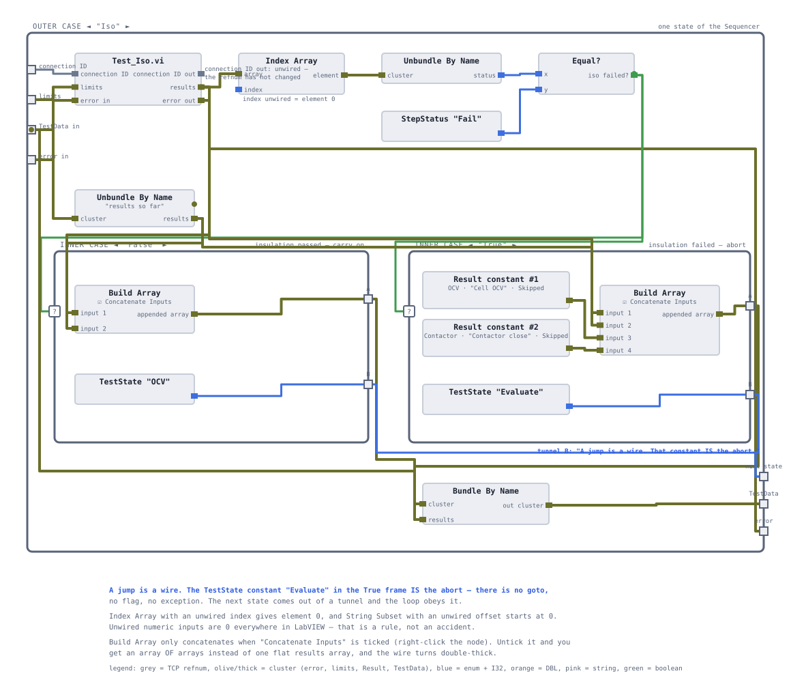
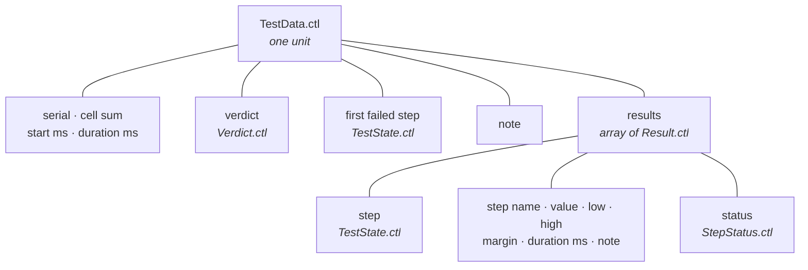
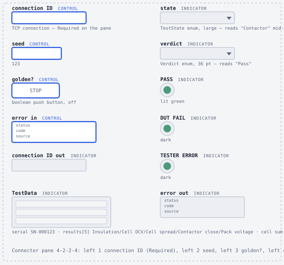

# The sequencer

`station/Sequencer.vi` runs one unit from end to end: it loads a pack, walks the fixed order of test steps, decides an outcome and hands back one record. This page describes the shape of that machine — its states, its transitions, its two abort paths and the record that accumulates across them — and why it is a state machine rather than a straight line of subVI calls. It is written for someone evaluating the design, not following it.

> **Build status.** The type definitions and the connector-pane alignment of the three test VIs are being built now. **`Sequencer.vi` itself is specified but not yet built**, so nothing on this page is a measured sequencer result. The step-level numbers quoted below come from [the test steps](06-test-steps.md), which are built and verified against the simulator; the unit-level outcomes are stated as the acceptance checkpoints the VI has to reproduce. The [status table](../README.md#status) is the authority on what exists.

**On this page**

- [Why a state machine and not a straight sequence](#why-a-state-machine-and-not-a-straight-sequence)
- [The loop skeleton](#the-loop-skeleton)
- [The state diagram](#the-state-diagram)
- [What each state does](#what-each-state-does)
- [The four moves every case makes](#the-four-moves-every-case-makes)
- [The error override](#the-error-override)
- [The insulation abort](#the-insulation-abort)
- [The record that accumulates](#the-record-that-accumulates)
- [What the caller owns](#what-the-caller-owns)
- [Acceptance checkpoints](#acceptance-checkpoints)

## Why a state machine and not a straight sequence

A straight sequence — call `Test_Iso.vi`, then `Test_CellOCV.vi`, then `Test_Contactor.vi`, chained on the error wire — passes every healthy unit correctly and is about a third of the diagram. It fails on the two things the [test specification](04-test-specification.md) actually asks for.

**It cannot abort.** The spec books an insulation failure as *ABORT sequence*, not *skip one step*. In a straight chain the only way to not run the next VI is to wrap it in a Case Structure, and then the one after that in another, and now every downstream step carries a copy of the upstream abort condition. Three steps is bearable. A fourth step means editing three existing cases.

**It cannot express "where am I".** A state machine names its position in a value that can be stored, compared, displayed and written into a report. That value is `lib/TestState.ctl`, an eight-item enum — `Init`, `IdComm`, `Iso`, `OCV`, `Contactor`, `Evaluate`, `Report`, `Done` — and the same type is reused as `Result ▸ step` and as `TestData ▸ first failed step`. The [first-failure attribution](08-verdict-model.md#first-failure-attribution) in the batch metrics is that reuse paying for itself: the Pareto bins on an enum the sequencer already produced, not on a step-name string somebody has to keep spelling the same way.

What the state machine buys, concretely: an abort is a **wire carrying a different constant**, written once inside the state that decided to abort. Nothing downstream needs to know it happened, because the downstream states simply never run.

> **There is no `goto` on a block diagram.** Every "jump to state X" in this design is the same object: a `TestState` constant reaching the next-state output tunnel. When the choice is made at run time, a Select node or an inner Case Structure picks between two such constants. Transitions are never made by incrementing the enum — the numeric value of a state is only its position in the list, so inserting a state in the middle would silently shift every transition by one, with no broken wire to warn you.

## The loop skeleton

One While loop, one Case Structure with eight cases, three shift registers, four plain tunnels.

| Carrier | Type | Initialised from | Why it is what it is |
|---|---|---|---|
| `state` shift register | `TestState` enum | a constant set to `Init` | drives the Case Structure selector and nothing else — no case ever needs to read the state it is already in |
| `TestData` shift register | `TestData` cluster | a constant with `verdict = TesterError` | the accumulating record; see [below](#the-record-that-accumulates) |
| `error` shift register | LabVIEW error cluster | `Load_Limits.vi ▸ error out` | a missing `data/limits.csv` becomes a TESTER ERROR instead of a silent set of zero limits |
| `connection ID`, `limits`, `seed`, `golden?` | refnum, `Limits`, I32, boolean | the VI's own controls | four plain tunnels — nothing that never changes needs a shift register |

Two choices in that table are worth defending.

**The `TestData` register starts with `verdict = TesterError`.** That is the pessimistic initial value. A sequence that dies before it reaches `Evaluate` must not be able to report a pass, and the only way to guarantee that is to make "pass" something a state has to actively write. If the verdict indicator reads `TesterError` and `note` is empty, the sequence never reached `Evaluate` at all — which is a genuinely different failure from a tester error that was caught and recorded, and the two are distinguishable at a glance.

**The error register is initialised by `Load_Limits.vi`, not by a blank constant.** Limits are loaded once, outside the loop, and its error output is the seed of the loop's error chain. That is one node doing two jobs: it puts the limits on a tunnel and it puts any file-read failure into the same abort machinery that handles a dropped socket.

Every shift register is initialised. An unwired left terminal is not a LabVIEW error — the register keeps whatever the previous run left in memory for as long as the VI stays loaded, so the sequencer would work perfectly the first time and start in state `Done` the second, with no broken arrow and no error dialog.

## The state diagram

The nominal path is one lap of eight states. Both abort paths lead to the same place.

The four `error on the wire` edges are not four pieces of logic. They are one Select node sitting outside all eight cases, described under [the error override](#the-error-override). The `Iso → Evaluate` edge is the only genuine per-state abort decision in the machine, and it is the only one built inside a case.

`Done` never executes. The loop's stop terminal fires on the iteration that *produces* `Done`, which means the transition into it is the last thing that happens. The case exists so that "add a case for every value" stays valid and all three output tunnels stay satisfied; its contents are three wires straight across and a constant that is never read. Cleanup belongs after the loop, where it runs exactly once no matter how the sequence ended — see [what the caller owns](#what-the-caller-owns).

## What each state does

| State | Command traffic | Writes to `TestData` | Next state |
|---|---|---|---|
| `Init` | `SYS:NEWUUT <seed>` or `SYS:GOLDEN` | `start ms`, `serial` | `IdComm` |
| `IdComm` | `*IDN?`, up to two attempts | nothing | `Iso`, always |
| `Iso` | `MEAS:ISO?` via `Test_Iso.vi` | appends 1 `Result`, or 3 on abort | `OCV` on pass, `Evaluate` on fail |
| `OCV` | 96 × `MEAS:VOLT:CELL?` via `Test_CellOCV.vi` | appends 2 `Result` rows, stores `cell sum` | `Contactor` |
| `Contactor` | `SYS:CONT CLOSE`, `MEAS:VOLT:PACK?`, `SYS:CONT OPEN` via `Test_Contactor.vi` | appends 2 `Result` rows | `Evaluate` |
| `Evaluate` | none | `verdict`, `first failed step`, `duration ms`, `note` | `Report` |
| `Report` | none yet — [session 6](09-reporting.md) fills it | report artifacts, pending | `Done` |
| `Done` | none | nothing | never runs |

Three details in that table carry weight.

**`Init` reads the serial back from the DUT.** The reply to `SYS:NEWUUT 123` is `OK,SN-000123`, and the serial is taken from character 3 of the reply rather than formatted from the seed. On a golden unit the reply is `OK,SN-GOLDEN` and the identical offset gives `SN-GOLDEN`, so there is no special case. Constructing the serial from the seed would be inventing data about the unit under test — which is exactly the habit that produces a report that agrees with itself and disagrees with the line.

**`IdComm` always transitions to `Iso`.** The retry is a For loop of at most two iterations with a conditional terminal, and each attempt begins with a Clear Errors so that a timeout on the first attempt does not poison the second — without it the retry is theatre. If the reply still does not begin `SIMU,BP96` after the second attempt, the case fabricates an error cluster with code **5001** and source `Sequencer.vi: *IDN? prefix wrong after retry`, and puts it on the wire. It does not jump anywhere. The global override does the jumping. One abort mechanism, not two.

**`OCV` stores `cell sum` in the record rather than on a shift register.** A shift register would have worked, and would have been one wire cheaper in this state. Putting it in `TestData` means the value is also present in the report and in the CSV row without any extra plumbing in [session 6](09-reporting.md), and the cross-check `Test_Contactor.vi` performs — pack terminal voltage against the sum of the cells the station measured itself — is auditable from the record afterwards.

<b>Reference — the eight cases and the one exception to "same four moves"</b>

 

`Init`, `IdComm` and `Evaluate` are the three cases that do not simply call a test VI:

- **`Init`** is the only case that builds a command string from a control (`SYS:NEWUUT %d` from `seed`) and the only case that reads the clock at the start of a sequence. The clock read is a subVI, `Timestamp_ms.vi`, and it is first on the case's error chain. That is not decoration: LabVIEW's clock primitives have no inputs, and a node with no inputs has nothing constraining when it runs inside the structure it sits in. Wrapping it in a VI with `error in` / `error out` gives it an input, and the error wire pins it to an exact point. `Timestamp_ms.vi` is **specified, not built**.
- **`IdComm`** is the only case containing a retry loop, and the only case that manufactures an error cluster rather than propagating one. Codes 5000–9999 are the user-definable range, which is why 5001 is safe to invent.
- **`Evaluate`** touches no instrument at all. It reads the accumulated results, decides the verdict and clears the error — see [the verdict model](08-verdict-model.md).

`Iso`, `OCV` and `Contactor` are the same four moves with a different VI in the middle. `Report` and `Done` are stubs, and `Report`'s stub already contains its Clear Errors for the reason given [below](#the-error-override).

## The four moves every case makes

Every test case does the same four things, in the same order:

1. **Unbundle** what it needs from the incoming `TestData` — the results so far, and for `Contactor`, the `cell sum` that `OCV` stored.
2. **Call** its test VI, wired `connection ID`, `limits`, `error in` from the shared input tunnels.
3. **Append** the `Result` array the VI returned to the results so far, using Build Array with *Concatenate Inputs* so that arrays splice and single elements append on the same node.
4. **Write** the next state as an explicit `TestState` constant.

That regularity is the whole reason [the three test VIs share one connector pane](06-test-steps.md). The sequencer does not know which test it is calling: it hands over a connection, a limits cluster and an error wire, and gets back an array of typed results. Adding a fourth measurement is a new VI with the same pane, one new enum item and one new case — not a redesign of the states around it.

This is the step/sequence model that [NI TestStand](14-teststand-mapping.md) implements: an ordered list of steps with a uniform interface, a result container that accumulates, and a per-step status that is richer than pass/fail. Building it by hand is what makes its cost visible.

## The error override

The rule is one sentence: **any LabVIEW error, in any state, sends the next state to `Evaluate`.**

It is implemented once, in the column between the Case Structure's right border and the loop's right border — outside all eight cases, where both the error wire and the next-state wire pass.

Three consequences follow from putting it there rather than inside the cases.

**A ninth state cannot break it.** The rule is a property of the machine, not of any state. A policy expressed in eight places is eight places to get it wrong, and the eighth one is the one that fails in front of a customer.

**The stop condition reads the override's output, not the Case Structure's tunnel.** The `Equal? vs Done` comparison is fed from the Select, so an error arriving on what would have been the last iteration still overrides `Done` and still reaches `Evaluate`. Comparing the raw next-state tunnel instead would let a late error skip the verdict entirely.

**The cycle terminates.** `Evaluate` and `Report` are the only two states that end with a Clear Errors. Every other state passes the error through untouched. So an error can send you *to* `Evaluate`, but `Evaluate` and `Report` can never send an error back out — there is no way to bounce between them forever. If `Report` did not clear, the override would send it back to `Evaluate`, which would clear and return to `Report`, and round it goes with no error and no broken arrow.

**Why jump to `Evaluate` rather than keep going.** A tester fault means no answer was received — the pack was never measured. Continuing to interrogate a DUT that is not answering costs cycle time to produce rows that are, at best, zeros, and at worst indistinguishable from real measurements. Worse, it invites the station to book those zeros as DUT failures. The jump lands on the one state that can record *why* the sequence stopped and mark the unit **TESTER ERROR**, which is [excluded from the yield denominator](10-batch-metrics.md) rather than counted as a bad pack.

## The insulation abort

The one abort that is a genuine per-state decision lives inside the `Iso` case, as an inner Case Structure selected by "did `Test_Iso.vi` book element 0 as `Fail`".

| Branch | Results appended | Next state |
|---|---|---|
| insulation passed | the `Insulation` row | `OCV` |
| insulation failed | the `Insulation` row, plus a `Cell OCV` row and a `Contactor close` row, both `status = Skipped`, both noted `skipped: insulation abort` | `Evaluate` |

The safety argument only covers the contactor: you never close contactors on a pack with degraded isolation, which is why [the order of operations](04-test-specification.md) puts insulation before anything that energises. The process argument covers both skipped steps — a pack at 0.40 MΩ is scrap, and spending another 24 round trips characterising scrap is cycle time paid for on every unit of a real line.

The two appended rows are marked `Skipped`, never `Fail`. Book them as failures and [the Pareto](10-batch-metrics.md) will report that the contactor test is the line's biggest problem when it never ran. The reason a skip is representable at all is that `StepStatus` is a four-value enum rather than a boolean — see [Skipped semantics](08-verdict-model.md#skipped-is-never-a-pass).

> **A documented asymmetry.** The abort appends **one row per skipped test VI**, not one per skipped limit check. Seed 125 therefore produces three rows — `Insulation` Fail, `Cell OCV` Skipped, `Contactor close` Skipped — where a completed sequence produces five. The derived checks that those VIs would have run (`Cell spread`, `Pack voltage`) have no row at all. That keeps the abort constants down to two hand-built clusters, at the cost of a report whose row count varies with the abort path. It is a trade, and the report reader has to know it.

## The record that accumulates

`lib/TestData.ctl` is one cluster carrying everything known about one unit. It is a type definition, so a field added in a later session appears on every constant, control and indicator that already exists without any diagram being reopened.

Everything one unit produces travels on one wire. Adding a field never means adding a connector-pane terminal and never means editing tunnels in eight cases — which is precisely what [session 6](09-reporting.md) needs when it adds a wall-clock timestamp and the report artifacts to the same cluster.

Two type reuses are load-bearing:

- `Result ▸ step` and `TestData ▸ first failed step` are both `TestState`. The value the sequencer switches on is the same value the report bins on. No string matching anywhere.
- `Result ▸ status` is `StepStatus`, whose item 0 is `NotRun`. A freshly created `Result` therefore defaults to "this step did not run", which is the honest default. If `Pass` were item 0, a row somebody forgot to fill in would report a pass.

## What the caller owns

`Sequencer.vi` does not open the TCP connection and does not close it. The caller passes a `connection ID` in and gets a `connection ID out` back, exactly as [`DUT_Query.vi`](05-instrument-layer.md) does. That is what lets [`Batch.vi`](10-batch-metrics.md) push thirty units through one socket.

<b>Reference — the connector pane</b>

 

The same twelve-cell 4-2-2-4 pattern every VI in the project uses.

| Cell | Input | Cell | Output |
|---|---|---|---|
| left 1 | `connection ID` — **Required** | right 1 | `connection ID out` |
| left 2 | `seed` (I32) | right 2 | `TestData` |
| left 3 | `golden?` (boolean) | right 3 | *reserved — session 6's CSV row* |
| left 4 | `error in` — Recommended | right 4 | `error out` |

`state`, `verdict` and the three verdict LEDs get no connector-pane cell. They are watch indicators for whoever is standing at the panel, not outputs of the VI, and `state` and `verdict` are wired **inside** the loop so they tick as the sequence runs.

Right cell 3 is left deliberately empty. Changing a connector-pane pattern relinks the VI and breaks every caller's wiring; reserving a spare cell before there are callers costs nothing.

**After the loop, on every path,** the sequencer clears the error and sends `SYS:CONT OPEN`. Clearing first is the point: every LabVIEW node skips its work when `error in` is non-empty, so leaving the error on the wire would silently skip the de-energise on exactly the runs where it matters most. Nothing is lost by clearing, because `Evaluate` has already written the code and source into `TestData ▸ note` and the verdict is already `TesterError`. On real hardware, "does the safe state command run on the error path" is the first question a safety review asks.

## Acceptance checkpoints

These are the checks `Sequencer.vi` has to pass, not results it has produced. The per-step values are measured — they come from the three test VIs run against the simulator through `Bench_Tests.vi`. The state paths, verdicts and `first failed step` values are the specified behaviour.

| Run | Serial | State path | Rows | Verdict | `first failed step` |
|---|---|---|---|---|---|
| seed 123 | `SN-000123` | Init → IdComm → Iso → OCV → Contactor → Evaluate → Report | 5 | PASS | `Done` (means none) |
| seed 120 | `SN-000120` | full path — a cell failure does **not** abort | 5 | DUT FAIL | `OCV` |
| seed 125 | `SN-000125` | Init → IdComm → Iso → Evaluate → Report | 3 | DUT FAIL | `Iso` |
| seed 130 | `SN-000130` | full path | 5 | DUT FAIL | `Contactor` |
| golden | `SN-GOLDEN` | full path | 5 | PASS | `Done` |
| simulator stopped | — | Init → Evaluate → Report | 0 | TESTER ERROR | `Done` |

<b>The measured step values behind those rows</b>

 

From [the reference units](03-dut-simulator.md), through the built test VIs:

| Seed | Insulation | Cell OCV | Cell spread | Contactor close | Pack voltage |
|---|---|---|---|---|---|
| 123 | 11.06 MΩ, margin 9.06 ✅ | 3.7757 V, margin 0.0743, worst cell 70 ✅ | 0.0396 V, margin 0.0104 ✅ | 1 ✅ | 0.0042 V, margin 0.9958 ✅ |
| 120 | 5.22 MΩ ✅ | 3.3100 V, margin −0.1900, worst cell 42 ❌ | 0.4298 V, margin −0.3798 ❌ | 1 ✅ | ✅ |
| 125 | 0.40 MΩ, margin −1.60 ❌ | ⬜ Skipped | *no row* | ⬜ Skipped | *no row* |
| 130 | 6.02 MΩ ✅ | 3.5689 V, margin 0.0689, worst cell 5 ✅ | 0.0383 V ✅ | 0, note `ERR,CONT_FAULT` ❌ | ⬜ Skipped |
| golden | 10.00 MΩ | 3.7000 V | 0.0000 V | 1 | 0.00 V against Σ 355.20 V |

Seed 120 is the case that proves the abort is a per-step decision and not a blanket rule: a cell failure is not a safety condition, so the sequence continues and the contactor step still runs. Only insulation aborts.

`duration ms` has no expected value here. It is wall-clock and machine-dependent, and it is not measured until [cycle time](11-cycle-time.md) has something to measure.

<b>Two deliberate breakages that prove the abort paths</b>

 

Neither of these is a unit test in any formal sense. They are the two cheapest ways to demonstrate that the tester-error path is real rather than drawn.

**Stop the simulator, then run.** `TCP Open Connection` returns error **63**, connection refused. Nothing was sent, `results` is empty, and the verdict must read TESTER ERROR with `note` reading `tester error 63 — TCP Open Connection in Run_One.vi`. A station that reported DUT FAIL here would be blaming a pack it never spoke to.

**Change the expected `*IDN?` prefix to something the simulator will not send.** The verdict must read TESTER ERROR with `note` reading `tester error 5001 — Sequencer.vi: *IDN? prefix wrong after retry`, and `data/trace.csv` must show **two** `*IDN?` rows for that run. The spec says "retry ×1, then TESTER ERROR"; the trace log is the only place that claim can be checked. See [the instrument layer](05-instrument-layer.md) for what the trace records and what it does not.

<b>Failure modes this shape has</b>

 

| Symptom | Cause |
|---|---|
| the loop never stops | a case does not write the next-state tunnel and the broken arrow was silenced with *Use Default If Unwired*. The default of a `TestState` enum is item 0, `Init`, so that case restarts the sequence — no error, no clue |
| the loop never stops, tunnels all wired | the stop comparison is fed from the Case Structure's next-state tunnel instead of the override Select's output, so an error on the last iteration overrides `Done` |
| `Evaluate` and `Report` alternate forever | `Report` is not clearing its error, so the override keeps sending it back |
| the sequencer starts in `Done` on the second run | a shift register left terminal is unwired; LabVIEW kept the previous run's value |
| every verdict is `TesterError`, `note` empty | the sequence never reached `Evaluate`, and what is on screen is the register's pessimistic initial value |
| every verdict is `TesterError`, `note` populated | read the note — it carries the code and source, recorded before the clear |

The first two are the reason the abort policy is one node rather than eight, and the reason *Use Default If Unwired* is never used on the next-state tunnel: both failures are silent, and a silent state machine is worse than a broken one.

<!-- nav -->
---

| | | |
|:--|:-:|--:|
| ← [The test steps](06-test-steps.md) | [Documentation index](README.md) | [The verdict model](08-verdict-model.md) → |
