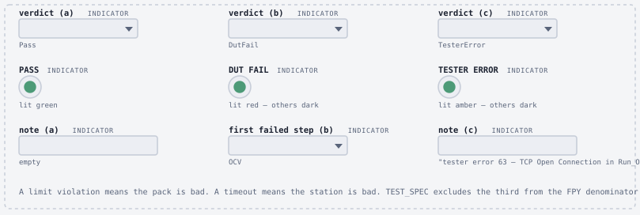
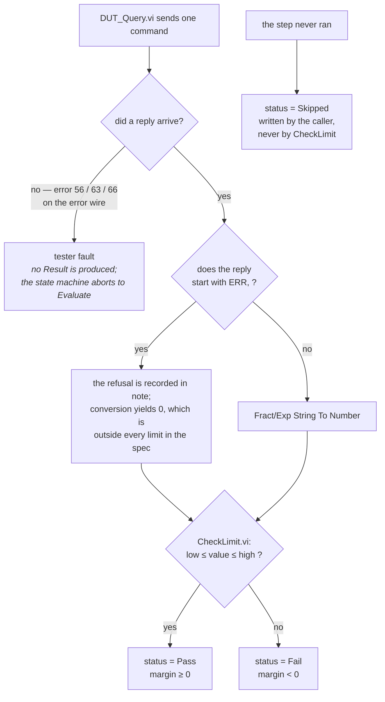
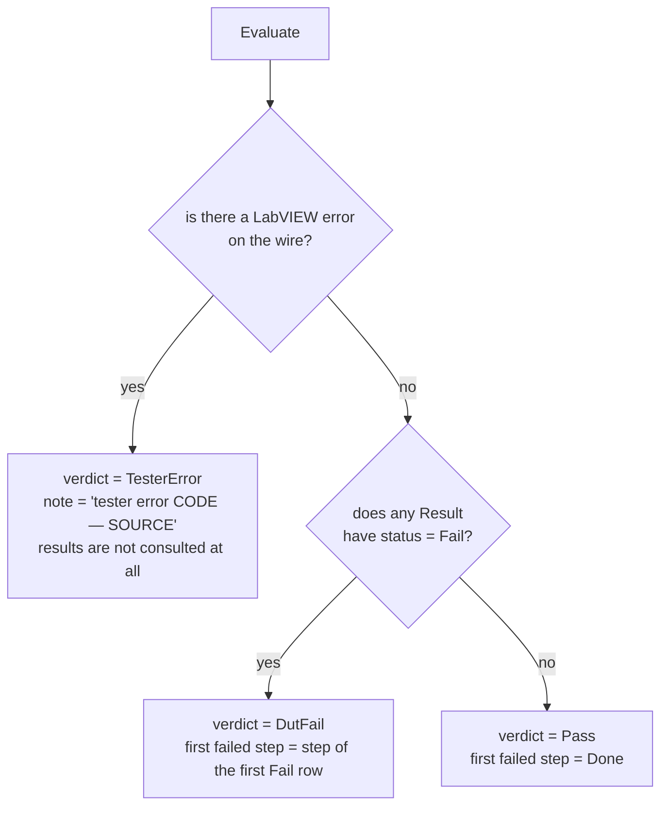
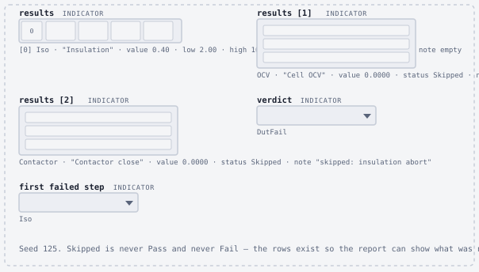
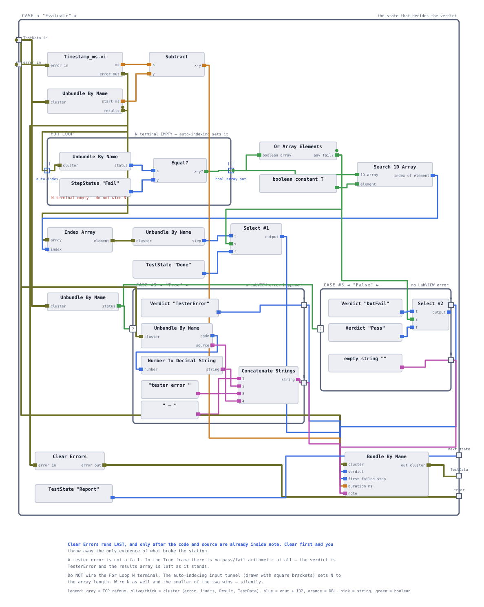

# The verdict model

Every unit this station tests ends in one of three outcomes, and every step inside it ends in one of four. This page defines both sets, shows where in the code the distinction between a bad pack and a bad tester is actually enforced, and works through the `Result` record field by field — including why `margin` is signed and why the first failing row, not all of them, is what gets attributed.

> **Build status.** `CheckLimit.vi`, the three test VIs, `StepStatus.ctl` and `Result.ctl` are built and verified against the simulator, so the step-level numbers on this page are measured. `TestState.ctl`, `Verdict.ctl` and `TestData.ctl` are being built now. The `Evaluate` state that computes the unit-level verdict lives in `Sequencer.vi`, which is **specified but not built** — no unit verdict on this page is presented as a result the station has produced.

**On this page**

- [Three outcomes, never two](#three-outcomes-never-two)
- [Where the distinction is enforced](#where-the-distinction-is-enforced)
- [From raw reply to verdict](#from-raw-reply-to-verdict)
- [The Result record](#the-result-record)
- [Margin, and why it is signed](#margin-and-why-it-is-signed)
- [Skipped is never a pass](#skipped-is-never-a-pass)
- [First-failure attribution](#first-failure-attribution)
- [Inside Evaluate](#inside-evaluate)

## Three outcomes, never two

| Verdict | Enum item | Meaning | Counts toward |
|---|---|---|---|
| 🟢 **PASS** | `Pass` | every executed step within limits | FPY numerator and denominator |
| 🔴 **DUT FAIL** | `DutFail` | at least one executed step violated a limit | FPY denominator only |
| 🟡 **TESTER ERROR** | `TesterError` | timeout, refused connection, or protocol error after retry | availability — **excluded from FPY entirely** |

A limit violation means the pack is bad. A timeout or a refused connection means the station is bad. Book one as the other and you either scrap good units or ship bad ones — and, quietly, you corrupt the yield number, because equipment downtime starts showing up as product failure. A first-pass-yield figure that mixes the two sends engineers to fix the wrong thing, which is worse than having no figure at all.

The exclusion is the reason the third verdict exists. [`docs/TEST_SPEC.md`](TEST_SPEC.md) keeps TESTER ERROR out of the FPY denominator and puts it into tester availability instead, `1 − (tester errors ÷ units started)`. Those are two different questions — *how good is the product* and *how good is the station* — and one number cannot answer both.

`lib/Verdict.ctl` is a three-item enum: `Pass`, `DutFail`, `TesterError`, one word each, no spaces. The display strings `DUT FAIL` and `TESTER ERROR` are produced where they are needed, by [the report writer](09-reporting.md); the stored value stays a comparable enum.



Three LEDs and one enum indicator reading the word. A single boolean LED has two states and this station has three outcomes; a panel that cannot show the difference is a two-outcome tester wearing a three-outcome story.

## Where the distinction is enforced

Not in `Evaluate`. By the time the sequencer gets there the classification has already happened, at the boundary where a reply becomes data.

**A reply beginning `ERR,` is data.** The DUT answered; its answer was a refusal. `MEAS:VOLT:PACK?` returns `ERR,CONT_OPEN` while the contactors are open, `SYS:CONT CLOSE` returns `ERR,CONT_FAULT` on a unit carrying the injected contactor fault, an out-of-range cell index returns `ERR,RANGE` and an unrecognised command returns `ERR,SYNTAX` — see [the simulator](03-dut-simulator.md) and [`dut_sim.py`](../simulator/dut_sim.py). A refusal by the DUT is information about the DUT.

**An error on the LabVIEW error wire is a tester fault.** 56 timeout, 63 connection refused, 66 peer closed the socket, 1 or 66 for a dead refnum. No answer was received at all, so nothing is known about the pack.

That boundary has to be guarded explicitly, because LabVIEW will not guard it for you. `Fract/Exp String To Number` does not fail on a non-numeric string — it quietly returns `0`. Without a guard, `ERR,CONT_OPEN` becomes a pack voltage of 0.00 V and `ERR,RANGE` becomes a cell at 0.0000 V, both of which are catastrophic failures that never happened, and both of which get booked against the product. All three test VIs therefore check the first four characters of the reply against `ERR,` before doing anything with it:

| VI | Where the guard sits | What it does |
|---|---|---|
| `Test_Iso.vi` | a Case Structure at the top level of the diagram | the conversion and the judgment live in the False case; the True case writes a `Fail` row directly |
| `Test_CellOCV.vi` | inside the 96-iteration For loop | one boolean per cell, OR-reduced to one for the pack, which overrides the note |
| `Test_Contactor.vi` | inside the True case, on the pack-voltage reply | overrides the note with the raw reply |

The two shapes are not arbitrary. Use the Case Structure form when the conversion and the judgment sit at the same diagram level. Use the detect-then-override-the-note form when the conversion is inside a loop or the judgment is far downstream, because a Case Structure there would mean rebuilding the loop around it for no change in the verdict.

In `Test_CellOCV.vi` the guard deliberately does *not* override `status`. A cell reading of 0.0000 V is already below the 3.50 V low limit, so `CheckLimit.vi` already returns `Fail`. What the limit check cannot do is say *why*, and an unexplained 0.0000 V looks like a dead cell rather than a protocol fault. The note is the whole fix.

> The one case that crosses the line on purpose is the `*IDN?` prefix check. If the reply arrives but does not begin `SIMU,BP96` after a retry, the sequencer manufactures error **5001** and the unit is booked TESTER ERROR, not DUT FAIL. The reasoning: a unit that identifies itself as something else is not a bad pack, it is the wrong product on the fixture or a protocol mismatch — a process fault either way, and one that must not be counted against yield. See [the sequencer](07-sequencer.md#what-each-state-does).

## From raw reply to verdict

Two decisions, at two levels. First, one command becomes one `Result`:



Then the accumulated rows become one verdict, once, in `Evaluate`:



Note the asymmetry in the second tree, because it is deliberate: **PASS requires every executed step to be within limits, but one `Fail` is enough to condemn the unit.** That is why the test is *any-fail* rather than *all-pass*. An all-pass test would let a `Skipped` row vote against the unit — a skip is not a pass, so an all-pass reduction would fail every aborted unit for the wrong reason and give it the wrong first-failure attribution.

Note also what the `TesterError` branch does not do: it never looks at the results. The unit was not properly tested, so there is no honest verdict to give about the pack, and inventing one from a partial set of rows is exactly the failure this model exists to prevent.

## The Result record

`lib/Result.ctl` is one row of the report. Nine fields, and the node that writes each one:

| Field | Type | Written by |
|---|---|---|
| `step` | `TestState` enum | a Bundle By Name in each test VI, from a `TestState` constant |
| `step name` | String | `CheckLimit.vi ▸ step name` input, from a frozen constant in the test VI |
| `value` | DBL | `CheckLimit.vi ▸ value` input |
| `low` · `high` | DBL | `CheckLimit.vi ▸ low` / `high` inputs, sourced from [`data/limits.csv`](../data/limits.csv) |
| `margin` | DBL | `CheckLimit.vi`, from Max & Min's *lower* output |
| `status` | `StepStatus` enum | `CheckLimit.vi`, from the Select fed by In Range and Coerce — or a constant, for a skip |
| `note` | String | `CheckLimit.vi ▸ note` input: worst cell index, raw DUT reply, or the reason for a skip |
| `duration ms` | DBL | the step that owns the clock, not the judgment |

`CheckLimit.vi` writes seven of the nine. It is a pure function — no error terminals, because it cannot run until `value` arrives and nothing downstream can run until `result` arrives. The data is the order. Adding error terminals to a pure function buys nothing and costs a wire on every diagram.


<details>
<summary><b>StepStatus — four values, and why not a boolean</b></summary>

<br>

`lib/StepStatus.ctl`, in order:

| Item | Value | Meaning |
|---|---|---|
| `NotRun` | 0 | the default of a freshly created `Result` |
| `Pass` | 1 | executed, within limits |
| `Fail` | 2 | executed, outside limits |
| `Skipped` | 3 | deliberately not executed, because an earlier step aborted |

`NotRun` is item 0 on purpose: the honest default for a row nobody filled in is "this did not run". If `Pass` were item 0, a step somebody forgot to write would report a pass, which is the single worst default value available.

The obvious alternative data model is `pass?` per step plus two booleans per unit. It does not work, and not for academic reasons. Two booleans give four combinations of which two are meaningless, and a per-step boolean has no way to say `Skipped` — the only available answer for a step that did not run is `FALSE`, which books skips as failures. [The spec](TEST_SPEC.md) requires an insulation failure to abort the sequence and requires a skipped step never to be recorded as a pass. Three enums cost twenty minutes and remove a whole class of wrong answer.

</details>

<details>
<summary><b>Why <code>Result</code> needs <code>step</code> when it already has <code>step name</code></b></summary>

<br>

They answer different questions, and only one of them survives being typed by a human.

`step name` is a string for the report: `Insulation`, `Cell OCV`, `Cell spread`, `Contactor close`, `Pack voltage`. Those five spellings are frozen — [the Pareto](10-batch-metrics.md) has to bin on something, and a bin that never matches reads as zero forever and looks like good news.

`step` is a `TestState` value the sequencer can compare, switch on and store in `TestData ▸ first failed step` without parsing a string at all. `Evaluate` finds the first failing row and copies its `step` straight across. Doing that with the string would mean matching text against a maintained list of expected spellings — which is the failure mode above, wearing a different hat.

Both `Test_CellOCV.vi` rows carry `step = OCV`. A single collapsed cell fails the window and, as a consequence, fails the spread; the physical cause is the cell, and both rows should attribute to the same step.

</details>

## Margin, and why it is signed

`margin` is the distance to the **nearest** limit, in either direction:

```
margin = min( value − low , high − value )
```

Positive means headroom. Negative means out of limits, and its magnitude is how far out. One number, one sign, and no separate "which limit did it break" field to keep consistent.

The worked example, from the built `Test_CellOCV.vi` against `CellOCV,3.50,3.85`:

| Unit | value | `value − low` | `high − value` | margin | status |
|---|---|---|---|---|---|
| seed 123, cell 70 | 3.7757 V | 0.2757 | **0.0743** | **+0.0743** | ✅ Pass |
| seed 120, cell 42 | 3.3100 V | **−0.1900** | 0.5400 | **−0.1900** | ❌ Fail |

A report line that says FAIL sends a technician looking. A line that says

```
Cell OCV   3.3100 V   limit 3.500–3.850   margin −0.1900   note "worst cell 42"
```

sends them to the right cell with the right expectation.

Positive margins matter as much as negative ones, and this is the argument for storing the number rather than the verdict. A batch whose insulation margins are drifting from 9 MΩ toward 1 MΩ is telling you something months before anything fails a limit. A column of `PASS` tells you nothing until the day it changes.

<details>
<summary><b>Measured margins across the reference units</b></summary>

<br>

Every value below came from running the built test VIs against [`dut_sim.py`](../simulator/dut_sim.py) through `Bench_Tests.vi`.

| Step | Limits | Unit | value | margin | status |
|---|---|---|---|---|---|
| Insulation | 2.0 – 1000 MΩ | seed 123 | 11.06 | +9.06 | ✅ |
| Insulation | 2.0 – 1000 MΩ | seed 125 | 0.40 | −1.60 | ❌ |
| Insulation | 2.0 – 1000 MΩ | golden | 10.00 | +8.00 | ✅ |
| Cell OCV | 3.50 – 3.85 V | seed 123, cell 70 | 3.7757 | +0.0743 | ✅ |
| Cell OCV | 3.50 – 3.85 V | seed 130, cell 5 | 3.5689 | +0.0689 | ✅ |
| Cell OCV | 3.50 – 3.85 V | seed 120, cell 42 | 3.3100 | −0.1900 | ❌ |
| Cell spread | 0 – 0.05 V | seed 123 | 0.0396 | +0.0104 | ✅ |
| Cell spread | 0 – 0.05 V | seed 120 | 0.4298 | −0.3798 | ❌ |
| Cell spread | 0 – 0.05 V | golden | 0.0000 | 0.0000 | ✅ |
| Pack voltage | −1.0 – 1.0 V | seed 123 | 0.0042 | +0.9958 | ✅ |

**The worst cell on a healthy pack is the highest one.** Seed 123's cells sit between 3.7361 and 3.7757 V, near the top of a 3.50–3.85 V window, so the cell in most danger is cell 70 with 0.0743 V of headroom to the *upper* limit. That is the definition working, not a bug: the cell with the least margin is the pack's margin, on whichever side it happens to be. It is also why one `CheckLimit` call on the worst cell gives exactly the same verdict as judging all 96 individually — if the worst is inside the window, all of them are.

**The golden pack's spread of 0.0000 V sits exactly on the low limit and passes.** In Range and Coerce includes both limits by default, so `low ≤ value ≤ high`. A margin of exactly zero is a pass, not a fail.

**`Cell spread` is the tightest limit in the spec.** A healthy pack runs about 0.0396 V against 0.05 V — 21% margin. It is the check that goes yellow first if the simulator's cell distribution is ever widened.

</details>

## Skipped is never a pass

A `Skipped` row means: this step was deliberately not executed, because an earlier step aborted. It is written by the caller, never by `CheckLimit.vi`, because `CheckLimit` only ever sees steps that ran.

Two places produce them:

| Producer | Rows | Note recorded |
|---|---|---|
| the `Iso` case of the sequencer, on an insulation failure | `Cell OCV` and `Contactor close` | `skipped: insulation abort` |
| `Test_Contactor.vi`, when `SYS:CONT CLOSE` is refused | `Pack voltage` | `not measured - contactors did not close` |



The rule that a skip is never a pass is not pedantry, it is the difference between two wrong reports:

- **Skip booked as `Pass`** — a unit ships with an untested contactor. This is the failure mode that matters on real hardware.
- **Skip booked as `Fail`** — [the Pareto](10-batch-metrics.md) reports that the contactor test is the line's biggest problem when it never ran once, and the improvement effort goes to a station that is working fine.

The verdict logic handles skips by never asking about them. `Evaluate` reduces on `status = Fail`, so a `Skipped` row contributes nothing in either direction; the unit's verdict comes from the step that actually failed. Seed 125 is DUT FAIL because insulation failed, not because two steps were skipped.

The flat CSV row is where a skip is easiest to lose, and [the reporting page](09-reporting.md) covers what a skipped step looks like in a file with fixed columns. The short version: the HTML carries the word `SKIPPED`, the CSV carries the first-failure column, and between the two nothing is ambiguous.

## First-failure attribution

Each rejected unit is attributed to **one** step: the first row in `results` whose status is `Fail`.

`Evaluate` builds a boolean array over the results — one element per row, true where `status = Fail` — and then uses it twice. `Or Array Elements` reduces it to *any fail?*, which selects the verdict. `Search 1D Array` for the first `TRUE` gives the index, which indexes back into `results`, and that row's `step` field is copied into `TestData ▸ first failed step`.

If nothing failed, `Search 1D Array` returns −1 and a Select substitutes the constant `Done`, which is this project's word for "none". Indexing an array with −1 returns the default element and raises no error, so nothing downstream is ever handed rubbish, and the Select never picks that branch anyway.

| Unit | Rows that fail | `first failed step` |
|---|---|---|
| seed 123 | none | `Done` |
| seed 120 | `Cell OCV`, then `Cell spread` | `OCV` |
| seed 125 | `Insulation` | `Iso` |
| seed 130 | `Contactor close` | `Contactor` |

**Why the first failing row and not all of them.** Seed 120 fails two rows from one physical defect: cell 42 has collapsed to 3.31 V, which fails the per-cell window and, as a direct consequence, blows the cell-to-cell spread out to 0.4298 V. Counting both double-counts one defect and points the improvement effort at a symptom. The cell is the cause; the spread is the shadow it casts.

**Why the position in the array and not a priority list.** "First" here means *first in execution order*, decided by where the failure actually occurred rather than by a ranking somebody maintains by hand. The results array is built in execution order by construction — every case appends — so the position of the first `Fail` is the answer, for free, with nothing to keep in sync. A hand-maintained priority list is one more artefact that can disagree with the test.

That ordering also determines a real choice inside `Test_CellOCV.vi`: the `Cell OCV` row is element 0 and `Cell spread` is element 1, so attribution lands on the window check rather than the spread. Both rows carry `step = OCV`, so the Pareto bin is the same either way — but the report's first-failure column names the honest one.

## Inside Evaluate

`Evaluate` is the only state that touches no instrument. It reads the record, decides, records, and clears.



In order:

1. **Stamp the end of the sequence.** `Timestamp_ms.vi` is first on the case's error chain, and `duration ms` is *now* minus the `start ms` that `Init` wrote. The clock read is a subVI with error terminals for the reason given in [the sequencer](07-sequencer.md); a bare clock primitive has no inputs and therefore nothing constraining when LabVIEW runs it.
2. **Scan the results** for any `Fail`, and find the index of the first one.
3. **Branch on the error wire's status**, not on anything else. True gives `TesterError`; False gives the pack a verdict.
4. **Build the note.** On the error path it reads `tester error <code> — <source>`, for example `tester error 63 — TCP Open Connection in Run_One.vi`. On the healthy path it is written empty, so the field means exactly one thing: *if this is not empty, the station failed and here is why.*
5. **Write `verdict`, `first failed step`, `duration ms` and `note`** back into `TestData` in one Bundle By Name.
6. **Clear the error — last.** The code and the source are already in `note`; clearing before recording throws away the evidence that [root-cause analysis](12-failure-injection.md) starts from. Clearing at all is necessary because the de-energise command after the loop must run on the error path, and every LabVIEW node skips its work when `error in` is non-empty.

Steps 5 and 6 in that order are the whole discipline of the page: **record, then clear.** A station that clears first is a station whose failure reports say only that something went wrong.

<details>
<summary><b>Reading a TESTER ERROR verdict</b></summary>

<br>

The note is diagnostic by design. The codes worth recognising:

| Code | Meaning | Usually means |
|---|---|---|
| 63 | connection refused | the simulator is not running |
| 56 | timeout | a run was aborted and left a socket open — restart the simulator *and* reopen the VI |
| 1 or 66 | invalid or closed refnum | the connection died mid-sequence |
| 85 | scan failed | a string-to-number conversion was handed an `ERR,` reply — a test VI is missing its guard |
| 5001 | fabricated | `*IDN?` prefix wrong after the retry |

An empty note with a `TesterError` verdict is a different animal: it means the sequence never reached `Evaluate` at all, and what is on screen is the `TestData` register's [pessimistic initial value](07-sequencer.md#the-loop-skeleton).

Code 85 is the one that matters most in review, because it is the station accusing itself: it appears precisely when the `ERR,` guard described [above](#where-the-distinction-is-enforced) is missing, and its absence would otherwise have booked the unit as a DUT failure at 0.0000 V.

</details>

<details>
<summary><b>What this model does not do</b></summary>

<br>

- **No retest policy.** FPY is defined as units passing *on first attempt*, and this station tests each unit once. A real line has a retest loop and a rule about which attempt counts; nothing here implements one.
- **No measurement uncertainty.** `margin` is computed from a single reading against a fixed limit, with no gauge R&R behind it and no guard band. Against a simulator with a deterministic model, a margin of +0.0001 and one of +0.5 are equally trustworthy, which is not true of any real instrument.
- **No severity grading.** A `Fail` is a `Fail`; there is no minor/major/critical distinction and no rework routing.
- **The limits themselves are not signed off.** The `CellOCV` low limit is 3.50 V rather than the 3.55 V a cell datasheet would suggest, because the simulator's own OCV model produces healthy cells as low as 3.5200 V — the limit was relaxed to match the model, not the cell. That is documented in [the test specification](04-test-specification.md) and it is the clearest example of why a limit without provenance is a guess with a decimal point.

</details>

<!-- nav -->
---

| | | |
|:--|:-:|--:|
| ← [The sequencer](07-sequencer.md) | [Documentation index](README.md) | [Reporting and evidence](09-reporting.md) → |
