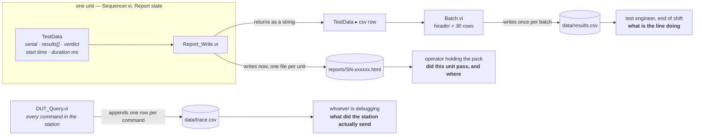
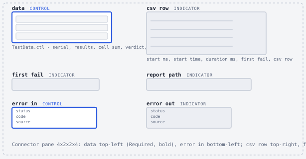
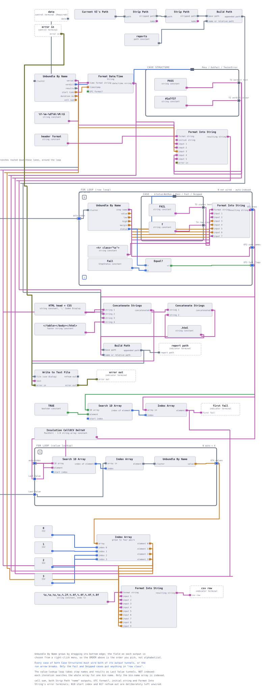
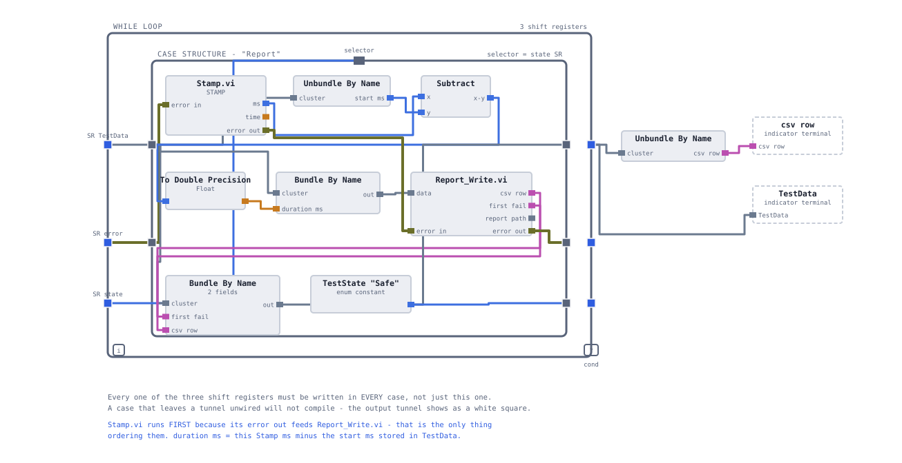

# Reporting and evidence

The station produces three files, and they exist because three different people ask three
different questions. This page gives the schema of each, says when it is written and by
what, and explains why the per-unit CSV row is returned from the sequencer as a string
instead of being written to disk where it is produced.

**On this page**

- [Three artefacts, three readers](#three-artefacts-three-readers)
- [The per-unit HTML report](#the-per-unit-html-report)
- [The batch record in results.csv](#the-batch-record-in-resultscsv)
- [Why the CSV row is a string and not a write](#why-the-csv-row-is-a-string-and-not-a-write)
- [The command log in trace.csv](#the-command-log-in-tracecsv)
- [Open points](#open-points)
- [What is built and what is specified](#what-is-built-and-what-is-specified)

## Three artefacts, three readers



The split is deliberate. A single format cannot serve all three without being bad at one
of them: the operator wants one verdict and one obvious red row and nothing else on the
page, the yield analysis wants thirty uniform rows in a spreadsheet, and the failure
investigation wants every byte on the wire with a timestamp. Merging them produces a file
that is too dense to read at the line and too pretty to load into Excel.

| Artefact | Written by | Written when | Scope | In git |
|---|---|---|---|---|
| `reports/<serial>.html` | `Report_Write.vi` | once per unit, in the sequencer's `Report` state | one unit | no — `reports/sample/` is the curated exception |
| `data/results.csv` | `Batch.vi` | once, after the batch loop ends | one batch, overwritten | no |
| `data/trace.csv` | `DUT_Query.vi` | once per command, appended | everything, ever | no |

Generated output does not belong in version control; evidence does. `reports/sample/`
holds a small number of hand-picked reports and one results file, committed on purpose so
that someone who clones the repository sees what the station produces without owning a
LabVIEW licence.

## The per-unit HTML report

**Question it answers:** did this pack pass, and if not, which step failed and by how much.
**Reader:** an operator or a technician standing at the line, holding the unit.
**Budget:** five seconds. If identifying the verdict and the failing step takes longer than
that, the layout is the defect, not the pack.

`Report_Write.vi` is the only VI in the project that touches the `reports/` folder. That
is a containment decision rather than an aesthetic one: when [cycle time](11-cycle-time.md)
is measured, there is exactly one place to look for per-unit file I/O and exactly one place
to switch it off.



### The interface

| Terminal | Direction | Carries |
|---|---|---|
| `data` | in, **required** | the finished `TestData` cluster for one unit |
| `error in` | in | places the VI in the sequencer's error chain |
| `csv row` | out | one line of `results.csv`, terminated, **not written** |
| `first fail` | out | the `step name` of the first failing step, empty if none |
| `report path` | out | the file that was just written |
| `error out` | out | file errors, propagated |

One VI, three products. The report goes to disk immediately because it belongs to one unit
and nothing downstream needs it. The other two come back as data on a wire.

The output path is derived, never typed: `Current VI's Path` → two `Strip Path` nodes to
climb out of `lib/` to the project root → `Build Path` with a `reports` constant, then a
second `Build Path` appending `<serial>.html`. Three nodes and one constant buy a project
that runs from whatever folder it was cloned into. A hard-coded `C:\eol-station\reports` is
a repository that works on exactly one machine.

The file is written with a single `Write to Text File` node given a path rather than a
refnum, which opens, replaces, writes and closes by itself. That is the right tool here
and the wrong tool for [trace.csv](#the-command-log-in-tracecsv), which appends and
therefore needs the four-node chain.



### The document

Three parts concatenated in one node: a static boilerplate constant carrying the doctype
and the stylesheet, a header assembled from the unit's data, and an array of table rows
produced by a `For Loop` auto-indexing over `results`. `Concatenate Strings` accepts a 1-D
string array on a single input and joins every element, which is why there is no second
loop and no shift register anywhere in the string assembly.

The verdict drives both the banner text and its colour, from one `Case Structure` over the
`Verdict` enum:

| `Verdict` | Banner text | Colour |
|---|---|---|
| `Pass` | `PASS` | `#1a7f37` |
| `DutFail` | `DUT FAIL` | `#c02020` |
| `TesterError` | `TESTER ERROR` | `#b26a00` |

Both tunnels are wired in all three cases. Neither is left to *Use Default If Unwired*,
which would silently print an empty verdict on a report — a document that says nothing
where it should say `DUT FAIL` is worse than one that fails to generate.

Each `Result` becomes one table row. A second `Case Structure`, this one over
`StepStatus`, turns the status into display text and a CSS class:

| `StepStatus` | Cell text | Row class | Renders as |
|---|---|---|---|
| `NotRun` | `NOT RUN` | *(empty)* | plain |
| `Pass` | `PASS` | *(empty)* | plain |
| `Fail` | `FAIL` | `f` | pink background, bold |
| `Skipped` | `SKIPPED` | `s` | grey text |

`Skipped` gets its own class rather than being folded into either neighbour. A skipped
step rendered as a pass is how a bad unit ships; rendered as a fail, it sends the
improvement effort at a test that never ran. See [the verdict model](08-verdict-model.md).

<details>
<summary><b>What the report looks like for the three reference units</b> — values from the seeded simulator</summary>

<br>

**Seed 123 — `SN-000123`, healthy, five rows, banner green.**

| step | value | low | high | margin | status |
|---|---|---|---|---|---|
| Insulation | 11.0600 | 2.0000 | 1000.0000 | 9.0600 | PASS |
| Cell OCV | 3.7757 | 3.5000 | 3.8500 | 0.0743 | PASS |
| Cell spread | 0.0396 | 0.0000 | 0.0500 | 0.0104 | PASS |
| Contactor close | 1.0000 | 1.0000 | 1.0000 | 0.0000 | PASS |
| Pack voltage | 0.0042 | -1.0000 | 1.0000 | 0.9958 | PASS |

The `Cell OCV` row carries 3.7757 V, the *highest* cell in the pack, not the lowest.
Margin is the distance to the nearest limit in either direction, so on a pack sitting at
the top of a 3.50–3.85 V window the cell in most danger is the top one — cell 70, with
0.0743 V of headroom. That is also why one `CheckLimit` call on the worst cell gives the
same verdict as ninety-six individual checks.

**Seed 125 — `SN-000125`, insulation fault, three rows, banner red.**

| step | value | low | high | margin | status |
|---|---|---|---|---|---|
| Insulation | 0.4000 | 2.0000 | 1000.0000 | -1.6000 | FAIL |
| Cell OCV | 0.0000 | 0.0000 | 0.0000 | 0.0000 | SKIPPED |
| Contactor close | 0.0000 | 0.0000 | 0.0000 | 0.0000 | SKIPPED |

Three rows, not five. An insulation failure aborts the sequence, so `Test_CellOCV.vi` and
`Test_Contactor.vi` never run and the `Iso` case appends one hand-built `Skipped` row per
skipped *test VI*, each noting `skipped: insulation abort`. The zeros in those rows are
not measurements and the word `SKIPPED` in the status column is what says so.

**Seed 130 — `SN-000130`, contactor fault, five rows, banner red.**

| step | value | low | high | margin | status |
|---|---|---|---|---|---|
| Insulation | 6.0200 | 2.0000 | 1000.0000 | 4.0200 | PASS |
| Cell OCV | 3.5689 | 3.5000 | 3.8500 | 0.0689 | PASS |
| Cell spread | 0.0383 | 0.0000 | 0.0500 | 0.0117 | PASS |
| Contactor close | 0.0000 | 1.0000 | 1.0000 | -1.0000 | FAIL |
| Pack voltage | 0.0000 | -1.0000 | 1.0000 | 0.0000 | SKIPPED |

`SYS:CONT CLOSE` answers `ERR,CONT_FAULT`, so the pack voltage cross-check has nothing to
measure and is recorded as skipped under the name of the step that was skipped. The raw
reply is preserved in that `Result`'s `note`.

</details>

### Where the report is produced



The `Report` state does four things and then hands control to `Done`:

1. Read the end-of-sequence millisecond tick through `Stamp.vi`, subtract `start ms`,
   convert to DBL, and bundle the result into `duration ms`. The conversion is explicit so
   the CSV never sees a coerced integer.
2. Call `Report_Write.vi` with the updated cluster.
3. Bundle the two returned strings — `first fail` and `csv row` — back into `TestData`.
4. Pass the error onward.

`Stamp.vi` exists only to make step 1 orderable. `Tick Count (ms)` and
`Get Date/Time In Seconds` have no inputs, and a node with no inputs has nothing
constraining when LabVIEW runs it — dropping it at the left of a case does not mean it runs
first. Wrapping the two in a SubVI with `error in` and `error out` gives them an input, and
the error wire then pins the clock read to an exact point in the sequence. That is the same
reason every real instrument driver VI carries error terminals even when it cannot fail.
See [LabVIEW design notes](13-labview-design-notes.md).

Outside the While Loop, a single `Unbundle By Name` lifts `csv row` off the final
`TestData` and puts it on the sequencer's connector pane. One wire, so that
[`Batch.vi`](10-batch-metrics.md) collects thirty rows through one auto-indexing tunnel
rather than thirty unbundles.

## The batch record in results.csv

**Question it answers:** what did this batch do — yield, Pareto, where the margins sit.
**Reader:** the test engineer at end of shift, in a spreadsheet.
**Scope:** exactly one batch. The file is overwritten on every run, on purpose.

Nine columns, one row per unit, no quoting:

```csv
serial,timestamp,verdict,first_fail,iso_MOhm,cell_min_V,delta_V,pack_dev_V,test_time_ms
```

| # | Column | Format | Source |
|---|---|---|---|
| 1 | `serial` | string | `TestData ▸ serial`, from the `*IDN?` reply |
| 2 | `timestamp` | `%Y-%m-%dT%H:%M:%S` | `TestData ▸ start time`, formatted by `Format Date/Time String` |
| 3 | `verdict` | `PASS` · `DUT FAIL` · `TESTER ERROR` | the same case tunnel that colours the HTML banner |
| 4 | `first_fail` | step name, or empty | position of the first `Fail` in `results` |
| 5 | `iso_MOhm` | `%.4f` | `value` of the `Insulation` result |
| 6 | `cell_min_V` | `%.4f` | `value` of the `Cell OCV` result — the worst-margin cell |
| 7 | `delta_V` | `%.4f` | `value` of the `Cell spread` result |
| 8 | `pack_dev_V` | `%.4f` | `value` of the `Pack voltage` result |
| 9 | `test_time_ms` | `%.0f` | `TestData ▸ duration ms` |

Column 8 is named for what it carries. `pack_dev_V` is the deviation between the measured
pack terminal voltage and the sum of the ninety-six cells — that is what the ±1.0 V limit
in [`data/limits.csv`](../data/limits.csv) is written against, so that is what the column
holds. Calling it `pack_V` would be a lie that survives until somebody plots it.

Columns 5 to 8 are not read positionally out of `results`. Each is fetched by searching the
step-name array for a fixed string and indexing the results array at whatever position that
search returns. That matters because the results array is not a fixed length: an aborted
unit has three elements, a healthy one has five. Positional indexing would silently print
one step's value under another step's heading the first time a sequence took a different
path.

The four lookup keys are `Insulation`, `Cell OCV`, `Cell spread` and `Pack voltage` — four
of the five frozen `step name` strings the test VIs emit. When a lookup misses, `Search 1D
Array` returns −1, `Index Array` returns the default for the type, and the column reads
`0.0000`.

**No quoting, and that is a decision.** Every field in this row is one the station
constructed: a serial, an ISO timestamp, a verdict word, a step name and five numbers. None
can contain a comma unless somebody names a test step with one. `trace.csv` quotes its
fields because DUT replies contain commas and the station does not control them.

<details>
<summary><b>Sample rows</b> — fixture values, with the two run-dependent fields marked</summary>

<br>

The station has not run a batch, so nothing below is a measured timestamp or duration.
The measured values come from the seeded simulator and are reproducible from a clean
checkout; `<stamp>` and `<ms>` are placeholders for the two fields only a run can fill.

```csv
serial,timestamp,verdict,first_fail,iso_MOhm,cell_min_V,delta_V,pack_dev_V,test_time_ms
SN-000123,<stamp>,PASS,,11.0600,3.7757,0.0396,0.0042,<ms>
SN-000125,<stamp>,DUT FAIL,Insulation,0.4000,0.0000,0.0000,0.0000,<ms>
```

Read the second row carefully. Three of its columns are `0.0000` and none of them is a
measurement — the sequence aborted at insulation and the remaining steps were skipped. In
a flat file that is what a skip looks like, and it is why `first_fail` is a column rather
than something to be inferred from the numbers. The HTML report carries the word
`SKIPPED`; the CSV carries `first_fail`. Between them nothing is ambiguous.

`first_fail` is also empty for a `TESTER ERROR` unit, because no step recorded a `Fail` —
the sequence never got far enough to judge the pack. The `verdict` column is what
distinguishes that case from a pass, which is the whole argument for having three verdicts
rather than two.

</details>

## Why the CSV row is a string and not a write

`Report_Write.vi` builds the row and returns it. It does not open `results.csv`.

Writing one row per unit means thirty open/seek/write/close cycles to produce one 31-line
file, and it raises a question with no good answer: who writes the header, and when? The
first unit of the batch cannot know it is the first unit. A separate "start batch" step
that writes the header is one more thing to forget, and appending to a file that already
has a header from a previous batch produces a file describing two batches with no marker
between them.

Returning the row removes all of that. `Batch.vi` concatenates a header constant with the
thirty-element array of rows and writes once. The header is simply the first thing in the
concatenation. The file describes exactly one batch because it is created by exactly one
write.

> **The trade, stated plainly: a crash halfway through the batch loses all thirty rows.**
> For thirty simulated units that is the right call — the run takes seconds and repeating
> it costs nothing. On a real line you append per unit and pay the I/O, because losing a
> shift of production data is far worse than being slow. The design here is chosen for the
> conditions it actually runs under, not copied from a line it does not run on.

The same reasoning kept the Pareto off this file. The batch metrics in
[`Batch.vi`](10-batch-metrics.md) are computed from the typed arrays leaving the loop, not
by parsing `results.csv` back in. The data is already in memory, typed, ten milliseconds
old; round-tripping it through a comma-separated text file would reintroduce the
decimal-separator problem and the stale-file problem and buy nothing.

## The command log in trace.csv

**Question it answers:** what did the station send, what came back, when, and how long did
it take.
**Reader:** whoever is investigating a failure, after the fact.
**Scope:** every command, from every VI, appended forever.

The log is written inside [`DUT_Query.vi`](../lib/DUT_Query.vi), which is the only VI in
the station that touches TCP. There is no code path that can send a command without
producing a trace row, because there is no other way to send a command. That property is
worth more than the log's contents: a log you have to remember to call is a log with holes
in exactly the places you needed it.

```
timestamp,command,reply,elapsed_ms
```

| Column | Format | Notes |
|---|---|---|
| `timestamp` | `%Y-%m-%dT%H:%M:%S%3u` | ISO 8601 with milliseconds — sorts lexically, and does not change with the machine's regional settings |
| `command` | quoted string | exactly what was sent, before the terminator was appended |
| `reply` | quoted string | the **trimmed** reply — the raw read still has `\r\n` attached and would break the row |
| `elapsed_ms` | `%.3f` | round trip, measured between two `Tick.vi` calls that bracket the write and the read |

The row comes from one `Format Into String` with the format `"%s","%s","%s",%.3f\n`.
All three text fields are quoted uniformly, but the reply is the one that requires it:
`*IDN?` alone answers `SIMU,BP96,SN-000123,FW1.0`, three commas in a single field. Leave
the quotes off and one four-column row becomes seven columns and every consumer downstream
is wrong.

```csv
timestamp,command,reply,elapsed_ms
"2026-08-06T14:15:32.418","*IDN?","SIMU,BP96,SN-000123,FW1.0",0.617
```

The file chain is four nodes — `Open/Create/Replace File` with operation `open or create`,
`Set File Position` from `end`, `Write to Text File`, `Close File` — because this file
appends. The report uses the one-node form because it replaces. The whole definition of
"append" in LabVIEW is that pair of constants, and getting either wrong produces a file
that looks fine until the second run.

`elapsed_ms` is measured across the TCP write and read only. The file chain sits
*downstream* of the second tick on the error wire, so the cost of logging is not included
in the number being logged. On loopback an open/append/close cycle costs 0.5–2 ms against a
round trip of roughly 0.6 ms, so getting that ordering wrong would have made the log the
dominant term in its own measurement. This matters again in
[cycle time and frame decoding](11-cycle-time.md), where the 96-query OCV path writes
ninety-six rows per unit and most of its cost turns out to be the logger rather than the
protocol.

> **A known gap, documented rather than hidden.** Every LabVIEW File I/O node passes an
> incoming error straight through without acting. The file chain sits downstream of
> `TCP Read` on the error wire, so a command that fails at the transport layer produces no
> trace row — the one exchange you most want to see is the one that is missing. The DUT
> faults this project exists to catch (`BADCELL`, `ISO`, `CONT`) all return perfectly
> valid replies and are logged normally; only genuine comms failures go untraced, and
> those announce themselves as an error code on `error out`.
>
> The fix is specified in [failure injection and root cause](12-failure-injection.md): a
> `Clear Errors` between `TCP Read` and the file chain, the error branched to `error out`
> so nothing is swallowed, and a fifth column `err_code` carrying the code. That turns the
> log's worst rows into its most useful ones — `56` timeout, `63` refused, `66` peer
> closed — and it is deliberately deferred until there is something to put in the column.

## Open points

These are known and unresolved. `Report_Write.vi` is not built yet, so all three are still
cheap to fix.

- **`cell_min_V` is misnamed.** It carries the `value` of the `Cell OCV` result, which is
  the cell with the *smallest margin*, not the smallest voltage. On a pack sitting near the
  top of the window — seed 123 — that cell is the maximum, 3.7757 V, and the column header
  claims the opposite. It happens to read correctly for every failing unit, because a
  collapsed cell is both the minimum and the worst, which is exactly the kind of bug that
  survives testing. `cell_worst_V` is the honest name.
- **The report table drops `note` and per-step `duration ms`.** Every `Result` carries
  both. The specified row format emits six columns — step, value, low, high, margin, status
  — so `worst cell 42` and the raw `ERR,CONT_FAULT` reply never reach the operator holding
  the pack, and the per-step timings never reach the report at all. The project README
  lists per-step durations as report content; adding the two columns is a two-specifier
  change and should be made before the VI is built rather than after.
- **Step names are matched as string literals.** Four columns of `results.csv` and all five
  [Pareto bins](10-batch-metrics.md#why-the-pareto-bins-only-the-first-failure) are looked
  up by comparing against hard-coded copies of the `step name` strings. `Result` already
  carries a `step` enum precisely so that the station never has to compare strings, and
  that enum would be the safer key. A misspelled bin does not fail loudly — it reads zero
  forever, which looks like good news.

## What is built and what is specified

| Component | State | Notes |
|---|---|---|
| `lib/DUT_Query.vi` — trace row | ✅ built | four-column `trace.csv`, appended per command |
| `trace.csv` `err_code` column | ⬜ specified | added in session 9 with the `Clear Errors` fix |
| `lib/Stamp.vi` | ⬜ specified | `error in` / `error out`, `ms` and `time` out; connector pane 4×2×2×4 |
| `lib/Report_Write.vi` | ⬜ specified | HTML file, CSV row, first fail |
| `station/Sequencer.vi` `Report` case | ⬜ specified | session 5 is in progress; the `Report` case is wired in session 6 |
| `data/results.csv` | ⬜ specified | written by `Batch.vi` |
| `reports/sample/` | 📁 empty | populated with two reports and one results file once the batch runs |

No report has been generated and no results file exists. Every value shown on this page
comes from [`simulator/dut_sim.py`](../simulator/dut_sim.py) and from the built test VIs
run individually against it; the timestamps and durations are the fields a run has to
supply, and they are marked as placeholders wherever they appear. See
[`docs/SHOTLIST.md`](SHOTLIST.md) for the screenshots that replace those placeholders.

<!-- nav -->
---

| | | |
|:--|:-:|--:|
| ← [The verdict model](08-verdict-model.md) | [Documentation index](README.md) | [Batch metrics](10-batch-metrics.md) → |
