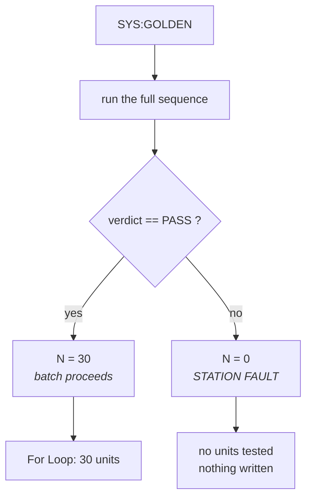
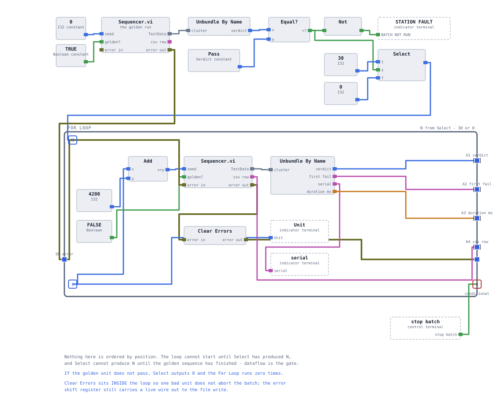
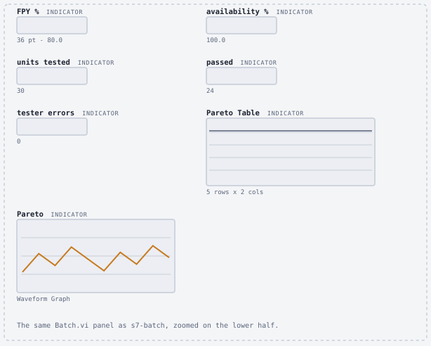

# Batch metrics

One unit tells you nothing about a line. Thirty tell you where to spend Monday morning — but
only if the tester is trustworthy first. This page documents the golden gate, the four metrics
`station/Batch.vi` produces, and the definitional choices behind each of them.

> **Build state:** `Batch.vi` is **specified, not built**. Definitions, structure and expected
> values from the fault model are documented here; the measured-results table is marked pending
> and will be filled from a real run.

**On this page:** [The golden gate](#the-golden-gate) · [What a batch run does](#what-a-batch-run-does) ·
[First pass yield](#first-pass-yield) · [Tester availability](#tester-availability) ·
[The first-failure Pareto](#the-first-failure-pareto) · [Cycle time](#cycle-time) ·
[Expected values](#expected-values-from-the-fault-model) · [Results](#measured-results)

## The golden gate

Before any real unit is tested, the station tests a pack whose answers it already knows.

`SYS:GOLDEN` loads the reference unit: all 96 cells at exactly **3.7000 V**, insulation
**10.00 MΩ**, sum **355.2000 V**, spread **0.0000 V**. Every one of those numbers sits
comfortably inside its limit. The station runs its full sequence against it and checks the
verdict.

**If the golden unit does not pass, the batch does not run.**

The gate is implemented as a `Select` turning the pass boolean into the loop count — 30 or 0 —
rather than as a conditional branch. A For Loop with `N = 0` runs zero iterations and produces
empty arrays, so "do not test anything" needs no special case.

**Why this matters more than it looks.** Testing thirty units with a broken tester does not
produce thirty errors. It produces thirty *answers*, all wrong, and a report that looks exactly
like a good one. Yield collapses, an engineer starts investigating the product, and the actual
fault is a cable. The golden unit costs one sequence — a few hundred milliseconds — and it is
the difference between a station and a script.

<b>What the golden unit does and does not catch</b>

 

**Catches:** a broken connection, a wrong limits file, a mis-wired judgment, a decoder that
scales incorrectly, a command constant with a typo, a step accidentally skipped, a unit
conversion error — anything that makes the station give a wrong answer to a known question.

**Does not catch:** anything that is correct for the golden unit's values but wrong elsewhere.
The golden pack is perfectly balanced with all cells identical, so a bug in the spread
calculation that only manifests on a real distribution would pass the gate. A single reference
point verifies presence, not linearity.

On real hardware this is what a multi-point verification standard or a set of golden units at
different points in the window would address. Here there is one, and this note is the honest
statement of its limit.

## What a batch run does

For each of thirty units, in one socket session:

1. `SYS:NEWUUT <seed>` — load the next unit, and record the serial the DUT reports back.
2. Run the full sequence via the sequencer: ID, insulation, cell OCV, contactor, evaluate.
3. Append the unit's CSV row to an accumulating array.
4. Accumulate the counters: passes, tester errors, and the first-failure bin.

After the loop: compute the metrics, write `results.csv` in one operation, and leave the
per-unit HTML reports that the sequencer already wrote.

**The socket is opened once for the whole batch, not once per unit.** Thirty connect/disconnect
cycles would add latency that has nothing to do with testing, and the simulator serves one
client at a time, so churning connections is the fastest way to hit the stale-refnum failure
described in [the DUT simulator](03-dut-simulator.md#statefulness-and-why-it-matters).

## First pass yield

$$\text{FPY} = \frac{\text{units passed}}{\text{units started} - \text{tester errors}}$$

The numerator is units that passed **on the first attempt** — no retest, no rework. The
denominator is units the station actually managed to test.

**Tester errors come out of the denominator.** This is the definitional choice that matters
most on this page. If the station could not get an answer from a unit, that unit was not
tested, and including it would let a flaky cable depress a yield number that is supposed to
describe the *product*. A unit that timed out is not a bad unit; it is a missing measurement.

The consequence is that FPY and availability move independently, and that is the point:

| Situation | FPY | Availability | What it tells you |
|---|---|---|---|
| 24 of 30 pass, no errors | 80.0% | 100% | product problem, tester fine |
| 24 of 27 pass, 3 timeouts | 88.9% | 90.0% | tester problem masking product data |
| 27 of 27 pass, 3 timeouts | 100% | 90.0% | product fine, fix the tester |

A single number that mixed the two would report the same value for all three and would be
useless in every case.

## Tester availability

$$\text{availability} = 1 - \frac{\text{tester errors}}{\text{units started}}$$

The fraction of presented units the station managed to test at all. This is where every
`TESTER ERROR` verdict lands: timeouts, refused connections, protocol errors after retry.

On a real line this is the number that decides whether the station is the constraint. A tester
at 90% availability on a line running at capacity is losing one unit in ten of throughput,
which is a maintenance problem, not a quality problem — and it is invisible if you only look
at yield.

## The first-failure Pareto

Each rejected unit is counted **once**, in the bin of the **first** step that failed.

The bins are the `TestState` enum values, not strings, so binning is an array index rather than
a run-time text comparison. A typo in a step-name constant would silently create a phantom
category; an enum cannot.

**Why first-failure and not every-failure.** A collapsed cell fails the OCV window *and*
widens the cell spread. Counting both would report two defects where there is one, and would
put `Cell spread` high in the Pareto — pointing improvement effort at a symptom. Attributing
to the first failing row means the Pareto names physical causes.

This is also why the row order inside `Test_CellOCV.vi` is fixed: `Cell OCV` is element 0,
`Cell spread` is element 1. See [the test steps](06-test-steps.md#test_cellocvvi).

<b>The trade-off this definition makes</b>

 

First-failure attribution loses information: a unit that would have failed three steps is
recorded as failing one. If you want to know how many units *would* have failed the contactor
check had they got that far, this Pareto cannot tell you.

That is the accepted cost. The Pareto exists to answer "what should we fix first", and for
that question a count of root causes beats a count of symptoms. The full per-step detail is
still in `results.csv` for anyone who needs the other view — nothing is thrown away, only the
headline is opinionated.

## Cycle time

Two numbers, from different places:

- **Per step** — each `Result` row carries `duration ms`, stamped by the step that produced it.
- **Per unit** — total sequence duration, stamped into the `TestData` record.

Both come from `lib/Stopwatch.vi` and `lib/Timestamp_ms.vi`, which wrap
`High Resolution Relative Seconds` behind an error-cluster pass-through so that a timing read
is ordered by dataflow rather than by where the node happens to sit on the diagram. A timer
with no inputs has nothing constraining when it executes — see
[LabVIEW design notes](13-labview-design-notes.md).

The dominant term is the OCV step's 96 transactions. Reducing it is
[chapter 11](11-cycle-time.md).

## Expected values from the fault model

These are what the simulator's fault distribution **predicts** for a thirty-unit batch whose
seeds begin where the fault cycle begins — for example seeds 100 to 129. They are derived from
the model, not measured from a run:

| | Expected |
|---|---|
| Units started | 30 |
| Faulty units injected | 6 (every fifth seed) |
| Units passing | 24 |
| **First pass yield** | **80.0%** |
| Tester errors | 0 |
| **Availability** | **100.0%** |

| Pareto bin | Expected count | Injected fault |
|---|---|---|
| `Insulation` | 2 | `ISO` |
| `Cell OCV` | 3 | `BADCELL` |
| `Cell spread` | 0 | — *(consequence, never first)* |
| `Contactor close` | 1 | `CONT` |
| `Pack voltage` | 0 | — *(only reached on healthy units)* |

Two entries are worth reading twice. `Cell spread` is expected to be **zero** even though
every `BADCELL` unit fails it — because it is never the *first* failure. And `Pack voltage`
is zero because a unit that reaches it has already passed everything before it.

If a real run produces a non-zero `Cell spread` bin, either the row order in
`Test_CellOCV.vi` is reversed or the attribution is scanning the array backwards. That is a
specific, checkable prediction, which is the point of writing it down before running.

## Measured results

To be filled from an actual thirty-unit run once `Batch.vi` exists.

| Metric | Value |
|---|---|
| Units started | *pending* |
| First pass yield | *pending* |
| Tester availability | *pending* |
| Pareto | *pending* |
| Mean cycle time per unit | *pending* |
| `results.csv` line count | *pending* — expect 31, one header plus thirty units |

A committed sample of the output will live in [`reports/sample/`](../reports/sample/). See
[reporting and evidence](09-reporting.md) for the file schemas.

<!-- nav -->
---

| | | |
|:--|:-:|--:|
| ← [Reporting and evidence](09-reporting.md) | [Documentation index](README.md) | [Cycle time and frame decoding](11-cycle-time.md) → |
