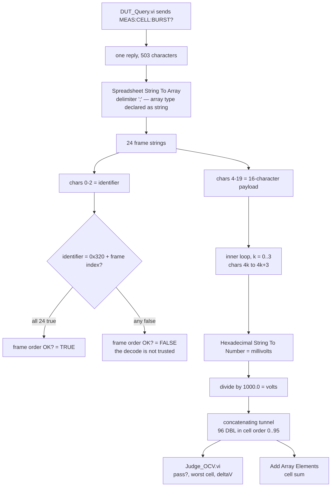
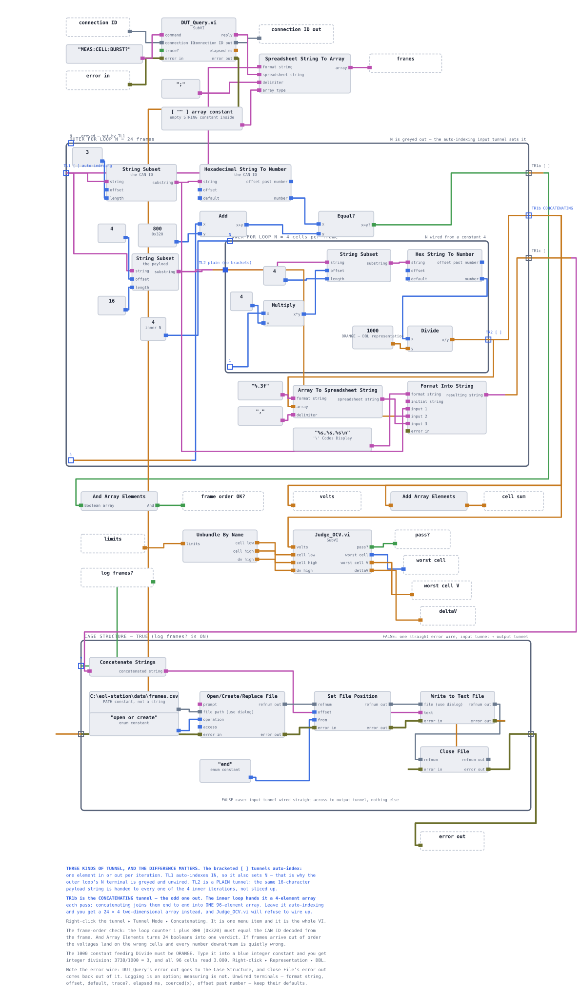
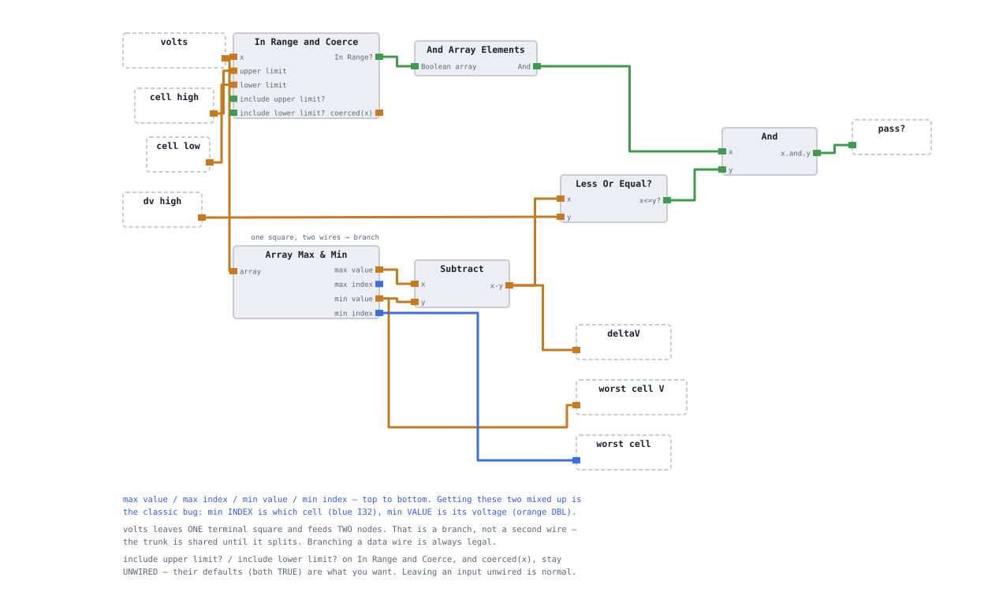
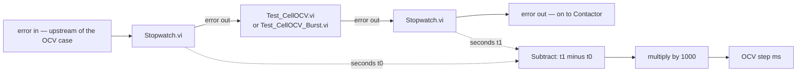
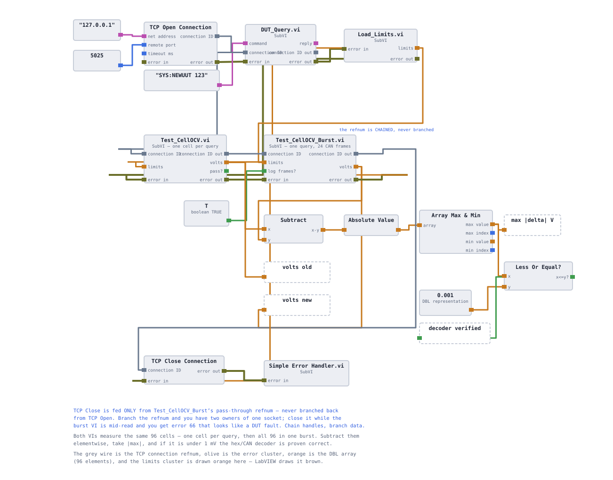

# Cycle time and frame decoding

The first working cell-OCV test asks the DUT for one cell at a time, ninety-six times per
unit. This page covers what replaces it — a single packed-frame query and the decoder that
unpacks it — how the replacement is proved correct before it is switched on, and how the
improvement is measured rather than claimed. Read it if you want to know what the fast path
costs as well as what it saves.

**On this page**

- [The cost of one query per cell](#the-cost-of-one-query-per-cell)
- [What the DUT sends instead](#what-the-dut-sends-instead)
- [The decoder](#the-decoder)
- [One judgment, two acquisition paths](#one-judgment-two-acquisition-paths)
- [Measuring it, not asserting it](#measuring-it-not-asserting-it)
- [Verifying before switching](#verifying-before-switching)
- [What the format costs](#what-the-format-costs)
- [Why the slow path is kept](#why-the-slow-path-is-kept)
- [Build status](#build-status)

---

## The cost of one query per cell

`lib/Test_CellOCV.vi` — described in [the test steps](06-test-steps.md) — runs a 96-iteration
FOR loop, and every iteration calls [`DUT_Query.vi`](05-instrument-layer.md) with
`MEAS:VOLT:CELL? n`. That is the honest, obvious implementation, and it is correct. It is
also the single most expensive thing the station does, and it is expensive twice over:

1. **96 TCP round trips.** Write, wait, read, trim — per cell.
2. **96 trace rows.** `DUT_Query.vi` opens `data/trace.csv`, seeks to the end, writes one
   line and closes the file *for every command*. That is deliberate — a command that can
   bypass the log is a command you cannot investigate later — but it means the OCV step
   performs 96 file open/append/close cycles per unit.

On loopback the transport is nearly free and the file work is not, so the naive
"96 queries are slow because the network is slow" story is probably wrong here. That
suspicion is the reason the measurement below is taken four ways instead of two.

| | Per-cell path | Burst path |
|---|---|---|
| Command | `MEAS:VOLT:CELL? n` | `MEAS:CELL:BURST?` |
| Transactions per unit | 96 | **1** |
| Reply size | 6 characters each | 503 characters, once |
| Trace rows per unit | 96 | 1 |
| VI | `lib/Test_CellOCV.vi` | `lib/Test_CellOCV_Burst.vi` |

---

## What the DUT sends instead

[`simulator/dut_sim.py`](../simulator/dut_sim.py) answers `MEAS:CELL:BURST?` with all 96
cells packed into 24 frames, joined by semicolons. Each frame is 20 characters, so the whole
reply is exactly `24 * 20 + 23 = 503` characters. Frame 10 of seed 123 is:

```
32A:0EB30EB20EB30EBC
└┬┘│└─┬┘└─┬┘└─┬┘└─┬┘
 │  │  │   │   │   └── chars 16-19  cell 43  0x0EBC = 3772 mV = 3.772 V
 │  │  │   │   └────── chars 12-15  cell 42  0x0EB3 = 3763 mV
 │  │  │   └────────── chars  8-11  cell 41
 │  │  └────────────── chars  4-7   cell 40
 │  └───────────────── char   3     separator
 └──────────────────── chars  0-2   identifier 0x32A = 0x320 + frame index 10
```

Four cells per frame, each a 16-bit unsigned integer in **millivolts**, **big-endian**,
hex-encoded, with a fixed scale factor of 1/1000. Identifiers run `0x320`–`0x337`.

Cell *n* is therefore addressed, not searched for:

```
frame index  = n / 4          cell 42 -> 10
identifier   = 0x320 + n / 4  cell 42 -> 0x32A
field        = n mod 4        cell 42 -> field 2
character    = 4 + 4 * field  cell 42 -> chars 12-15
```

On seed 120 — the `BADCELL` unit — that field reads `0CEE` in frame `32A:0E8C0E7A0CEE0E8B`,
which is 3310 mV. Being able to walk from "cell 42 is bad" to the four characters that say
so is the same operation as finding a signal in a CAN log from its DBC definition: identifier,
start bit, length, byte order, scale factor.

That resemblance is the point of the format, and it is also where the honesty belongs:
**this is CAN-shaped, but it is not CAN.** It runs over TCP on localhost. There is no bus,
no arbitration, no cyclic timing, no bus load. What transfers to a real vehicle bus is the
decoding discipline, not the transport.

<details>
<summary><b>Full frame map</b> — 24 frames, identifiers and the cells they carry</summary>

<br>

| Frame index | Identifier | Cells | Seed 123 frame |
|---|---|---|---|
| 0 | `0x320` | 0–3 | `320:0E9A0E9C0EA80E9C` |
| 1 | `0x321` | 4–7 | |
| … | … | … | |
| 10 | `0x32A` | 40–43 | `32A:0EB30EB20EB30EBC` |
| … | … | … | |
| 23 | `0x337` | 92–95 | `337:0E980EAD0E9B0EB4` |

The three quoted frames are exact, produced by running the simulator on seed 123. They are
the anchors the decoder is checked against: `0x0E9A` is 3738, so `volts[0]` must read 3.738,
and any offset, width or endianness error moves that number visibly.

The golden unit is deliberately **not** used as an anchor. `SYS:GOLDEN` sets all 96 cells to
exactly 3.7000 V, so every frame is the identical string `320:0E740E740E740E74` and all 24
are byte-for-byte the same. A decoder with the wrong offset, the wrong field width or swapped
byte order still returns 3.700 for every cell and looks perfect. A check that cannot fail is
not a check.

</details>

---

## The decoder

`lib/Test_CellOCV_Burst.vi` presents **the same connector pane as `Test_CellOCV.vi`**, with
one addition: an optional `log frames?` input. That is not tidiness. It is what allows the
OCV case inside [the sequencer](07-sequencer.md) to swap one VI for the other without a
single wire being redrawn, which in turn is what makes the before/after measurement a
comparison of two acquisitions rather than a comparison of two diagrams.





Three properties of that pipeline are worth stating explicitly, because each one prevents a
specific failure:

**The identifier is checked, not assumed.** The decoder compares each frame's identifier
against `0x320 + i` and ANDs the 24 results into `frame order OK?`. A decoder that just splits
on `;` and trusts arrival order is a string parser. One that addresses frames by identifier
is a bus decoder, and it is the only one that survives a transport that can reorder or drop.

**The array type is declared, not inferred.** `Spreadsheet String To Array` is told, via a
string-array constant on its *array type* terminal, that it is producing strings. Given a
numeric type instead, it scans `320:0E9A…` as a number, returns 320, and throws the payload
away — 24 confidently wrong values, no broken wire, no error.

**The nested loops produce a 2-D array unless told otherwise.** Auto-indexing across two
loop borders adds a dimension; it does not flatten one. The outer output tunnel is set to
*Concatenating* mode, which is what turns 24 × 4 into 96 in cell order.

<details>
<summary><b>Four ways a decoder returns confident nonsense</b> — and what catches each one</summary>

<br>

Every failure in this list produces a full-size array of plausible voltages with no broken
wire and no error on the error cluster. That is the category of bug the differential test in
[Verifying before switching](#verifying-before-switching) exists for.

| Fault | What you see | Caught by |
|---|---|---|
| Numeric `array type` on the string split | 24 values reading 320, 321, 322 … | `frame order OK?` is meaningless; array size is 24, not 96 |
| Integer divisor instead of DBL 1000.0 | every cell reads exactly 3.000 | anchor value: `volts[0]` must be 3.738 on seed 123 |
| Outer tunnel left auto-indexing | `volts` is 24 rows of 4, or 24 elements | array size check; `Judge_OCV` sees the wrong shape |
| Wrong offset, width or byte order | plausible but wrong voltages | anchor values, and `max abs delta` against the per-cell path |

Byte order is the one worth naming: `0E9A` read as `9A0E` is 39438 mV. It does not look
plausible on this pack, but on a signal with a different scale factor it would, which is why
the differential test is a numeric comparison and not an eyeball.

</details>

---

## One judgment, two acquisition paths

Before the second acquisition path exists, the pass/fail arithmetic is lifted out of
`Test_CellOCV.vi` into `lib/Judge_OCV.vi`:

| Direction | Terminals |
|---|---|
| In | `volts` (96 DBL), `cell low`, `cell high`, `dv high` |
| Out | `pass?`, `worst cell`, `worst cell V`, `deltaV` |



The reason for extracting it is the comparison that comes later. If each acquisition path
carried its own copy of the in-range check and the spread calculation, the two could disagree
for reasons that have nothing to do with the frame format, and a mismatch would prove nothing
about the decoder. With the judgment shared, **the only difference between the two paths is
how the 96 numbers were fetched.**

The extraction is a refactor, so it is validated by *nothing changing*: on seed 120,
`Test_CellOCV.vi` must still report `pass?` FALSE, worst cell 42, worst cell V 3.3100 and
`deltaV` 0.4298 — exactly the values it produced before the SubVI existed. A refactor that
moves a number is not a refactor.

> **A trade-off in the diagnostic, stated plainly.** `worst cell` and `worst cell V` come
> from *Array Max & Min*'s minimum index and minimum value, so they report the **lowest**
> cell, not the cell with the least margin. On a pack with a collapsed cell those are the
> same: seed 120's cell 42 at 3.3100 V is both. On a healthy pack they diverge — seed 123's
> lowest cell is index 13 at 3.7361 V, while the cell closest to a limit is index 70 at
> 3.7757 V, only 0.0743 V below the 3.85 V ceiling. `pass?` is unaffected, because *In Range
> and Coerce* tests every cell against both limits. Only the field that tells a technician
> where to look is biased, and it is biased toward the failure this pack model actually
> produces.

---

## Measuring it, not asserting it

`lib/Stopwatch.vi` is three objects: `error in`, `seconds`, `error out`. It exists because
of one property of LabVIEW that makes naive timing silently wrong.

Every timing primitive — *Tick Count (ms)*, *High Resolution Relative Seconds* — has **no
input terminals**. A node with no inputs has no data dependency, so the runtime may execute
it at any point while the enclosing diagram runs. Placing it "to the left of the thing you
are timing" constrains nothing; diagram position is decoration. Two bare timer nodes and a
Subtract therefore produce a number that looks exactly like a duration and is not one — and
they do it without a broken wire, a dialog or an error code.

Giving the timer `error in` and `error out` and wrapping it in a SubVI fixes that with the
same mechanism that already orders TCP Write before TCP Read: the SubVI cannot start until
its error cluster arrives, and nothing downstream can start until it returns.



A Flat Sequence would also work, and it is what most people reach for. The SubVI is preferred
for one practical reason: it composes. It can be dropped into any error chain anywhere in the
project and it lands exactly where it was placed, with no structure, no frames and no tunnels.
See [the LabVIEW design notes](13-labview-design-notes.md) for the general form of this
argument.

### The measurement that gets reported

Four numbers, not two. The second variable is the `trace?` switch added to `DUT_Query.vi` —
an optional Boolean input defaulting to TRUE, so every existing caller keeps logging exactly
as it does today, and only the timed comparison turns it off.

| OCV step, median of 3 | trace on | trace off |
|---|---|---|
| 96 single-cell queries | *pending — session 8* | *pending* |
| 1 burst query | *pending* | *pending* |

The right-hand column isolates the improvement attributable to the protocol change. The
difference between the columns is the cost of per-command tracing, which the 96-query path
pays 96 times and the burst path pays once. Reporting only the top-left and bottom-left cells
would be true and misleading: it would credit the frame format with a saving that mostly
belongs to file I/O.

Two further constraints on how the number is taken:

- **Median of three, not best of three.** A single figure off a desktop moves by tens of
  percent between runs. Quoting the median and the spread is a measurement; quoting the best
  run is a sales pitch, and the first question it invites is "which run was that?"
- **Resolution is stated.** *High Resolution Relative Seconds* is sub-microsecond. Where it
  is unavailable and *Tick Count (ms)* stands in, the instrument has 1 ms resolution — which
  makes a single-digit-millisecond "after" number uncertain at the tens-of-percent level, and
  the write-up has to say so rather than quote three decimal places.

---

## Verifying before switching

`station/Compare_OCV.vi` is a differential test. One socket is opened, `SYS:NEWUUT 123` puts
a known unit in front of it, `Load_Limits.vi` reads [`data/limits.csv`](../data/limits.csv)
once, and both acquisition VIs run against **the same unit, the same limits and the same
connection**, in that order, on one chained refnum.



The comparison itself is four nodes: subtract the two 96-element arrays elementwise, take the
absolute value, take the array maximum, and test it against 1 mV. Two indicators come out:
`max |delta| V` and a `decoder verified` LED.

| | |
|---|---|
| Threshold | 0.001 V — one millivolt, the resolution of the frame format |
| Expected maximum | 5.0e-4 V — half a millivolt, the worst rounding error the format can commit |
| Measured maximum | *pending — session 8* |

The expected value is arithmetic, not an empirical result. The simulator holds cell voltages
to four decimal places and the frame carries integer millivolts, so the largest possible
difference between the two paths is half of one millivolt. Computed directly from the
simulator's own seed-123 cell values, the maximum difference is exactly 5.0e-4 V. What
`Compare_OCV.vi` adds is the confirmation that the LabVIEW decoder agrees with that
prediction on all 96 cells — and until that has been run, the cell above stays *pending*.

Three details in that diagram carry weight:

- **The refnum is chained, never branched.** `TCP Close` is fed from the burst VI's
  pass-through, not from `TCP Open`. Branch it and there are two owners of one socket; close
  it while the burst read is in flight and you get error 66, which looks exactly like the DUT
  failing.
- **`log frames?` is TRUE here and nowhere else.** This harness is the only caller that asks
  the burst VI to dump `data/frames.csv`. In the sequencer the input is left unwired, so it
  takes its FALSE default and no file I/O happens inside the region being timed. That is what
  makes the cycle-time number a measurement of the station rather than of its own logger.
- **A number is the deliverable, not a look.** "I compared the arrays" is a claim.
  "Maximum absolute difference across all 96 cells was 5.0e-4 V, which is the millivolt
  quantisation of the format and nothing else" is evidence, and it costs five nodes.

---

## What the format costs

The burst path is not free. Rounding to millivolts is a real loss of resolution, and it lands
in different places with different severity. All three rows below are derived from the
simulator's own values, not measured in LabVIEW:

| Quantity | Worst-case error | Seed 123, per-cell path | Seed 123, decoded | Limit it is checked against |
|---|---|---|---|---|
| One cell | ±0.5 mV | 3.7361 V min | 3.736 V | 3.50–3.85 V |
| ΔV (max − min) | ±1 mV — two independently rounded numbers | 0.0396 V | 0.040 V | ≤ 0.05 V |
| Σ cells (96 values) | ±48 mV in theory | 360.3158 V | 360.316 V | ±1.0 V pack deviation |

The middle row is the one that matters. ΔV is a *derived* quantity, so its quantisation error
is twice the per-cell error, and its limit is the tightest in the spec: on seed 123 the margin
to the 0.05 V spread limit is 0.0104 V, so 1 mV of quantisation eats about a tenth of it. That
is acceptable here and it is documented rather than ignored, because on a real pack with a
tighter spread limit it would be the first thing to reconsider.

The bottom row goes the other way. The theoretical worst case is 96 × 0.5 mV = 48 mV, but
rounding errors of both signs cancel: across seeds 123, 120, 125 and 130 the decoded sum
differs from the reference sum by at most 2.7 mV. Against the ±1.0 V window that
[`Test_Contactor.vi`](06-test-steps.md) uses to cross-check `MEAS:VOLT:PACK?`, even the
theoretical worst case has a factor of twenty in hand.

---

## Why the slow path is kept

`lib/Test_CellOCV.vi` stays in the repository after the burst decoder works. Three reasons,
in order of how often they come up:

1. **It is the reference the fast path is verified against.** `Compare_OCV.vi` calls both.
   Delete one and the differential test cannot exist, and the decoder's correctness reverts
   to an assertion.
2. **It is the baseline the improvement is measured from.** A "before" you have already
   thrown away is not a before. If the OCV step had been switched to the burst read before
   the baseline was taken, no honest number could be quoted afterwards.
3. **It costs nothing to keep.** It is a VI on disk, not a branch in the sequencer. The
   sequencer calls exactly one OCV VI; the extra one is only ever loaded by the comparison
   harness.

The same reasoning is why the two VIs share a connector pane. Keeping the slow path is only
cheap if switching between them is a one-node substitution.

---

## Build status

| Item | State |
|---|---|
| `MEAS:CELL:BURST?` in the simulator | ✅ built — [`dut_sim.py`](../simulator/dut_sim.py) |
| `lib/Test_CellOCV.vi` — reference path | ✅ built |
| `lib/Stopwatch.vi` | ⬜ specified |
| `lib/Judge_OCV.vi` | ⬜ specified |
| `lib/Test_CellOCV_Burst.vi` | ⬜ specified |
| `station/Compare_OCV.vi` | ⬜ specified |
| `trace?` input on `DUT_Query.vi` | ⬜ specified |
| Four-cell cycle-time table | ⬜ pending — no timing has been taken |
| Measured `max abs delta` | ⬜ pending |

Everything marked *specified* has a defined interface and defined behaviour, and nothing on
this page reports a duration or a deviation that a VI has actually produced. The frame
contents, the address arithmetic and the quantisation bounds are derived from the simulator
and are exact. The cycle-time numbers are not, and are left empty until they are.

Related pages: [the test steps](06-test-steps.md) for the OCV step's place in the sequence,
[the instrument layer](05-instrument-layer.md) for `DUT_Query.vi` and the trace log,
[failure injection and root cause](12-failure-injection.md) for what happens to this timing
when the DUT stops answering, and [batch metrics](10-batch-metrics.md) for cycle time as a
per-unit figure. Terms used here are defined in the [glossary](glossary.md).

<!-- nav -->
---

| | | |
|:--|:-:|--:|
| ← [Batch metrics](10-batch-metrics.md) | [Documentation index](README.md) | [Failure injection and root cause](12-failure-injection.md) → |
