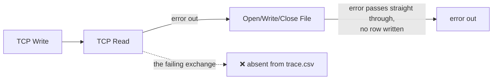
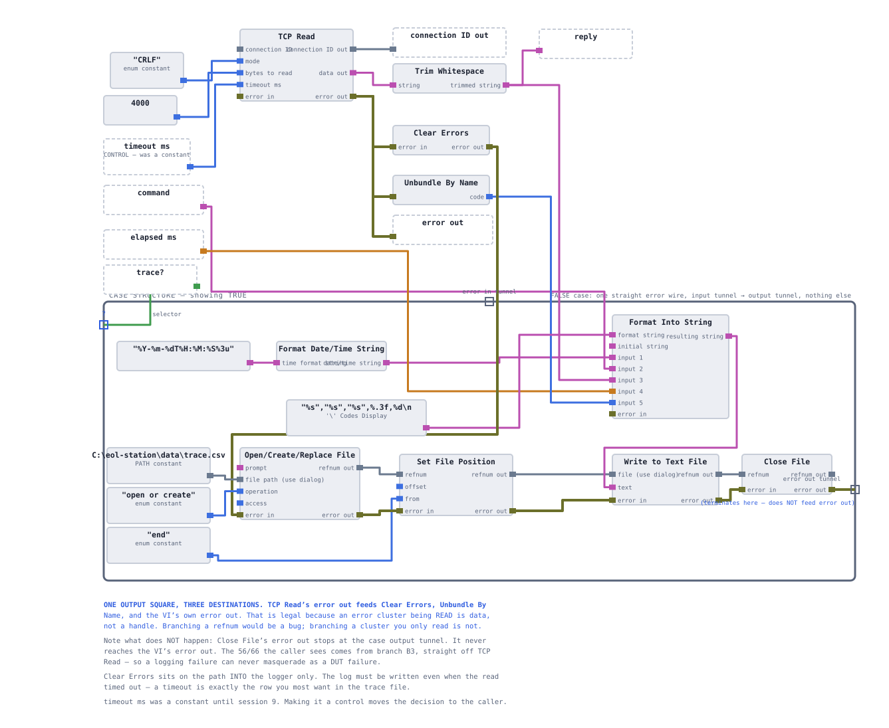
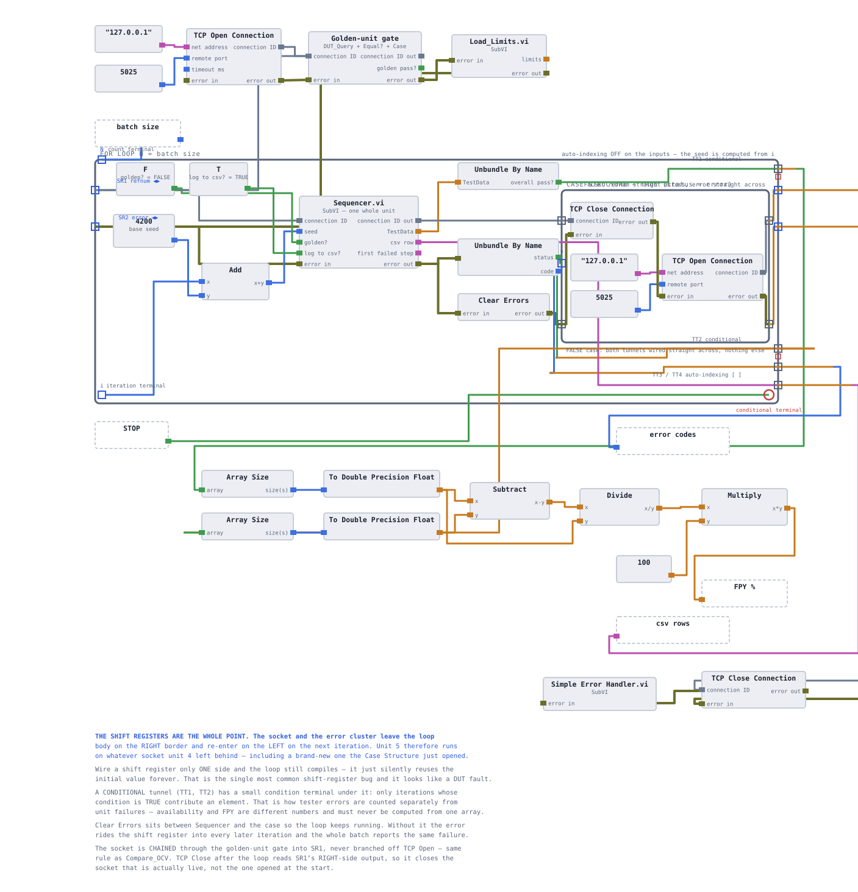
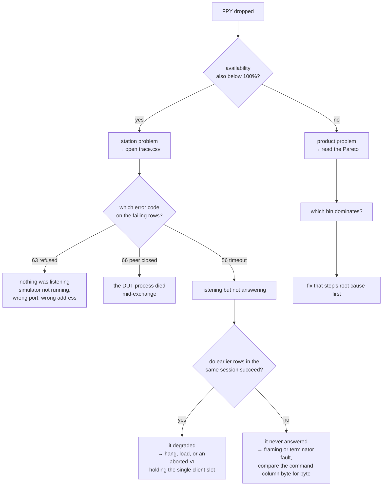

# Failure injection and root cause

A station that has only ever been tested working is a station whose failure behaviour is
unknown. This page documents the two faults deliberately injected into a running batch, what
each should produce in the report, the CSV and the trace, and how you get from a symptom back
to a cause using only the artefacts the station leaves behind.

> **Build state:** the injections and the extra instrumentation are **specified, not built**.
> The error taxonomy and the trace-gap problem below are real and already observed during the
> build; the walkthrough describes the intended exercise.

**On this page:** [Why break it on purpose](#why-break-it-on-purpose) ·
[The trace gap](#the-trace-gap-and-why-it-is-fixed-first) ·
[Injection A — the DUT vanishes](#injection-a--the-dut-vanishes) ·
[Injection B — the DUT is slow](#injection-b--the-dut-is-slow) ·
[Root-cause walkthrough](#root-cause-walkthrough) · [Error taxonomy](#error-taxonomy)

## Why break it on purpose

Everything else in this repository asks *does the station measure correctly*. This asks a
different question: **when the station cannot measure at all, does it say so honestly, and
can you find out why afterwards?**

Two properties are under test:

1. **Classification.** A transport failure must produce `TESTER ERROR`, not `DUT FAIL`. It must
   come out of the FPY denominator and land in availability. If it does not, one flaky cable
   quietly depresses a yield number that is supposed to describe the product.
2. **Traceability.** The failure must leave enough evidence to be diagnosed without
   reproducing it. A fault at 02:00 on a night shift is diagnosed from files, not from
   watching it happen.

A single injection teaches a single reflex, so there are two, and they fail differently: one
kills the connection, the other keeps it and withholds the answer.

## The trace gap, and why it is fixed first

There is a real defect in the instrument layer as built in session 3, and it is exactly the
one that matters here.

`DUT_Query.vi` writes its trace row through LabVIEW's File I/O nodes, which sit downstream of
the TCP read on the error wire. **Every File I/O node passes an incoming error straight
through without acting.** So when a command fails at the transport layer, the trace row is
never written — and the one exchange you most want to see is the only one missing from the
log.



This was an accepted trade at the time: the DUT faults the project exists to catch — a
collapsed cell, degraded insulation, a refusing contactor — all come back as perfectly valid
replies, so the log covers them. Transport failures were the gap.

Closing it is the first thing this session does. The error is branched *around* the file
chain so the row is written regardless, with the error code in place of the reply:

```csv
timestamp,command,reply,elapsed_ms
2026-08-10T02:14:07.412,MEAS:ISO?,"ERROR 56 TCP Read timed out",2000.31
```

Two controls are added to `DUT_Query.vi` at the same time: `trace?`, so tracing can be turned
off when it is not wanted, and `timeout ms`, so injection B has something to inject against.



## Injection A — the DUT vanishes

**The injection:** kill the Python simulator part-way through a thirty-unit batch.

**What the station experiences** depends on exactly when it dies:

| Moment | LabVIEW error | Meaning |
|---|---|---|
| before the socket is opened | **63** — connection refused | nothing is listening on the port |
| while a command is in flight | **66** — peer closed the connection | the process died mid-exchange |
| after the socket is open, process hung | **56** — timeout | something is listening, nothing answers |

**What should happen:**

- The unit in progress is booked `TESTER ERROR`. Not `DUT FAIL` — the station never got an
  answer, so it learned nothing about the pack.
- The verdict's note carries the numeric code. `TESTER ERROR 63` and `TESTER ERROR 56` send an
  engineer to two different places.
- That unit leaves the FPY denominator and increments the availability counter.
- The batch does not silently continue producing garbage. A station-fault indicator lights.
- `trace.csv` contains the failing exchange, with the error text where the reply would be.

**What must not happen:** the pack being recorded as failing insulation because
`Fract/Exp String To Number` turned an empty reply into `0.00`. That is the same class of bug
the [ERR guard](06-test-steps.md#the-err-guard) prevents on the data path, appearing here on
the transport path.

## Injection B — the DUT is slow

**The injection:** leave the simulator running but make it answer far later than the station is
willing to wait — or equivalently, drop `timeout ms` below the DUT's response time.

This one is more interesting than A because **the connection is fine**. Nothing is refused,
nothing is closed. The station simply does not get an answer inside its budget.

| | Injection A | Injection B |
|---|---|---|
| Socket state | broken | healthy |
| Error | 63 / 66 | **56 only** |
| Recovery on retry | fails identically | may succeed |
| Looks like | a cable | a slow instrument, a loaded network, a DUT firmware hang |

**What should happen:** the same classification — `TESTER ERROR`, out of the FPY denominator —
but the recovery behaviour differs. `*IDN?` is retried once before the unit is abandoned,
because an intermittent timeout on the first command of a sequence is often worth one more
attempt. A timeout mid-sequence is not retried: the DUT's state is now unknown, and reissuing
`MEAS:VOLT:PACK?` after an unacknowledged `SYS:CONT CLOSE` is not something a test station
should do.



**The safe state still has to be restored.** Whatever happens, the contactors get an
`SYS:CONT OPEN` on the way out — which is why that command sits outside the Case Structure in
`Test_Contactor.vi` rather than inside a branch that a timeout can skip. See
[the test steps](06-test-steps.md#test_contactorvi).

## Root-cause walkthrough

The exercise: someone hands you `results.csv`, a folder of HTML reports and `trace.csv` from
a batch that went wrong, and no memory of what happened. Work only from the files.



The first branch is the one that matters. **Availability answers "is it me or is it them"**
before anyone looks at a single measurement, and it answers it from one number rather than
from thirty reports.

The second useful move is reading the `command` column of the last successful row and the
first failing row side by side. If the commands are identical, the DUT changed. If they
differ, the station did.

<details>
<summary><b>The failure this exercise is really rehearsing</b></summary>

<br>

During the build, a run started timing out on every command after having worked minutes
earlier. The cause was not the station's logic at all: a VI had been stopped with the red
abort button, which does not close open TCP connections. The refnum stayed open, the
simulator — which serves one client at a time — sat inside `recv()` on a dead socket and never
returned to `accept()`, and every subsequent run connected into the listen backlog and then
timed out with error 56.

Nothing in the station was broken. The diagnosis came from the simulator's console showing two
`client connected` lines with no `client disconnected` between them.

That is why the simulator logs connections at all, and why this chapter exists: the artefacts
have to be designed before the failure, not after it.

</details>

## Error taxonomy

The complete set of things that can go wrong, and where each is booked:

| Source | Example | Classified as | Counts toward |
|---|---|---|---|
| DUT answers with a refusal | `ERR,CONT_FAULT` | **DUT FAIL** | FPY denominator and numerator-miss |
| DUT answers, value out of limits | `0.40` against a 2.0 MΩ floor | **DUT FAIL** | same |
| DUT answers a question that has no answer yet | `ERR,CONT_OPEN` | **TESTER ERROR** | availability — the station asked too early |
| DUT refuses a malformed command | `ERR,SYNTAX`, `ERR,RANGE` | **TESTER ERROR** | availability — the station sent something wrong |
| No answer arrives | error 56 / 63 / 66 | **TESTER ERROR** | availability |

The middle two rows are the subtle ones. `ERR,SYNTAX` and `ERR,RANGE` arrive as valid replies
over a healthy socket — by transport they look like data — but semantically they mean *your
station sent something wrong*, and booking them against the product would be wrong. The
classification therefore reads the error text, not just the transport status.

`ERR,CONT_FAULT` and `ERR,CONT_OPEN` sit on either side of the same line: the first is the pack
reporting a defect in itself, the second is the station asking a question out of order. Same
shape, opposite attribution.

<!-- nav -->
---

| | | |
|:--|:-:|--:|
| ← [Cycle time and frame decoding](11-cycle-time.md) | [Documentation index](README.md) | [LabVIEW design notes](13-labview-design-notes.md) → |
