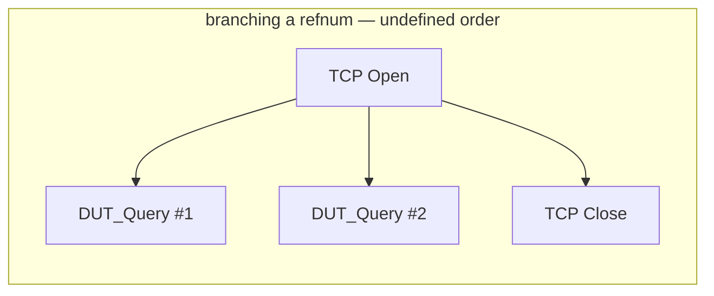
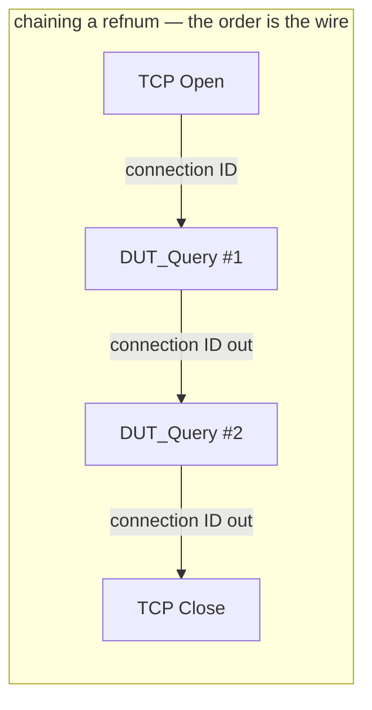
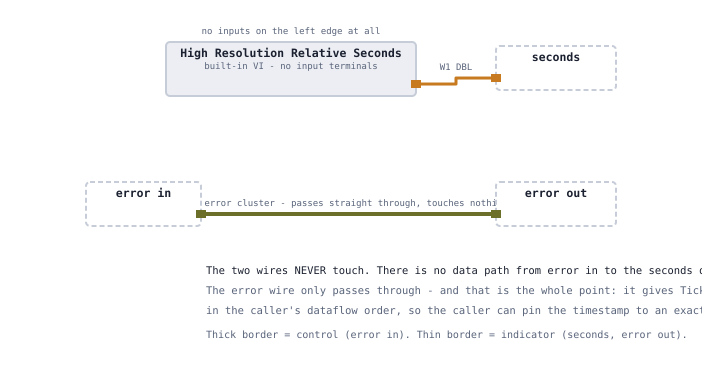
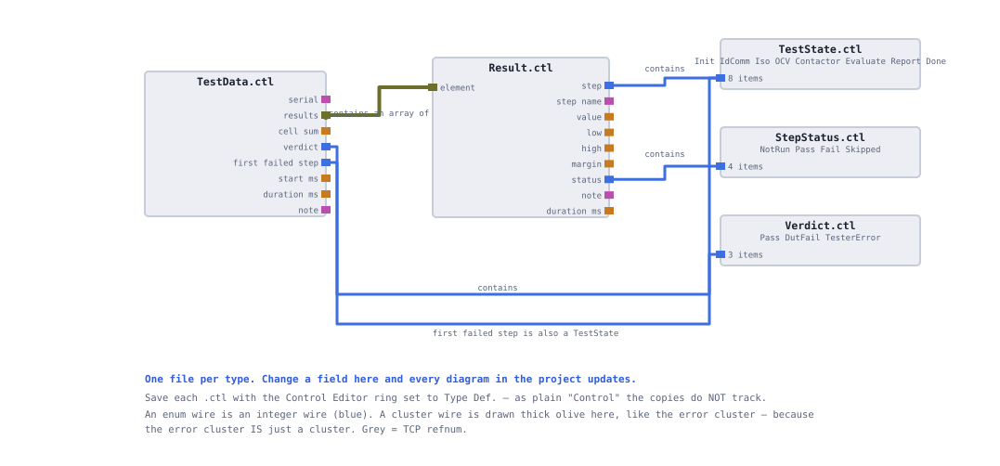

# LabVIEW design notes

Written for a reader who may not use LabVIEW. It explains the handful of language properties
that shaped this station, the bugs each one causes when ignored, and what they mean for anyone
reviewing this repository on GitHub.

**On this page:** [Dataflow](#dataflow-is-the-whole-language) ·
[Chaining vs branching](#chaining-versus-branching) · [The error cluster](#the-error-cluster-as-a-sequencing-wire) ·
[Timing nodes](#timing-nodes-have-no-inputs) · [Type definitions](#type-definitions-and-their-one-sharp-edge) ·
[Case Structure tunnels](#case-structure-tunnels) · [Array polymorphism](#array-polymorphism) ·
[Reviewing this repo](#reviewing-a-labview-repository)

## Dataflow is the whole language

A LabVIEW block diagram is not a list of statements. A node executes when **all of its inputs
have data**, and not before. Nothing else orders execution — not position on the screen, not
left-to-right, not the order you placed the nodes.

Two nodes with no wire between them have **no defined order**. They may run in either
sequence, or genuinely in parallel on different cores, and which one happens can change between
runs or between machines.

This is the single most important thing to understand about the code in this repository,
because almost every ordering bug found during the build came from forgetting it:

| Symptom | Cause |
|---|---|
| Error 1 — invalid refnum at TCP Write | `TCP Close` was wired from `TCP Open` rather than chained after the write, so nothing stopped it closing the socket first |
| Elapsed time reads as noise | the two timing reads had no inputs, so neither was ordered relative to the thing being timed |
| A contactor read returns `ERR,CONT_OPEN` intermittently | the close command and the read were not on the same wire |

None of these produce a compile error. The diagram looks correct, the arrow is unbroken, and
the failure appears under timing you did not anticipate.

**The rule this station follows:** if A must happen before B, there is a wire from A to B. If
no natural data flows between them, use the error cluster. If you find yourself reaching for a
Flat Sequence Structure, first check whether either node has an error terminal — it almost
always does.

## Chaining versus branching

A wire carrying a value may be **branched** freely: two consumers, same data, no ordering
implied. That is correct for `limits`, which every test step reads and none modifies.

A wire carrying a **resource** must be **chained**: each user takes it in and passes it out,
so the next user cannot start until the previous one has finished with it.





Every VI in `lib/` that touches the connection therefore exposes both `connection ID` and
`connection ID out`, even though the refnum value is unchanged. The output terminal exists
purely to carry ordering. The same pattern is why `SYS:CONT CLOSE` reliably happens before
`MEAS:VOLT:PACK?` and why `SYS:CONT OPEN` reliably happens last.

## The error cluster as a sequencing wire

LabVIEW's error cluster — a status boolean, a numeric code and a source string — travels
alongside the data through every node that can fail. Nodes that receive an incoming error
generally do nothing and pass it through, so a fault propagates to the end of the chain
instead of causing a cascade of secondary failures.

It is also the ordering mechanism of last resort. Two operations with no data relationship can
still be sequenced by threading the error wire from one into the other. That is how the timing
VIs in this project are ordered, and it is why `lib/Tick.vi` and `lib/Stopwatch.vi` exist as
wrappers rather than as bare timer nodes.

**The one place this bites** is documented in
[failure injection](12-failure-injection.md#the-trace-gap-and-why-it-is-fixed-first): because
File I/O nodes pass errors through without acting, the trace row for a *failing* exchange never
gets written. Pass-through is the right default and it is occasionally exactly wrong.

## Timing nodes have no inputs

`Tick Count (ms)` and `High Resolution Relative Seconds` take no arguments. That means nothing
constrains when they run, and "put one before the operation and one after" is not something
the diagram can express by position.

`lib/Tick.vi` and `lib/Stopwatch.vi` wrap the timer with an `error in` / `error out`
pass-through. Threading the error wire through them puts them in the chain, and the
measurement becomes what it claims to be.



Two further notes on timing here. `High Resolution Relative Seconds` returns a DBL and is
preferred over `Tick Count (ms)`, which returns a U32 and rolls over every 49.7 days —
irrelevant for a demo, wrong in a station meant to run continuously. And every duration in
this project is measured on one developer machine over TCP loopback; it demonstrates a method,
not a throughput figure.

## Type definitions and their one sharp edge

A type definition is a `.ctl` file that defines one data type. Every control, indicator and
constant created from it stays **linked** to that file, so adding a field updates every
instance on every diagram at once.

Six of them carry this project's data model:



| File | What it is |
|---|---|
| `StepStatus.ctl` | enum: `NotRun`, `Pass`, `Fail`, `Skipped` |
| `TestState.ctl` | enum: `Init`, `IdComm`, `Iso`, `OCV`, `Contactor`, `Evaluate`, `Report`, `Done` |
| `Verdict.ctl` | enum: the three outcomes |
| `Limits.ctl` | 8 DBLs — the parsed limits file |
| `Result.ctl` | one report row, 9 fields |
| `TestData.ctl` | one unit's whole record, containing an array of `Result` |

`NotRun` is item 0 of `StepStatus` deliberately. A freshly created `Result` therefore defaults
to *this step did not run*, which is the honest default. If `Pass` were item 0, a step nobody
remembered to fill in would report a pass.

<details>
<summary><b>The sharp edge: a disconnected instance stops updating, silently</b></summary>

<br>

An instance can become **disconnected** from its type definition — most easily by copying an
object from another VI rather than creating it from the `.ctl`. A disconnected copy keeps
working, keeps its old shape, and never receives another update.

This cost real time on this project. `Result.ctl` gained a ninth field partway through the
build. Every linked instance updated instantly. Three disconnected copies did not, and the
symptom was:

```
You have two or more cluster data types wired together, but the clusters have
different kinds or numbers of elements. Cluster Result, a cluster of 8 elements,
conflicts with cluster Result, a cluster of 9 elements.
```

The error names the type twice and does not say which instance is stale. The reliable
diagnostic is right-clicking the `.ctl` in the Project Explorer and choosing **Find ▸
Instances** — it lists every VI holding a *linked* instance, so any VI you expect in that list
and do not see is holding a dead copy.

The deeper lesson is a design one rather than a LabVIEW one: the field should have existed from
the start. Adding a field to a shared type mid-project is churn that a type definition is
supposed to prevent, and it only propagates cleanly if every instance is genuinely linked.

</details>

## Case Structure tunnels

A Case Structure is LabVIEW's conditional. Data crosses its border through **tunnels**, and
the rule that matters is:

> An **output** tunnel is one tunnel shared by all cases, and it must be wired in **every**
> case, or the VI will not run.

A hollow square on the border means "wired in some cases, not all". The fix is to wire it in
the remaining cases.

**The fix is never `Use Default If Unwired`.** That option silences the broken run arrow and
hands you a zero, an empty string or `NotRun` that nobody notices — a silent wrong answer in
place of a loud refusal to run. In a test station that is the worst possible trade.

Two consequences visible in this repository. Wires cannot cross between cases, so where both
branches need the same constant there are genuinely two constants — that is not duplication by
accident. And every case of the sequencer's structure writes the next state to the shift
register, because a state machine whose case forgets to do so simply never advances.

## Array polymorphism

Most LabVIEW arithmetic operates on arrays as readily as on scalars, element by element, with
no loop. `Test_CellOCV.vi` leans on this heavily:

```
cell volts (96) − cell low (scalar)   → 96 headrooms to the floor
cell high (scalar) − cell volts (96)  → 96 headrooms to the ceiling
Max & Min of those two arrays          → 96 per-cell margins
Array Max & Min                        → the worst margin and which cell owns it
```

Four nodes, no second loop, and the result names the offending cell. The alternative — a loop
around 96 `CheckLimit` calls — would be slower to run, slower to read, and would still need
extra work to identify the worst cell.

This deletes more loops than any other single idea in the language, and it is the reason the
OCV step's arithmetic all sits *outside* the acquisition loop.

## Reviewing a LabVIEW repository

Worth stating plainly, because it is the first thing that surprises anyone opening this repo:

**`.vi` and `.ctl` files are binary.** They are marked as such in
[`.gitattributes`](../.gitattributes) so git never attempts to diff or merge them. There is no
meaningful code review from a pull request diff, no line-level blame, and a merge conflict in a
VI is unresolvable — you keep one side.

The practical consequences, all of which shape this repository:

- **Text is where the reviewable decisions live.** Limits are a CSV. The specification is
  Markdown. The DUT is Python. Anything that can be text, is.
- **A screenshot of a block diagram is the diff.** That is why
  [`docs/SHOTLIST.md`](SHOTLIST.md) exists and why every chapter here carries diagrams.
- **Branching is expensive**, so the history is close to linear.
- `.gitignore` excludes LabVIEW's per-user files — `*.aliases`, `*.lvlps` — which change on
  every open and carry no information.

`eol-station.lvproj` is the entry point. Without it a clone is a folder of loose VIs with no
project context, which is why it belongs in the repository even though it is nearly opaque.

<!-- nav -->
---

| | | |
|:--|:-:|--:|
| ← [Failure injection and root cause](12-failure-injection.md) | [Documentation index](README.md) | [Mapping to NI TestStand](14-teststand-mapping.md) → |
